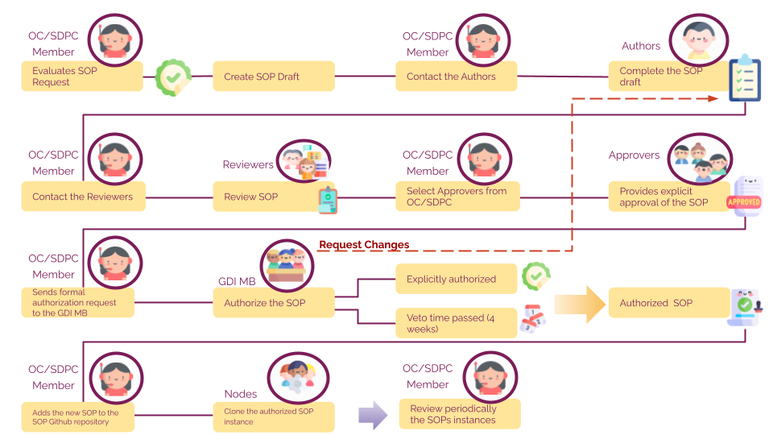
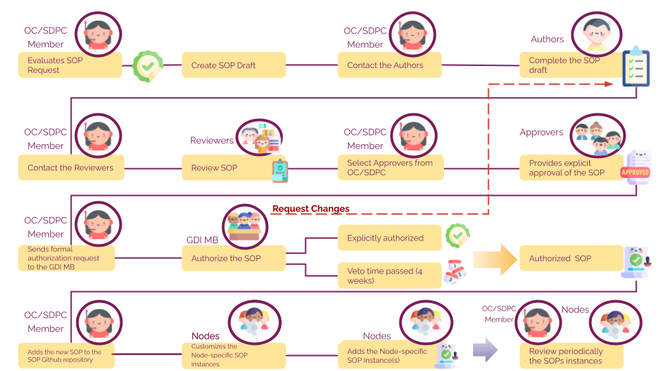
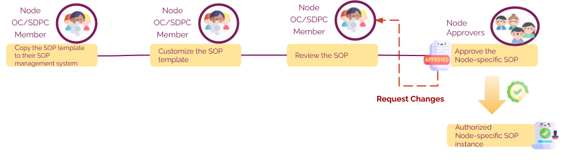

# European GDI - Procedures for Information Service Management for SOPs

## Index

1. [Document History](#1-document-history)
2. [Glossary](#2-glossary)
3. [Roles and Responsibilities](#3-roles-and-responsibilities)
4. [Purpose](#4-purpose)
5. [Scope](#5-scope)
6. [Introduction and Background Information](#6-introduction-and-background-information)
7. [Information Service Management Procedures](#7-information-service-management-procedures)
   1. [GDI SOP creation](#71-gdi-sop-creation)
      1. [European-level SOPs](#711-european-level-sops)
      2. [Node-specific SOP templates](#712-node-specific-sop-templates)
      3. [Node-specific SOPs](#713-node-specific-sops)
   2. [GDI SOP accessioning and file naming](#72-gdi-sop-accessioning-and-file-naming)
   3. [GDI SOP review and revision](#73-gdi-sop-review-and-revision)
   4. [GDI SOP access rules](#74-gdi-sop-access-rules)
8. [References](#references)

## 1. Document History

| Version | Author(s) | Description of Changes             | Date |
| ------- | --------- | ---------------------------------- | ---- |
| v0      |           | First version of document released |      |

## 2. Glossary

The following table defines the abbreviations and terms relevant to GDI SOPs.

| Abbreviation | Description                            |
| ------------ | -------------------------------------- |
| OC           | Operations Committee                   |
| SDPC         | Security and Data Protection Committee |

| **Term**                     | **Definition**                                                                               |
| ---------------------------- | -------------------------------------------------------------------------------------------- |
| European-level SOP instances | Standard Operating Procedures (SOPs) to be followed for GDI processes at the European level. |
| Node-specific SOP template   | Templates for SOPs that can be tailored to the specific processes of each node.              |

## 3. Roles and Responsibilities

| Role         | Full name             | GDI/node role   | Organisation            |
| ------------ | --------------------- | --------------- | ----------------------- | 
| **Author**   | Mallory Freeberg      | Task 4.3 member | EMBL-EBI                |
| **Author**   | Marcos Casado Barbero | Task 4.3 member | EMBL-EBI                |
| **Author**   | Silvia Bahena         | Task 4.3 member | EMBL-EBI                |
| **Reviewer** | Jeroen Belien         | GDI-Member      | Health-RI/Amsterdam UMC |
| **Reviewer** | Mattias Strömberg     | Task 4.3 member | UU                      |
| **Reviewer** | Elisavet Torstensson  | Task 4.3 member | UU                      |
| **Approver** |                       |                 |                         |     
| **Approver** |                       |                 |                         | 

## 4 Purpose

This document aims to ensure the effective management of information across all activities related to the delivery and management of GDI services at both the European and national node levels, as outlined in the GDI SOP collection. It focuses on preserving the confidentiality, integrity, and accessibility of relevant information across both levels.

## 5 Scope

This document applies to all GDI staff responsible for managing and implementing GDI SOPs at both the European and national node levels, unless otherwise specified.

## 6 Introduction and Background Information
This document provides the necessary procedures to manage information effectively across all activities involved in the delivery and management of GDI services at both the European and national node levels. It emphasises the importance of preserving the confidentiality, integrity, and accessibility of information as outlined in the GDI SOP collection.

Standard Operating Procedures (SOPs) are vital to maintaining uniformity and high standards across the GDI infrastructure. They ensure consistent practices, fostering better interoperability, security, and an improved user experience. To maintain these standards, it is crucial to develop clear procedures for Information Service Management (ISM) to guide the implementation of SOPs, ensuring that all staff adhere to best practices and contribute to the optimal functioning of the GDI infrastructure.

## 7 Information Service Management Procedures

### 7.1 GDI SOP creation

#### 7.1.1 European-level SOPs

For each European-level GDI SOP, only one SOP document is produced which all GDI partners/nodes are expected to follow. The need for a new European-level GDI SOP is first identified by one or more GDI project partners who will then prepare a proposal, making use of the GitHub repository "[New SOP Request](https://github.com/GenomicDataInfrastructure/standard-operating-procedures/issues/new/choose)" GH issue. The proposal should include the purpose and scope of the SOP and a justification for its need. Once the proposal for a new European-level GDI SOP is approved by the OC/SDPC, then work can begin on creating the new SOP following the Steps below (Figure 1). For more in detail information, refer to this "[Context Diagram.](https://github.com/GenomicDataInfrastructure/standard-operating-procedures/blob/dev/sops/european-level/GDI-SOP0007_SOP-template-creation.md#7-summary-or-context-diagram)"

**Steps:**

1. After a SOP request is received in the repository, a OC/SCDP member evaluates the request. If it is a valid request,the OC/SCDP member prepares the SOP draft from the [GDI General SOP template.](./GDI-SOP_sop-template.md)
2. OC/SCDP member shares template with the authors( OC/SDPC or nominated experts) to write the SOP (i.e. fill in the content)
3. After the drafting is completed, the OC/SCDP member shares the draft internally or with experts to review for completeness.
4. Both committees (OC/SDPC) approve the reviewed document.
5. The OC/SDPC member then shares the approved SOP with GDI MB for authorization.
6. GDI MB reviews the SOP and authorise or requests changes (repeat from Step 3)
7. OC/SDPC accessions ([7.2](#72-gdi-sop-accessioning-and-file-namin)) the authorised SOP according to agreed process and the SOP goes into production
8. OC/SDPC initiates periodic review cycle (repeat Steps 3-6)

_Figure 1: Proposal for creating and approving European-level SOPs instances._

#### 7.1.2 Node-specific SOP templates

For each Node-specific SOP, first a template is created and approved at the European level, as explained above ([7.1.2](#712-node-specific-sop-templates)). Once approved, the template is then used by each node to create their own SOP instance ([7.1.3](#713-node-specific-sops)) which is approved at the node level. The steps below describe how to get a node-specific template created and approved.

Steps:

1. After a SOP request is received in the repository, a OC/SCDP member evaluates the request. If it is a valid request,the OC/SCDP member prepares the SOP draft from the [GDI General SOP template.](./GDI-SOP_sop-template.md)
2. OC/SCDP member shares template with the authors( OC/SDPC or nominated experts) to write the SOP (i.e. fill in the content)
3. After the drafting is completed, the OC/SCDP member shares the draft internally or with experts to review for completeness.
4. Both committees (OC/SDPC) approve the reviewed document.
5. The OC/SDPC member then shares the approved SOP with GDI MB for authorization.
6. GDI MB reviews the SOP and authorise or requests changes (repeat from Step 3)
7. OC/SDPC accessions ([7.2](#72-gdi-sop-accessioning-and-file-naming)) the approved SOP template according to agreed process and informs nodes ready to adapt to their own node processes.

_Figure 2: Proposal for creating and approving node-specific SOP templates._

#### 7.1.3 Node-specific SOPs

For each Node-specific SOP, first a template is created and approved at the European level ([7.1.2](#712-node-specific-sop-templates)). Once approved, the template is then used by each node to create their own SOP instance ([7.1.3](#713-node-specific-sops)) which is approved at the node level. The Steps below describe how nodes will create their node-specific SOPs.

Steps:

1. OC/SDPC representative(s) from each node copy the SOP template to their node’s SOP management system
2. OC/SDPC rep (or nominated experts) uses the template to create the SOP according to their node’s needs and internally review for completeness
3. OC/SDPC rep initiates their node-defined approval process for the node-specific SOP
4. [Node-appointed approver] reviews the SOP and approves or requests changes (repeat from Step 2)
5. OC/SDPC members from the node accessions ([7.2](#72-gdi-sop-accessioning-and-file-naming)) the approved SOP according to agreed process and the SOP goes into production

_Figure 3: Proposal for creating and approving node-specific SOPs instances._

SOP template reviews and revisions should follow guidelines for GDI SOP revision and review ([7.3](#73-gdi-sop-review-and-revision)) in the GDI SOP GitHub repository.

### 7.2 GDI SOP accessioning and file naming

**GDI SOP templates** will be assigned accessions upon being approved. GDI SOPs template accessions will take the form “GDI-SOP00000.v0”, where the number before the full stop will auto increment by 1 and the number after the full stop will indicate the version number. For example, version 1 of the first approved GDI SOP template will be given the accession “GDI-SOP00001.v1”. GDI SOP templates must be referenced by this accession.

**Node instances** of GDI SOP templates will be assigned accessions which take the form of the template accession followed by a string (“node identifier”) chosen by each GDI node to represent their node’s SOPs. For example, if the Swedish node chooses “SWE” as their node identifier, then their instance of version 1 of the first approved GDI SOP template will be given the accession “GDI-SOP00001.v1-SWE”. Nodes can modify their SOP instances - as long as SOP instances adhere to the requirements of the originating template - and append additional versioning to the accession. For example, if the Swedish node decides to make a change to their GDI-SOP00001.v1-SWE SOP (assuming that they continue to adhere to the GDI-SOP00001.v1 template), they may choose to name it “GDI-SOP00001.v1-SWE.v1”.

Filenames for GDI SOP templates and node instances must contain the accession as the first part of the filename. The remainder of the filename can vary but must be separated from the accession with an underscore (“\_”). For example, if the GDI SOP “GDI-SOP00001.v1” is about how to manage node helpdesk tickets, the file for the template could be named “GDI-SOP00001.v1_Node-Helpdesk-Ticket-Management-Template”.

GDI-SOP00001.v1_Node-Helpdesk-Ticket-Management-Template-SWE.v1

**Supporting GDI SOP documents** will also be assigned an accession number…

Filenames for GDI SOP supporting documents must start with “GDI-SOP\_”, followed by a brief text describing the document, a full stop, and finally a version number. For example, the first approved version of the GDI SOP Charter could be named “GDI-SOP_Charter.v1”.

### 7.3 GDI SOP review and revision

<_To do- describe a general plan for how GDI SOP templates, node instances of SOPs, and supporting documentation will be reviewed and revised. Include guidance for how to update “Document History” sections of all these documents._>

### 7.4 GDI SOP access rules

_&lt;to-do>_

## 8 References

<table>
  <tr>
   <td><strong>References</strong>
   </td>
   <td><strong>Description</strong>
   </td>
  </tr>
  <tr>
   <td><a href="./GDI-SOP_charter.md">1</a>
   </td>
   <td>European GDI - SOP Charter
   </td>
  </tr>
  <tr>
   <td><a href="./GDI-SOP_ORR.md">2</a>
   </td>
   <td>European GDI - Organisational Roles and Responsibilities
   </td>
  </tr>
    <tr>
   <td><a href="https://www.flaticon.com/authors/freepik">3</a>
   </td>
   <td>Schemas Icons
   </td>
  </tr>
</table>
