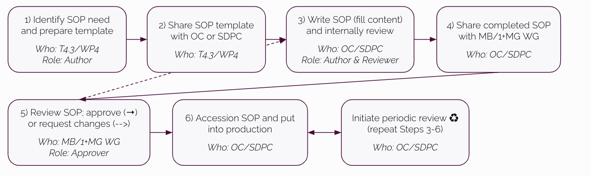
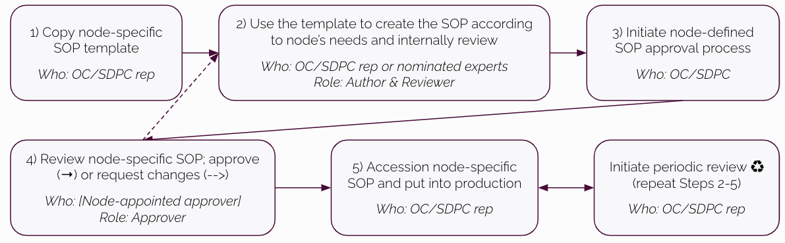

# European GDI - Procedures for Information Service Management for SOPs

## Index

1. [Document History](#document-history)
2. [Glossary](#glossary)
3. [Roles and Responsibilities](#roles-and-responsibilities)
4. [Purpose](#purpose)
5. [Scope](#scope)
6. [Introduction and Background Information](#introduction-and-background-information)
7. [Information Service Management Procedures](#information-service-management-procedures)
   1. [GDI SOP creation](#gdi-sop-creation)
      1. [European-level SOPs](#european-level-sops)
      2. [Node-specific SOP templates](#node-specific-sop-templates)
      3. [Node-specific SOPs](#node-specific-sops)
   2. [GDI SOP accessioning and file naming](#gdi-sop-accessioning-and-file-naming)
   3. [GDI SOP review and revision](#gdi-sop-review-and-revision)
   4. [GDI SOP access rules](#gdi-sop-access-rules)
8. [References](#references)

## 1. Document History
| Version | Author(s)               | Description of Changes                                   | Date       |
| ------- | ----------------------- | -------------------------------------------------------- | ---------- |
| v0      | | First version of document released |  |

## 2. Glossary
The following table defines the abbreviations and terms relevant to GDI SOPs.

| Abbreviation | Description                                                         |
| ------------ | ------------------------------------------------------------------- |
| OC           | Operations Committee                                                |
| SDPC         | Security and Data Protection Committee                              |

| **Term**     | **Definition**                 |
| ------------ | ------------------------------ |
|              |                                |
## 3. Roles and Responsibilities
| Role       | Full name       | GDI/node role   | Organisation |
|------------|-----------------|-----------------|--------------|
| **Author**     |  | |  |
| **Author**     | | |  |
| **Reviewer**   | | |  |
| **Approver**   | | |  |
| **Approver**   | | |  |

## 4 Purpose

This document aims to manage information effectively in all activities performed to deliver and manage GDI node services as outlined in the GDI SOP collection, so that the confidentiality, integrity, and accessibility of relevant information is preserved.

## 5 Scope

The procedures outlined here apply to all GDI node staff involved in managing and implementing GDI node SOPs, unless otherwise specified.

## 6 Introduction and Background Information

## 7 Information Service Management Procedures

### 7.1 GDI SOP creation

#### 7.1.1 European-level SOPs

For each European-level GDI SOP, only one SOP document is produced which all GDI partners/nodes are expected to follow. The need for a new European-level GDI SOP is first identified by one or more GDI project partners who will then prepare a proposal, making use of the GitHub repository "[New SOP Request](https://github.com/GenomicDataInfrastructure/standard-operating-procedures/issues/new/choose)" GH issue. The proposal should include the purpose and scope of the SOP and a justification for its need. Once the proposal for a new European-level GDI SOP is approved by the OC/SDPC, then work can begin on creating the new SOP following the Steps below (Figure 1).

Steps:

1. T4.3/WP4 identifies SOP need and prepares the template (from the [GDI General SOP template](https://docs.google.com/document/d/1k9h_KFLWbdTGfX_NAtLQ3Zf4-agRnam83GmaZddwJmg/edit#heading=h.94zixl2wbth))
2. T4.3/WP4 shares template with OC or SDPC (depending on the SOP type)
3. OC/SDPC or nominated experts write the SOP (i.e. fill in the content) and internally review for completeness
4. OC/SDPC shares completed SOP with MB (and 1+MG corresponding WG?)
5. MB/1+MG WG reviews the SOP and approves or requests changes (repeat from Step 3)
6. OC/SDPC accessions ([7.2](#7-2-gdi-sop-accessioning-and-file-naming-5)) the approved SOP according to agreed process and the SOP goes into production
7. OC/SDPC initiates periodic review cycle (repeat Steps 3-6)

_Figure 1: Proposal for creating and approving European-level SOPs._

#### 7.1.2 Node-specific SOP templates

For each Node-specific SOP, first a template is created and approved at the European level ([7.1.2](#7-1-2-node-specific-sop-templates-3)). Once approved, the template is then used by each node to create their own SOP instance ([7.1.3](#7-1-3-node-specific-sops-4)) which is approved at the node level. To be determined if 1+MG WG approval is also needed to start creating a node-specific template in the first place. The Steps below describe how to get a node-specific template created and approved.

Steps:

1. T4.3/WP4 identifies SOP need and prepares the template
2. T4.3/WP4 shares template with OC or SDPC (depending on the SOP type)
3. OC/SDPC adds any shared content to the template (i.e. content that will be the same for all nodes) and internally review for completeness
4. OC/SDPC shares template SOP with MB (and 1+MG corresponding WG?)
5. MB/1+MG WG reviews the SOP template and approves or requests changes (repeat from Step 3)
6. OC/SDPC accessions ([7.2](#7-2-gdi-sop-accessioning-and-file-naming-5)) the approved SOP template according to agreed process and informs nodes it is ready to adapt

_Figure 2: Proposal for creating and approving node-specific SOP templates._

#### 7.1.3 Node-specific SOPs

For each Node-specific SOP, first a template is created and approved at the European level ([7.1.2](#7-1-2-node-specific-sop-templates-3)). Once approved, the template is then used by each node to create their own SOP instance ([7.1.3](#7-1-3-node-specific-sops-4)) which is approved at the node level. The Steps below describe how nodes will create their node-specific SOPs.

Steps:

1. OC/SDPC representative(s) from each node copy the SOP template to their node’s SOP management system
2. OC/SDPC rep (or nominated experts) uses the template to create the SOP according to their node’s needs and internally review for completeness
3. OC/SDPC rep initiates their node-defined approval process for the node-specific SOP
4. [Node-appointed approver] reviews the SOP and approves or requests changes (repeat from Step 2)
5. OC/SDPC members from the node accessions ([7.2](#7-2-gdi-sop-accessioning-and-file-naming-5)) the approved SOP according to agreed process and the SOP goes into production

_Figure 3: Proposal for creating and approving node-specific SOPs._

SOP template reviews and revisions should follow guidelines for GDI SOP revision and review ([7.3](#7-3-gdi-sop-review-and-revision-6)) in the GDI SOP GitHub repository.

### 7.2 GDI SOP accessioning and file naming

**GDI SOP templates** will be assigned accessions upon being approved. GDI SOPs template accessions will take the form “GDI-SOP00000.v0”, where the number before the full stop will auto increment by 1 and the number after the full stop will indicate the version number. For example, version 1 of the first approved GDI SOP template will be given the accession “GDI-SOP00001.v1”. GDI SOP templates must be referenced by this accession.

**Node instances** of GDI SOP templates will be assigned accessions which take the form of the template accession followed by a string (“node identifier”) chosen by each GDI node to represent their node’s SOPs. For example, if the Swedish node chooses “SWE” as their node identifier, then their instance of version 1 of the first approved GDI SOP template will be given the accession “GDI-SOP00001.v1-SWE”. Nodes can modify their SOP instances - as long as SOP instances adhere to the requirements of the originating template - and append additional versioning to the accession. For example, if the Swedish node decides to make a change to their GDI-SOP00001.v1-SWE SOP (assuming that they continue to adhere to the GDI-SOP00001.v1 template), they may choose to name it “GDI-SOP00001.v1-SWE.v1”.

Filenames for GDI SOP templates and node instances must contain the accession as the first part of the filename. The remainder of the filename can vary but must be separated from the accession with an underscore (“_”). For example, if the GDI SOP “GDI-SOP00001.v1” is about how to manage node helpdesk tickets, the file for the template could be named “GDI-SOP00001.v1_Node-Helpdesk-Ticket-Management-Template”.

GDI-SOP00001.v1_Node-Helpdesk-Ticket-Management-Template-SWE.v1

**Supporting GDI SOP documents** will also be assigned an accession number…

Filenames for GDI SOP supporting documents must start with “GDI-SOP_”, followed by a brief text describing the document, a full stop, and finally a version number. For example, the first approved version of the GDI SOP Charter could be named “GDI-SOP_Charter.v1”.

### 7.3 GDI SOP review and revision

_Describe a general plan for how GDI SOP templates, node instances of SOPs, and supporting documentation will be reviewed and revised. Include guidance for how to update “Document History” sections of all these documents._

### 7.4 GDI SOP access rules

_&lt;to-do>_

## 8 References

<table>
  <tr>
   <td><strong>References</strong>
   </td>
   <td><strong>Description</strong>
   </td>
  </tr>
  <tr>
   <td><a href="docs/GDI-SOP_charter.md">1</a>
   </td>
   <td>European GDI - SOP Charter
   </td>
  </tr>
  <tr>
   <td><a href="docs/GDI-SOP_ORR.md">2</a>
   </td>
   <td>European GDI - Organisational Roles and Responsibilities
   </td>
  </tr>
</table>

