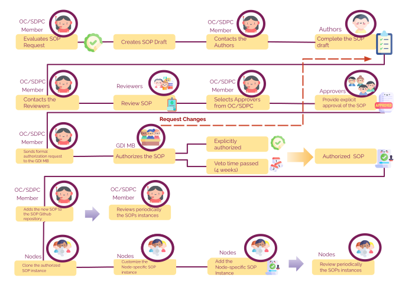
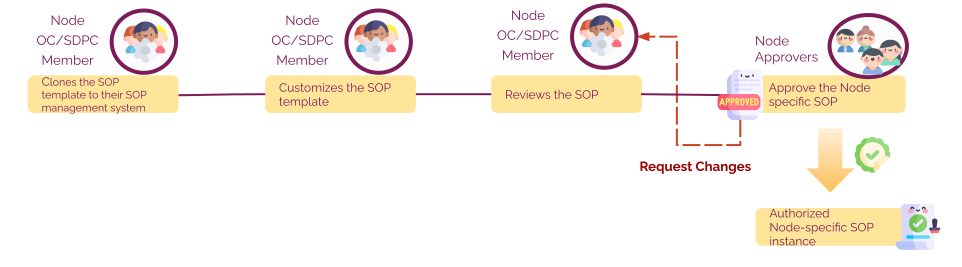

# European GDI - Procedures for Information Service Management for SOPs

## Index

1. [Document History](#1-document-history)
2. [Glossary](#2-glossary)
3. [Roles and Responsibilities](#3-roles-and-responsibilities)
4. [Purpose](#4-purpose)
5. [Scope](#5-scope)
6. [Introduction and Background Information](#6-introduction-and-background-information)
7. [Information Service Management Procedures](#7-information-service-management-procedures)

   - 7.1. [GDI SOP creation](#71-gdi-sop-creation)

     - 7.1.1. [European-level SOPs](#711-european-level-sops)
     - 7.1.2. [Node-specific SOP templates](#712-node-specific-sop-templates)
     - 7.33. [Node-specific SOPs](#713-node-specific-sops)

   - 7.2. [GDI SOP accessioning and file naming](#72-gdi-sop-accessioning-and-file-naming)

   - 7.3. [GDI SOP review and revision](#73-gdi-sop-review-and-revision)

   - 7.4. [GDI SOP access rules](#74-gdi-sop-access-rules)

8. [References](#references)

## 1. Document History

| Version | Author(s)        | Description of Changes                                                    | Date                |
| ------- | ---------------- | ------------------------------------------------------------------------- | ------------------- |
| v0      | Mallory Freeberg |                                                                           | 9th of April 2024   |
| v1      | Silvia Bahena    | Updated information about the current status of the SOPs creation process | 2nd of October 2024 |

## 2. Glossary

The following table defines the abbreviations and terms relevant to GDI SOPs.

| Abbreviation | Description                                   |
| ------------ | --------------------------------------------- |
| FAIR         | Findable, Accessible, Interoperable, Reusable |
| GDI          | European Genomic Data Infrastructure          |
| IMS          | Information Management System                 |
| MB           | Management Board                              |
| OC           | Operations Committee                          |
| QMS          | Quality Management System                     |
| SDPC         | Security and Data Protection Committee        |
| SOP          | Standard Operating Procedure                  |

| **Term**                   | **Definition**                                                                  |
| -------------------------- | ------------------------------------------------------------------------------- |
| European-level SOP         | SOPs to be followed for GDI processes at the European level.                    |
| Node-specific SOP template | Templates for SOPs that can be tailored to the specific processes of each node. |

## 3. Roles and Responsibilities

| Role         | Full name             | GDI/node role   | Organisation            |
| ------------ | --------------------- | --------------- | ----------------------- |
| **Author**   | Mallory Freeberg      | Task 4.3 member | EMBL-EBI                |
| **Author**   | Silvia Bahena         | Task 4.3 member | EMBL-EBI                |
| **Reviewer** | Jeroen Belien         | GDI-Member      | Health-RI/Amsterdam UMC |
| **Reviewer** | Mattias Strömberg     | Task 4.3 member | UU                      |
| **Reviewer** | Elisavet Torstensson  | Task 4.3 member | UU                      |
| **Reviewer** | Gabriele Rinck        | Task 4.3 member | EMBL-EBI                |
| **Reviewer** | Marcos Casado Barbero | Task 4.3 member | EMBL-EBI                |
| **Approver** |                       |                 |                         |
| **Approver** |                       |                 |                         |

## 4. Purpose

This document aims to ensure the effective management of information across all activities related to the delivery and management of GDI services at both the European and national node levels. It focuses on preserving the confidentiality, integrity, and accessibility of relevant information across both levels.

## 5. Scope

This document applies to all GDI staff responsible for managing and implementing GDI SOPs at both the European and national node levels, unless otherwise specified.

## 6. Introduction and Background Information

To ensure consistent management practices, the GDI network utilizes an Information Management System (IMS), which is a framework designed to systematically manage information flows across the infrastructure. The IMS ensures that information is handled securely and efficiently, fostering improved decision-making, enhanced communication, and better compliance with regulatory requirements.

In line with this, the implementation of SOPs must follow clear procedures established within the IMS. This ensures that all staff members adhere to best practices, contributing to the optimal functioning and continuous improvement of the GDI network.

Together with the [Charter](./GDI-SOP_charter.md), which defines the scope and management of SOPs within the GDI network, the IMS provides the structural foundation necessary for effectively managing SOPs. It ensures they are consistently applied across all nodes of the GDI network, from development through to execution.

## 7. Information Service Management Procedures

### 7.1. GDI SOP creation

#### 7.1.1. European-level SOPs

For each European-level GDI SOP, only one SOP document is produced which all GDI nodes are expected to follow. The need for a new European-level GDI SOP is first identified by one or more GDI project partners who will then prepare a proposal, making use of the GitHub repository "[New SOP Request](https://github.com/GenomicDataInfrastructure/standard-operating-procedures/issues/new/choose)" Github issue template. The proposal should include the purpose and scope of the SOP and a justification for its need. Once the proposal for a new European-level GDI SOP is approved by the Operations Committee (OC) and/or the Security and Data Protection Committee (SDPC), then work can begin on creating the new SOP following the Steps below (Figure 1). For more in detail information, refer to this "[Context Diagram.](https://github.com/GenomicDataInfrastructure/standard-operating-procedures/blob/dev/sops/european-level/GDI-SOP0007_SOP-template-creation.md#7-summary-or-context-diagram)"

**Steps:**

1. After a SOP request is received in the repository, a OC/SCDP member evaluates the request. If it is valid, the OC/SCDP member prepares the SOP draft from the [GDI General SOP template.](./GDI-SOP_sop-template.md)
2. OC/SCDP member shares the template with the authors (OC/SDPC or nominated experts) to write the SOP (i.e. fill in the content).
3. After the drafting is completed, the OC/SCDP member shares the draft internally or with experts to review for completeness.
4. Both committees (OC/SDPC) approve the reviewed document.
5. The OC/SDPC member then shares the approved SOP with the GDI MB for authorization.
6. GDI MB reviews the SOP and authorises or requests changes (repeat from Step 3)
7. OC/SDPC accessions ([7.2.](#72-gdi-sop-accessioning-and-file-naming))the authorised SOP according to the agreed process and the SOP goes into production.
8. OC/SDPC initiates periodic review cycle ([7.3.](#73-gdi-sop-review-and-revision)), if updates are needed then repeats steps 3-6.

_Figure 1: Workflow for creating and approving European-level SOPs._

#### 7.1.2 Node-specific SOP templates

For each Node-specific SOP, first a template is created and approved at the European level, as explained above ([7.1.2](#712-node-specific-sop-templates)). Once approved, the SOP template is then used by each node to create their own SOP instance ([7.1.3](#713-node-specific-sops)) which is approved at the node level. The steps below describe how to get a node-specific template created and approved.

**Steps:**

1. After a SOP request is received in the repository, a OC/SCDP member evaluates the request. If it is a valid request,the OC/SCDP member prepares the SOP draft from the [GDI General SOP template.](./GDI-SOP_sop-template.md)
2. OC/SCDP member shares template with the authors( OC/SDPC or nominated experts) to write the SOP (i.e. fill in the content).
3. After the drafting is completed, the OC/SCDP member shares the draft internally or with experts to review for completeness.
4. Both committees (OC/SDPC) approve the reviewed document.
5. The OC/SDPC member then shares the approved SOP with GDI MB for authorization.
6. GDI MB reviews the SOP and authorises or requests changes (repeat from Step 3).
7. OC/SDPC accessions ([7.2.](#72-gdi-sop-accessioning-and-file-naming)) the approved SOP template according to agreed process and informs the nodes that the SOP template is ready to be adapted to their own node processes (Figure 1).
8. OC/SDPC initiates periodic review cycle ([7.3.](#73-gdi-sop-review-and-revision)), if updates are needed then repeats steps 3-6.

#### 7.1.3. Node-specific SOPs

For each Node-specific SOP, first a template is created and approved at the European level ([7.1.2.](#712-node-specific-sop-templates)). Once approved, the template is then used by each node to create their own SOP instance ([7.1.3.](#713-node-specific-sops)) which is approved at the node level. The Steps below describe how nodes will create their node-specific SOPs.

**Steps:**

1. OC/SDPC representative(s) from each node copy the SOP template to their node’s [SOP management system](https://github.com/GenomicDataInfrastructure/standard-operating-procedures/blob/main/docs/GDI-SOP_github-management.md).
2. OC/SDPC representative (or nominated experts) uses the Node-specific SOP template (from [7.1.2.](#712-node-specific-sop-templates)) to create their node's instance of that SOP, according to their node’s needs, and internally review for completeness
3. OC/SDPC representative initiates their node-defined approval process for the node-specific SOP instance.
4. Node-appointed approver then approves or requests changes (repeat from Step 2).
5. OC/SDPC member(s) from the node accessions ([7.2.](#72-gdi-sop-accessioning-and-file-naming)) the approved SOP according to the agreed process and the SOP goes into production at their node.
6. Nodes should implement a periodic review cycle. The reviews and revisions should follow guidelines for GDI SOP revision and review ([7.3.](#73-gdi-sop-review-and-revision)).

_Figure 2: Workflow for creating and approving node-specific SOP instances._

### 7.2. GDI SOP accessioning and file naming

The [GDI SOP Accessioning Proposal](./GDI-SOP_sop-accessioning.md) is a specialized document that outlines the SOP accessioning system for the GDI project. It covers guidelines for SOP identifier formats, file naming conventions, automation workflows, repository structure, version control, and referencing mechanisms. The aim is to enhance the management, versioning, and referencing of SOPs to ensure clarity, consistency, and efficiency within the project.

### 7.3. GDI SOP review and revision

The SOPs in the GDI network will follow a structured review cycle to ensure they stay relevant, effective, and compliant. Reviews will take place both annually and on demand as described below:

1. **Annual Review Cycle**: Each SOP will be reviewed annually. The OC/SDPC will initiate and oversee the review.
   The OC/SDPC will check the SOP’s relevance, clarity, and effectiveness based on the based on the [SOP Review Check List](./GDI-SOP_review-checklist.md), then updates or changes will be made as necessary.

2. **Ad-Hoc Review Requests**: Any GDI member can request a review if they believe a process needs to be updated or improved.

- Submission Process:

  Review requests are submitted by creating a GitHub issue. We recommend to use the [SOP Content Change Suggestion](https://github.com/GenomicDataInfrastructure/standard-operating-procedures/issues/new?assignees=&labels=help+wanted%2Cenhancement&projects=&template=content_suggestion.yaml&title=%5BChange+Suggestion%5D+%3CTitle%3E) template, adding the `'SOP-review'` label to the GH issue.

The OC/SDPC will evaluate the request and decide if the review is justified.

**Automating reminders for the Review Cycle**

An automated workflow in [GitHub](./github/workflows/review_reminder.yml) was created to streamline the annual review process. The workflow will get automatically triggered run every month, calling a [python script](scripts/check_sop_reviews.py) that performs the following:

Checks all SOPs, one by one, if they are due for review, using the last date entry of each SOP's Document History. If this value is older than one full year, the SOP is considered for review.
For each SOP due for review, the script creates a new GitHub issue, labelled with `'SOP-review'`, listing the actions to take for the SOP to be reviewed. This happens only if there are no other open GH issues for that same SOP with the same label.
GitHub issues propagate automatically to the ZenHub board, and those labeled with `'SOP-review'` shall go into the "SOP-reviews" pipeline in the board for clarity.

All reviews, regardless of the trigger, will be recorded in the SOP’s revision history (i.e., their Document History). The status of each review will be monitored through the ZenHub board to ensure that actions are taken timely. If a review deems that an SOP needs to be updated in content (i.e., revision is due), the changes will undergo similar development stages as those described in [GDI-SOP0007_SOP Template creation](sops/european-level/GDI-SOP0007_SOP-template-creation.md).

### 7.4. GDI SOP access rules

It is critical for maintaining quality and consistency across procedures to ensure that only the latest, fully authorized version of an SOP is used, for this a process is established to differentiate between current and obsolete versions.

1. Version Control and Differentiation: The latest, fully authorized SOP versions should be clearly distinguished from outdated, obsolete versions. This helps prevent the use of incorrect or outdated procedures that could lead to errors. To achieve this, version control systems such as GitHub and Zenodo are employed. This systems provide robust version control and archiving mechanisms.

2. Access Control: Within an appropriate Quality Management System (QMS), access to obsolete or outdated SOP versions should be restricted. While GitHub allows version tracking, care must be taken to configure access settings in a way that limits visibility to old versions, ensuring only the latest authorized SOPs are readily accessible. This could involve setting strict branch protections or archiving mechanisms that prevent access to outdated SOPs.

3. FAIR Principles and Accessibility: Following FAIR (Findable, Accessible, Interoperable, Reusable) sharing principles, all authorized European-level SOPs, as well as templates for node-specific SOPs templates, will be openly accessible through the GDI GitHub repository. This ensures transparency and encourages consistent usage across different nodes and projects.

4. Node-Specific SOP Access: Individual nodes are responsible for determining access rules for their specific SOPs. These SOPs, adapted to meet local requirements, may have different access permissions depending on the node’s specific quality control policies, while maintaining the transparency required by the overarching FAIR principles.

## 8 References

<table>
  <tr>
   <td><strong>References</strong>
   </td>
   <td><strong>Description</strong>
   </td>
  </tr>
  <tr>
   <td><a href="./GDI-SOP_charter.md">1</a>
   </td>
   <td>European GDI - SOP Charter
   </td>
  </tr>
  <tr>
   <td><a href="./GDI-SOP_ORR.md">2</a>
   </td>
   <td>European GDI - Organisational Roles and Responsibilities
   </td>
  </tr>
    <tr>
   <td><a href="./GDI-SOP_sop-template.md">3</a>
   </td>
   <td>European GDI - General SOP template
   </td>
  </tr>
    <tr>
   <td><a href="./GDI-SOP_sop-accessioning.md">4</a>
   </td>
   <td>European GDI - SOP Accessioning Proposal
   </td>
  </tr>
    <tr>
   <td><a href="./GDI-SOP_review-checklist.md">5</a>
   </td>
   <td>European GDI - Review Check List
   </td>
  </tr>
      <tr>
   <td><a href="./sops/european-level/GDI-SOP0007_SOP-template-creation.md">6</a>
   </td>
   <td>European GDI - GDI-SOP0007_SOP Template creation
   </td>
  </tr>
    <tr>
   <td><a href="https://www.flaticon.com/authors/freepik">7</a>
   </td>
   <td>Schemas Icons
   </td>
  </tr>
</table>
