# Introduction to GitHub for GDI SOP Maintainers

This guide is designed to **help maintainers** (see [ORR](../docs/GDI-SOP_organisational-roles-and-responsibilities.md)) of the [Genomic Data Infrastructure (GDI) SOP Repository](https://github.com/GenomicDataInfrastructure/standard-operating-procedures) understand and navigate the **basic functionalities of GitHub**. It covers the essentials of creating and managing pull requests, handling issues, working with branches, and using GitHub workflows within the context of SOP maintenance.

It is worth noting that this guide is a fraction of the incredibly detailed (and much better written) [**official GitHub documentation**](https://docs.github.com/en/get-started). This guide of ours is specifically targeted to this repository and covers the bare minimum.

## Index
1. [What is GitHub?](#what-is-github)
2. [Understanding the Repository](#understanding-the-repository)
3. [Issues](#issues)
4. [Branches](#branches)
5. [Pull Requests (PRs)](#pull-requests)
6. [Workflows and Linting](#workflows-and-linting)
7. [General Recommendations](#general-recommendations)
8. [Further Reading](#further-reading)

## What is GitHub?

GitHub is a cloud-based platform that allows for **collaborative development of projects through version control**. For this repository, GitHub allows multiple maintainers and contributors to work on the **Standard Operating Procedures (SOPs)** simultaneously, ensuring that changes are tracked and reviewed before they are added to the `main` branch. Each repository is made up of a combination of code files, documentation, and workflows that automate certain actions (e.g., verifying formatting of SOPs).

If you are familiar with Google Drive, OneDrive, or Dropbox, you can think of GitHub as a similar platform. Even though the differences are notable, for the purpose of this introduction, you can imagine that when you modify a GitHub repository, you are modifying a directory (i.e., a folder) shared with contributors through the internet. We will promptly discuss the features of GitHub that go beyond just storing files.

### Key GitHub Concepts:
- **Repository** (_blue_): A directory containing project files. In this case, the GDI SOP repository stores the SOPs and associated metadata.
- **Branch** (_yellow_): A separate version of the repository where you can work on changes without affecting the main codebase (also known as the `main` branch).
- **Commit** (_orange_): A record of changes made to files. As the name implies, when you "commit" any change to a file, you are committing those changes to the branch where you are working.
- **Pull Request (PR)** (_pink_): A request to merge changes from one branch to another.
- **Issue** (_green_): A way to track tasks, improvements, or bugs in the repository.

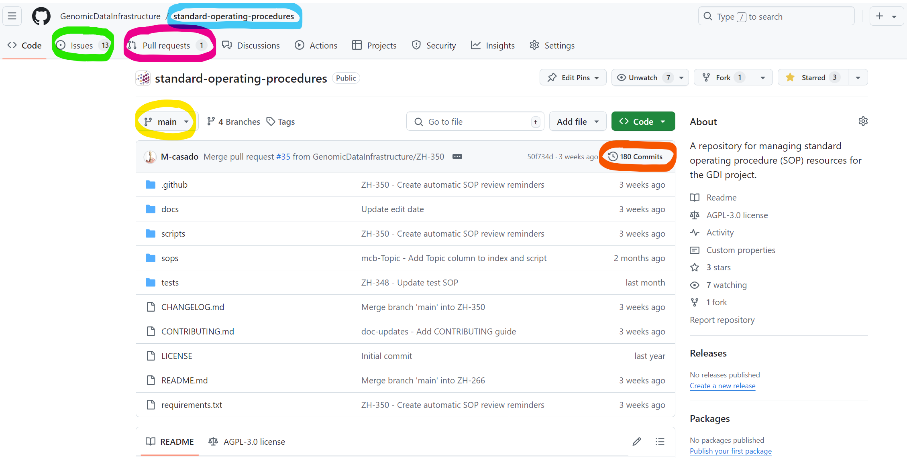

We will elaborate on these key concepts further in the sections below.

### Example of GitHub usage
See the diagram below for a simple example of how changes are propagated through the branches of this repository.

From left to right:
- The GDI SOP repository (`main` branch) was created.
- New changes (e.g., documentation files) were added.
- A new branch (`dev`) was created to hold 'new features' until they were ready to be part of the `main` branch.
- A new SOP was scheduled, so another branch, `new-SOP`, was created.
- After adding and reviewing the new SOP, it was merged into the `dev` branch.
- More work was done on `dev` (e.g., adding new documents, SOPs, modifying content). Keep in mind that so far, the `main` branch remained unaltered.
- Eventually, when the new changes in `dev` (including the "new SOP") were ready, `dev` was merged into `main`.

````mermaid
gitGraph
    commit id: "Initial project"
    commit id: "New changes"
    branch dev
    checkout dev
    commit id: "Create 'dev' branch"
    commit id: "More changes"
    branch new-SOP
    checkout new-SOP
    commit id: "Create new branch"
    commit id: "Add new SOP"
    commit id: "Revise new SOP"
    checkout dev
    merge new-SOP id: "Merge new SOP into dev"
    commit id: "Continue work on dev"
    checkout main
    merge dev id: "Merge dev into main"
    commit id: " "
````

## Understanding the Repository

This repository has a specific folder and file structure, including:
- **`/docs/`**: Contains documentation files, including this guide.
- **`/sops/`**: Contains the Standard Operating Procedures (SOPs).
- **`/scripts/`**: Contains Python scripts used in workflows to automate certain processes. These scripts are called from elsewhere, either manually or automatically, to ease some tasks.
- **`/.github/`**: Contains bits that you could consider part of the "settings" of the repository, like Pull Request and Issue templates, as well as workflows.
- **`README.md`**: The main landing page for the repository, explaining its purpose. There may be multiple other ``README.md`` files in other folders, which are rendered by GitHub as soon as you enter a directory.

Refer to the [**GDI-SOP charter**](../docs/GDI-SOP_charter.md) for more information on the structure and purpose of this repository.

Refer to the [**SOP accessioning guide**](../docs/GDI-SOP_sop-accessioning.md) for more details on how files in this repo are named and organised.

## Issues

Issues are used to track tasks, requests, or bugs. When you (or anyone) creates an issue in the repository, it automatically gets added to the [**ZenHub board**](https://app.zenhub.com/workspaces/t43-gdi-sops-667c1c5532726a00b93d51e4/board) used by GDI for project management.

You can find more details about GitHub issues in the [**GitHub Issues documentation**](https://docs.github.com/en/issues).

### Creating an Issue
1. Navigate to the **Issues** tab at the top of the repository.
2. Click on [**New Issue**](https://github.com/GenomicDataInfrastructure/standard-operating-procedures/issues/new/choose).
3. Select the appropriate template (e.g., "New SOP Request").
4. Fill in the necessary details and submit.

Make sure to assign relevant labels, milestones, and the person responsible.

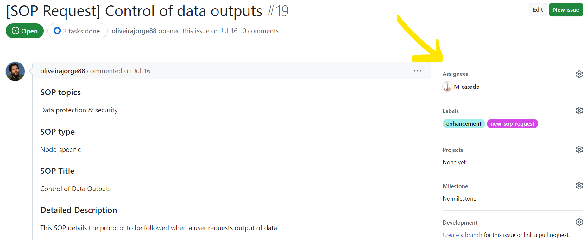

The issue will now appear in the issues list and on the ZenHub board.

## Branches

Branches allow you to **work on changes without affecting the `main` branch**. When you create a branch, you are effectively creating a "copy" of the repository content. You can modify this copy freely without affecting others until you merge it back into another branch.

Find more details in [**GitHub's official documentation about branches**](https://docs.github.com/en/pull-requests/collaborating-with-pull-requests/proposing-changes-to-your-work-with-pull-requests/about-branches).

### Main Branches in the Repository
- **`main`**: The primary branch, representing the most stable version of the repository. This branch is what everyone sees when they land on the repository.
- **`dev`**: A branch where new features and changes are tested before being merged into `main`.

### Creating a New Branch
1. Navigate to the **Code** tab.
2. Click the "Branches" button.
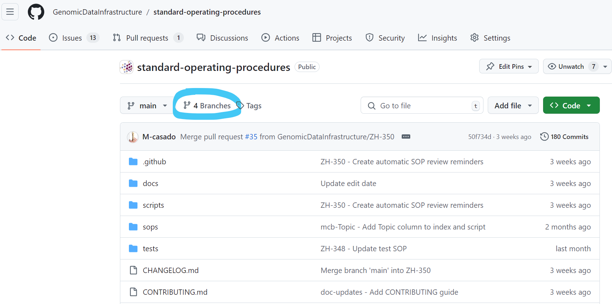
3. Click "New branch", provide the new branch a name, and select the source. The source is very relevant since it is the branch you are effectively "copying" into your new branch. You might want to start from `main`, or perhaps copy `dev`.
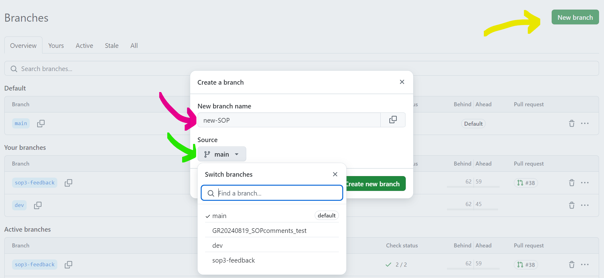

### Best Practices
- 🚨 **Never commit directly to the `main` branch** 🚨. Committing this way happens when you are in the `main` branch, change something, and commit those changes to the same branch.
  - As a rule of thumb, unless you know exactly what you're doing (and sometimes even then), **never commit changes to `main`**.
  - You may break things without realising it, and you would bypass all checks in place for Pull Requests and versions.
  - To avoid this, always create a new branch for your changes.
- Generally, use the `dev` branch as your source when creating a new branch.
- Keep branch names clear, short, and informative (e.g., `ZH-301`, or `diagram-quickfix`, not `my-branch` or `123`).

## Pull Requests

**Pull Requests** (PRs) are used to **propose changes from one branch to another**. They ensure that changes are reviewed before being added to the repository. To draw a parallel with Google Drive, when you enter "suggestion mode" and propose changes to a document, you are doing something similar to a PR, which the document owner will later approve. GitHub PRs work similarly, but in much more detail.

Refer to [**GitHub's official documentation on Pull Requests**](https://docs.github.com/en/pull-requests/collaborating-with-pull-requests/proposing-changes-to-your-work-with-pull-requests/about-pull-requests) for more details.

### Creating a Pull Request
1. Once you have finished your changes on a branch, go to the **Pull Requests** tab.
2. Click **New Pull Request**.
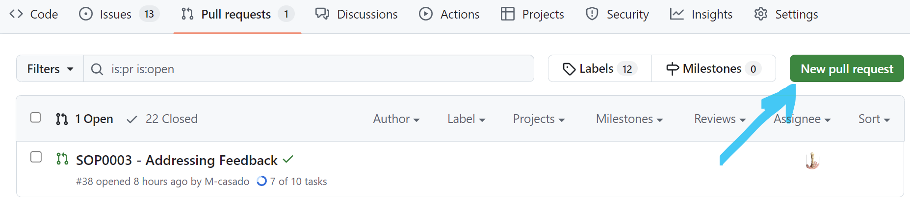
3. Select the branch you want to merge from (e.g., `sop3-feedback`) and the branch you want to merge into (likely `dev`), and click on "Create pull request".
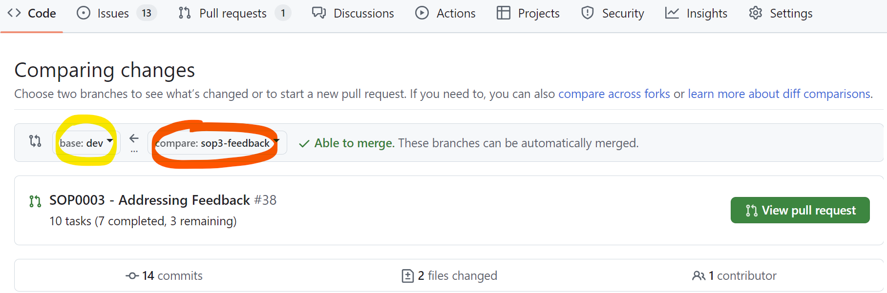
4. The description will be prefilled by the PR template: fill it out with useful information for your PR.
5. Assign reviewers, labels, and pertinent labels.
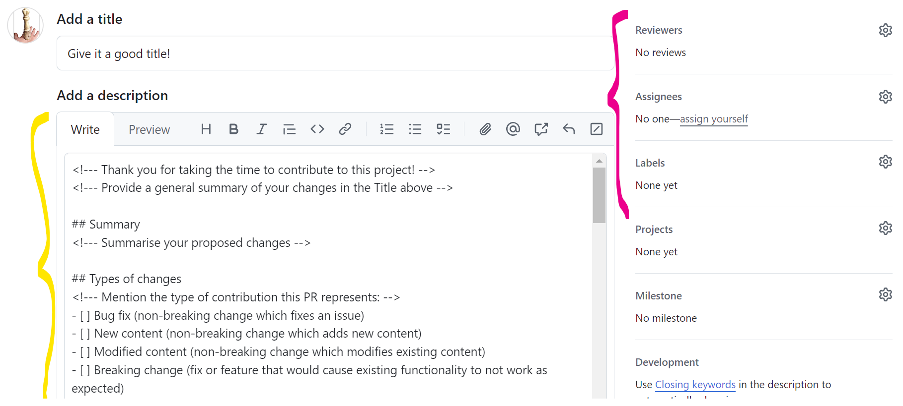
6. Click "Create pull request".

### Reviewing a Pull Request
As a maintainer, you will likely be assigned as a reviewer for PRs.

Please refer to the [**official GitHub documentation about Pull Request reviews**](https://docs.github.com/en/pull-requests/collaborating-with-pull-requests/reviewing-changes-in-pull-requests/about-pull-request-reviews) for further details. Below, we cover the minimum steps:

1. Navigate to the **Pull Requests** tab and select the PR you want to review.
2. In the PR, you can see the conversation tab with previous comments, the PR description, etc.
3. To review the changes in detail, go to the **Files changed** tab (_yellow_), where you will find every changed file listed. The view for each file is split in two: the left side shows the previous version; the right side shows the proposed version. Differences between the two are highlighted for convenience.
4. You can click on the `+` symbol next to any line of code to **leave comments**. Click "Start a review" and add as many comments as needed.
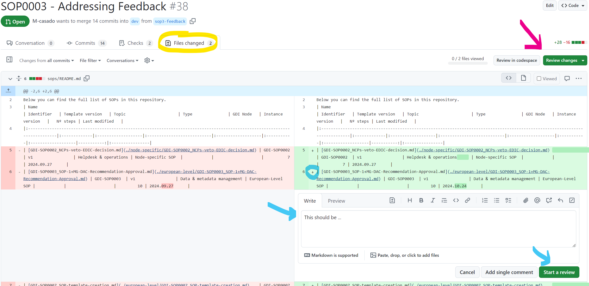
5. Once you have reviewed the changes, click on the **Review changes** button, where you can choose to add a comment, approve the PR, or request changes.
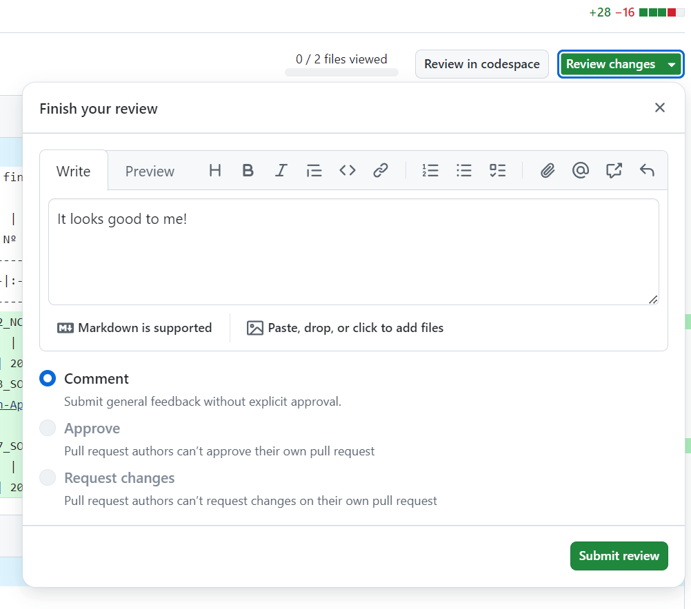

For **more details on the reviewing process**, refer to the [**review checklist**](../docs/GDI-SOP_review-checklist.md).

## General Recommendations

- **Do not push directly to `main`**: Always use a PR to propose changes.
- **Check PR origin**: Review who submitted the PR and ensure it follows repository guidelines before merging.
- **Ensure workflow checks pass**: Before merging a PR, ensure that all GitHub Actions workflows have passed (e.g., linting).
- **Clear commit messages**: Use descriptive commit messages to help maintain a clean history (e.g., `ZH-301 - Fix SOP typo in section 2.3`).

## Workflows and Linting

GitHub Workflows, also known as GitHub Actions, help **automate certain actions in the repository**. In the GDI SOP repository, workflows are used, for example, to ensure SOPs follow proper formatting and style guidelines before merging them.

You can **find the workflow configurations for this repository** in the [`.github/workflows/`](../.github/workflows/) directory, and the scripts they run in the [`scripts/`](../scripts/) folder. To learn more about each specific workflow, see the description at the top of the corresponding workflow file in `.github/workflows/`.

Generally speaking, if everything works as expected, you will not need to dive much into this repository's workflows. Instead, they will simply aid you with visually appealing icons at Pull Requests:
- ✔️ - Implies that the **workflow(s) finished correctly** and all checks were passed. 
- ❌ - Implies that **something went wrong**. This requires further investigation (see example below).

Let's go over a simple example of how a workflow aided in a [recent Pull Request](https://github.com/GenomicDataInfrastructure/standard-operating-procedures/pull/38). In this PR, ``M-casado`` created a PR against the ``dev`` branch, which triggered some of the workflows:
- Compare SOP index table ([``compare_index.yml``](../.github/workflows/compare_index.yml)). It has a ❌, letting us know that something went wrong.
- Linter of SOPs ([``lint_sops.yml``](../.github/workflows/lint_sops.yml)). It has a ✔️, so it checked the SOPs in this branch and lets us know that they seem to be well formatted.

Notice at the bottom of the image below that, once the owner of the PR noticed the error through this workflow, it was amended and a checkmark ✔️ was obtained. We will see below how to identify errors from the report of these workflows, and based on them one simply needs to edit the files that were affected.

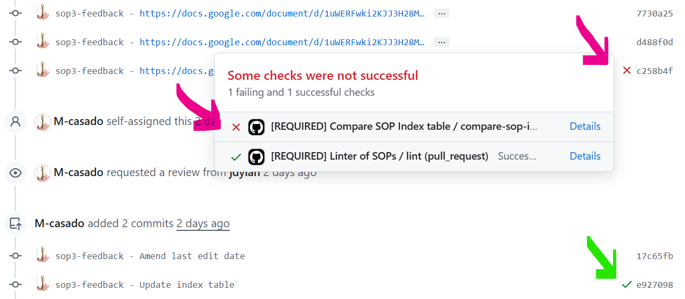

To see further we can click on the **Details** next to the workflow that failed (see image below). You can inspect for yourself the same page [**here**](https://github.com/GenomicDataInfrastructure/standard-operating-procedures/actions/runs/11477389761/job/31939356879). This is the report that each workflow gives, besides the simple emoji above mentioned.

In the details of the workflow, you can see that something went wrong at the ``Run SOP index comparison`` step (the only one with 🔴). If we take a closer look, we can see that there is some code executed at this step, and the error displayed at the bottom says "Process completed with exit code ``1``" (i.e., there was an error). Instead of having to dig up exactly why ourselves, the message (in JSON format) that the script prints (see highlighted green below) gives us all the needed clues:
- There were some differences between the existing [SOP index table](../sops/README.md) and the one that the script created (representing the latest version).
- The difference was identified for ``GDI-SOP0003`` and specifically at the ``Last modified`` column of the table, where the values were not matching.

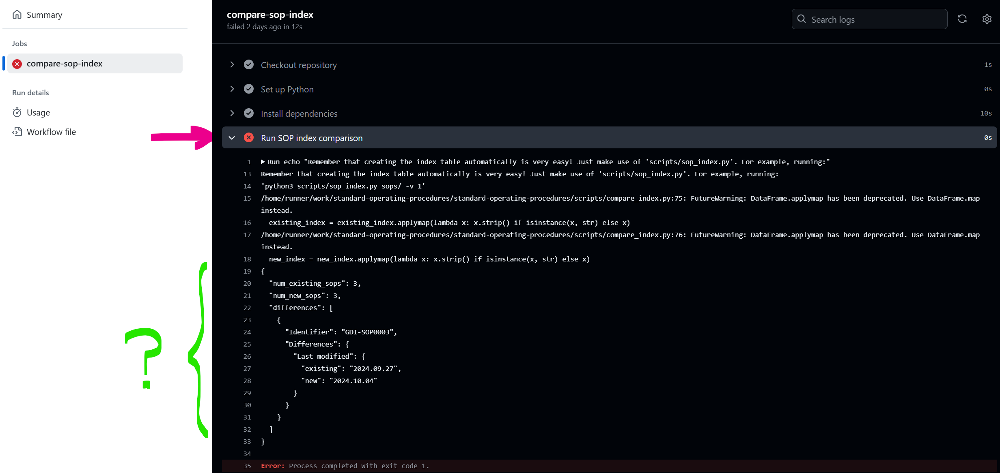

To fix it was simple, ``M-casado`` updated the index table in the [**next commit**](https://github.com/GenomicDataInfrastructure/standard-operating-procedures/pull/38/commits/e92709896a20f4ab1cf58d18472e87594cdcdc97), and pushed the changes back to the remote branch (the one with changes), which triggered again the workflow and this time both returned with no errors (✔️).

It is crucial to know that the execution details of each workflow are heavily tied to how they were written. Therefore, the defined exit codes and printed messages across workflows will likely vary.

You can find a full list of all executed actions in the corresponding [**Actions**](https://github.com/GenomicDataInfrastructure/standard-operating-procedures/actions) tab of the repository.

Documentation on GitHub workflows is very detailed, _perhaps too much_ for the level aimed in this guide. If you want to know more about workflows, it may be best to refer to the [**Creating an example workflow**](https://docs.github.com/en/actions/use-cases-and-examples/creating-an-example-workflow) page.