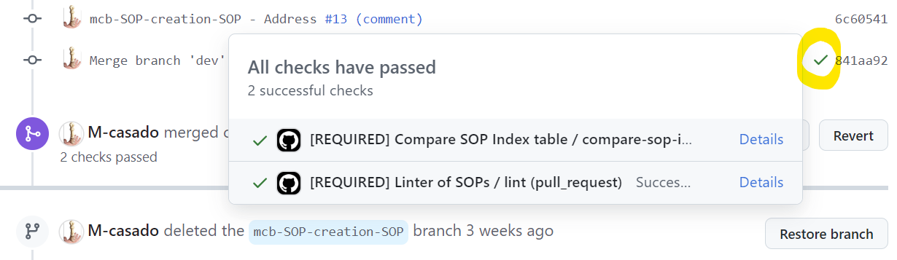

# SOP Review Checklist

This checklist serves as a guide for **SOP reviewers, approvers, and authorizers**. It outlines the steps and key points to ensure that the SOPs are complete, clear, and compliant with the GDI framework. All reviewers should ensure each point is met before moving on to the next step. Approvers and authorizers have additional responsibilities as noted below.

## General SOP Review Checklist

### 1. **Document Structure & Formatting**
- [ ] **Compliance with SOP template**: Ensure that the SOP complies with the latest SOP template (see [``GDI-SOP_sop-template.md``](./GDI-SOP_sop-template.md)). Annotations in the template (between ``<>``) contain useful information and formatting rules, including:
    - **Required Sections**: Ensure the SOP includes the required sections (e.g., ``Index`` or ``Procedures``).
    - **Linting Process**: Check that key values (e.g., the SOP title, the SOP number...) make sense and comply with the expected format.
- [ ] **Document Consistency**: Check for consistent formatting, structure, and numbering throughout the SOP.
- [ ] **Metadata**: Verify that metadata in all tables (e.g., versioning, dates, authors...) is included and accurate.

#### Linting Script
To ease the document linting process, the script ``sop_linter.py`` was created. This script **checks multiple parts of the format of an SOP**, and retrieves any given errors.

You can **manually execute** the script to ensure a file (i.e., the SOP document) passes the linting checks as follows:
````
cd standard-operating-procedures
pip install --upgrade --no-deps -r requirements.txt
python3 scripts/sop_linter.py tests/GDI-SOP0000_sop-template_for_linting.md -v 1
````

Replace the test SOP (``tests/GDI-SOP0000_sop-template_for_linting.md``) with the file path of the SOP you are reviewing.

If there are no linting errors, the output will look like the following:
````
{
  "tests/GDI-SOP0000_sop-template_for_linting.md": {
    "errors": [],
    "warnings": []
  }
}
````

For your convenience, the script is automatically executed (via [``lint_sops.yml``](../.github/workflows/lint_sops.yml) workflow) whenever a [Pull Request](https://github.com/GenomicDataInfrastructure/standard-operating-procedures/pulls) (PR) containing SOPs is created. Therefore, if you are reviewing a PR, you can **easily see if the SOPs comply with the expected format** by ensuring that the **latest commit has the green check mark** (✔️) next to it.



If, on the contrary, the latest commit has a red cross (❌), some of the checks did not pass and it requires further inspection.

### 2. **Content Completeness**
- [ ] **Purpose and Scope**: Ensure the SOP clearly states its purpose and scope, with no ambiguity about the intended outcomes.
- [ ] **Roles and Responsibilities**: Confirm that the roles are clearly defined and all stakeholders (OC, SDPC, authors, reviewers, etc.) are properly referenced.
- [ ] **Procedures**: Review all procedures for clarity and completeness. Procedures should include step-by-step instructions that are easy to follow.
- [ ] **References**: Ensure any external references, tools, or resources are correctly cited and linked if applicable. Make sure that all hyperlinks work as expected.

### 3. **Clarity & Usability**
- [ ] **Language**: Verify the SOP is written in clear, simple language, avoiding jargon where possible.
- [ ] **Consistency**: Ensure terms and abbreviations are used consistently throughout the document, as defined in the glossary, and also across the related SOPs, where appropriate.
- [ ] **Glossary**: Check that the glossary includes all acronyms that are being used throughout the document.
- [ ] **Examples/Diagrams**: Check for the presence of any necessary examples, diagrams, or clarifying notes to aid understanding.

### 4. **Operational Feasibility**
- [ ] **Applicability**: Evaluate whether the content of SOP is relevant to the intended operational environment and aligned with GDI objectives.
- [ ] **Scalability**: Depending on the type of SOP, ie "European-level" or "Node-specific", review how the SOP is applicable to all GDI nodes, or specifies any node-specific requirements, respectively.
- [ ] **Feasibility**: Ensure that the procedures are feasible for the assigned roles and aligned with the technological capabilities of the nodes.

### 5. **Cross-Referencing and SOP Compliance**
- [ ] **Referencing Existing SOPs**: Check that the SOP does not significantly overlap or conflict with other existing SOPs, and ensure that references to any related SOPs are included. See the full [list of released SOPs](../sops/README.md).
- [ ] **Compliance with SOP Development SOP**: Verify that the SOP has followed the procedure outlined in the [``GDI-SOP0007_SOP-template-creation.md``](../sops/european-level/GDI-SOP0007_SOP-template-creation.md), including review stages and deadlines.

## Reporting and Escalation
- [ ] **Document your feedback** in the appropriate review platform: either the Google Document or Pull Request, depending on the SOP development phase.
- [ ] **Escalate comments to both the authors and the OC/SDPC member** in charge of this SOP development. These stakeholders are listed in the SOP's "Roles and Responsibilities" section. There are numerous ways to reach out to these roles, depending on the platform of review: ideally either Google Doc comments or GitHub Pull Request reviews; and secondarily through emails or directly GDI's slack workspace.

## Additional Checklist for Approvers

- [ ] **Impact Assessment**: Evaluate the potential impact of the SOP on operations, and confirm that it enhances standardization and efficiency across nodes.
- [ ] **Node Representation**: Confirm that the SOP has been reviewed by relevant representatives from GDI nodes, and their input has been incorporated.
- [ ] **Feedback Integration**: Ensure that all feedback from reviewers has been appropriately addressed in the final draft.

## Additional Checklist for Authorizers

- [ ] **Formal Authorization**: Confirm that the SOP is ready for final release, and provide authorization (or veto) for its inclusion in the GitHub repository. This veto period is defined in the SOP ``SOP Template creation``(../sops/european-level/GDI-SOP0007_SOP-template-creation.md) as **4 weeks** after the authorization request. If no comment is received before the veto can be exercised, the **SOP will automatically be considered authorized**.

## Tools & References

- **GitHub Repository**: [GDI SOP Repository](https://github.com/GenomicDataInfrastructure/standard-operating-procedures) (Check linting status, review, and approve PRs)
- [**SOP Template creation SOP**](../sops/european-level/GDI-SOP0007_SOP-template-creation.md)
- **ZenHub Board**: [T4.3 GDI SOPs](https://app.zenhub.com/workspaces/t43-gdi-sops-667c1c5532726a00b93d51e4/board)
