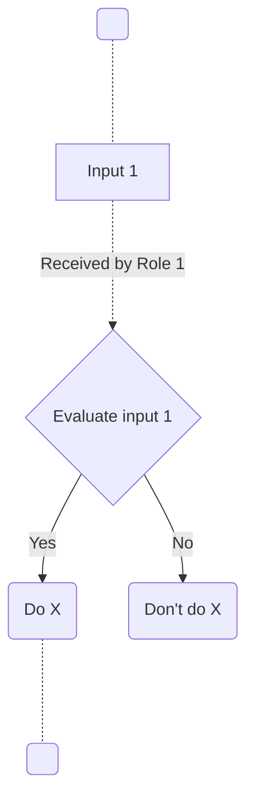

_< Below is a **template that you can use to create a new SOP**. You can start your new SOP by copying this document in different ways: copying the raw markdown of this document if you want to start from markdown; or by copying the rendered document as is, directly, and pasting it into another platform (e.g. Google Docs) if you want to use it elsewhere. >_

_< The template has some annotations and examples between ``<>``, with the only purpose of helping you fill out the content. >_

_< Follow the [accessioning documentation](https://github.com/GenomicDataInfrastructure/standard-operating-procedures/blob/main/docs/GDI-SOP_sop-accessioning.md) for identifying and naming your new SOP. >_

_< Make sure to always **use the latest version** of this [Generic SOP Template](https://github.com/GenomicDataInfrastructure/standard-operating-procedures/blob/main/docs/GDI-SOP_sop-template.md) from GDI's GitHub repository >_

# European GDI - < _SOP title_ >

_< Title of the SOP prepended by "European GDI:". The title must remain the same for all instantiations of the SOP (see more details at the [ISM document](https://github.com/GenomicDataInfrastructure/standard-operating-procedures/blob/main/docs/GDI-SOP_information-service-management.md)). **Only** for node-specific SOP instances, the GDI node and institution names must be added in the following table. >_

| Metadata          | Value         |
|-------------------|---------------------|
| Template SOP number  | _< ``GDI-SOP000...``. The number should be unique in the GDI SOP namespace. See [documentation](https://github.com/GenomicDataInfrastructure/standard-operating-procedures/blob/main/docs/GDI-SOP_sop-accessioning.md#identifier-format) for further details. >_ |
| Template SOP version      | _< ``vY``. See [documentation](https://github.com/GenomicDataInfrastructure/standard-operating-procedures/blob/main/docs/GDI-SOP_sop-accessioning.md#identifier-format) >_ |
| Template SOP Type      | _< Either "Node-specific SOP" or "European-Level SOP". See [documentation](https://github.com/GenomicDataInfrastructure/standard-operating-procedures/blob/main/docs/GDI-SOP_sop-accessioning.md#sop-life-cycle) >_ |
| GDI Node   | _< Unique Alpha-3 code for the node (e.g. SWE for Sweden). Only needed if the node is instancing the template. >_ |
| Instance version     | _< ``vZ``. See [documentation](https://github.com/GenomicDataInfrastructure/standard-operating-procedures/blob/main/docs/GDI-SOP_sop-accessioning.md#identifier-format). Only needed if a node is instancing the template. >_ |

## Index

1. [Document History](#1-document-history)
2. [Glossary](#2-glossary)
3. [Roles and Responsibilities](#3-roles-and-responsibilities)
4. [Purpose](#4-purpose)
5. [Scope](#5-scope)
6. [Introduction and Background Information - as needed](#6-introduction-and-background-information)
7. [Summary or Context Diagram - as needed](#7-summary-or-context-diagram)
8. [Procedure](#8-procedure)
9. [References](#9-references)

### 1. Document History
_< This section is required >_

_< Manual or automated tracking of the history of changes for this SOP. Notice how the template and instance have different version trackers, since there can be different combinations of versions. >_

| Template Version | Instance version | Author(s) | Description of changes       | Date       |
|---------|-----------|-----------|------------------------------|------------|
| _< ``v1`` >_ | _< ``v2`` >_ | _< Full name >_           | _< Modified node's instance at ... >_ | _< ``YYYY.MM.DD`` >_ |
| _< ``v1`` >_ | _< ``v1`` >_ | _< Full name >_           | _< SOP Instance of node ..., changed ... >_ | _< ``YYYY.MM.DD`` >_ |
| _< ``v1`` >_ | _< ``-`` >_| _< Full name >_           | _< First version of template... >_ | _< ``YYYY.MM.DD`` >_ |


### 2. Glossary
_< This section is required >_

_< Include definitions of node and/or SOP-specific concepts used in this SOP. >_

Find GDI SOPs common Glossary at the [**charter document**](https://github.com/GenomicDataInfrastructure/standard-operating-procedures/blob/main/docs/GDI-SOP_charter.md).

| Abbreviations | Description     |
|---------------|-----------------|
|               |                 |

| Term          | Definition      |
|---------------|-----------------|
|               |                 |

### 3. Roles and Responsibilities
_< This section is required >_

_< Roles and responsibilities table to be completed with who is responsible to author, review, approve, and authorize the SOP (see more details at the [ORR document](https://github.com/GenomicDataInfrastructure/standard-operating-procedures/blob/main/docs/GDI-SOP_organisational-roles-and-responsibilities.md)). To be decided how these responsibilities are shared between GDI/European-level operations and node-level operations. >_

See qualifications and responsabilities of the roles at the [**Organisational Roles and Responsibilities**](https://github.com/GenomicDataInfrastructure/standard-operating-procedures/blob/main/docs/GDI-SOP_organisational-roles-and-responsibilities.md) document.

| Role       | Full name       | GDI/node role   | Organisation |
|------------|-----------------|-----------------|--------------|
| Author     |                 |                 |              |
| Reviewer   |                 |                 |              |
| Approver   |                 |                 |              |
| Authorizer |                 |                 |              |

_< Example GDI/node roles: Legal Officer, Service Lead, Data Protection Officer, Admin Lead... >_

### 4. Purpose
_< This section is required >_

_< 1-2 sentence summary of the reason for having this SOP. What value does the SOP add? What will be accomplished by following this SOP? >_

### 5. Scope
_< This section is required >_

_< 1-2 sentence summary describing what is covered within this SOP, defining what the input (e.g., a user inquiry) and output (e.g., created and assigned HD ticket) of the SOP is. E.g., "This SOP covers from X to Y, and describes how to..." >_

### 6. Introduction and Background Information

_< Include if additional information is needed to ensure the SOP can be understood as a standalone document. Include definitions of SOP-specific concepts, and also include relevant definitions in the Glossary section below. >_

### 7. Summary or Context Diagram

_< If applicable, include a diagram (e.g., in mermaid or plantUML format) summarizing the SOP step-by-step. Diagrams could represent the larger context of where this particular SOP should be used, e.g., within a "virtual helpdesk", if that is useful. >_


### 8. Procedure
_< This section is required >_

_< List step-by-step hierarchical instructions for the SOP. Each step has at first a table with information, followed by an explanation of what is done at the step. For example: >_
#### 1. < Evaluate input 1 >
| Step identifier            | When             | Who |
|:------------------|:----|:----|
| _< 1 >_                     | _< When input 1 is received... >_ | _< The 1+MG Management Board at ... >_ |

_< After input 1 is received by ..., it is evaluated following this checklist: >_
- _< It is ... >_
- _< It contains ...>_
#### 2.1. < Do X >
| Step identifier            | When             | Who |
|:------------------|:----|:----|
| _< 2.1 >_                     | _< After positive evaluation at [step 1](#1--evaluate-input-1-)... >_ | _< The 1+MG Management Board at ... >_ |

_< If positive evaluation is received, then ... executes the following code: >_
```bash
echo "Hello world"
```
#### 2.2. < Do X >
| Step identifier            | When             | Who |
|:---------------------------|:-----------------|:----|
| _< 2.2 >_                  | _< After negative evaluation at [step 1](#1--evaluate-input-1-)... >_ | _< The 1+MG Management Board at ... >_ |

_< If negative evaluation is received, then ... executes the following code: >_
```bash
echo "Bye world"
```

### 9. References
_< This section is required >_

_< Include references to useful information to understand this document. >_

| Reference | Description                                          |
|-----------|------------------------------------------------------|
| [1](#)    | European GDI - SOP Charter (including Glossary)      |
| [2](#)    | European GDI - Procedures for Information Service Management (ISM) for SOPs |
| [3](#)    | European GDI - Organisational Roles and Responsibilities (ORR) |
| [4](#)    | ... |