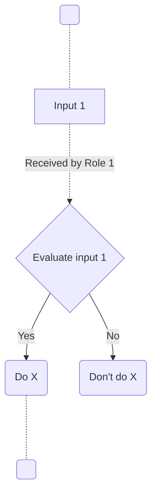

## SOP Example Template

Below is a template that you can use to start a new SOP. Click the "copy" icon to copy all the markdown text, and then past in a new file.

Follow the [accessioning documentation](sop-accessioning.md) for identifying and naming your new SOP.

````markdown
# European GDI - _SOP title_

_< Title of the SOP prepended by "European GDI:". The title must remain the same for all instantiations of the SOP. For node-specific SOPs, the GDI node name must be added in the subtitle. >_

| SOP Identifier | SOP Type | GDI Node             | Institution name |
|:--|:--|:--|:--|
| _< "GDI-SOP000..." See [documentation](../sop-accessioning#identifier-format) >_ | _< Either "Node-specific SOP" or "European Level SOP". See [documentation](../sop-accessioning#sop-life-cycle) >_ | _< Unique Alpha-3 code for the node (e.g. SWE for Sweden) >_ | _< Name of the GDI Node institution instancing the SOP (only if the SOP is of type "Node-specific SOP") >_ |

## Index

1. [Document History](#1-document-history)
2. [Glossary](#2-glossary)
3. [Roles and Responsibilities](#3-roles-and-responsibilities)
4. [Purpose](#4-purpose)
5. [Scope](#5-scope)
6. [Introduction and Background Information - as needed](#6-introduction-and-background-information)
7. [Summary or Context Diagram - as needed](#7-summary-or-context-diagram)
8. [Procedure](#8-procedure)
9. [References](#9-references)

### 1. Document History
_< This section is required >_

_< Manual or automated tracking of the history of changes for this SOP. >_

| Version | Author(s) | Description of changes       | Date       |
|---------|-----------|------------------------------|------------|
| v1.0.0      | _< Full name >_           | _< First version of SOP released, added ... >_ | _< YYYY.MM.DD >_ |
| v0.1.0      | _< Full name >_           | _< First review prior release, changed ... >_ | _< YYYY.MM.DD >_ |
| v0.0.0      | _< Full name >_           | _< First draft... >_ | _< YYYY.MM.DD >_ |


### 2. Glossary
_< This section is required >_

_< Include definitions of node and/or SOP-specific concepts used in this SOP. >_

| Abbreviations | Description     |
|---------------|-----------------|
|               |                 |

| Term          | Definition      |
|---------------|-----------------|
|               |                 |

### 3. Roles and Responsibilities
_< This section is required >_

_< Roles and responsibilities table to be completed with who is responsible to author, review, approve, and authorize the SOP. To be decided how these responsibilities are shared between GDI/European-level operations and node-level operations. >_

| Name     | GDI/node role | Organisation |
|----------|-----------------|--------------|
| Author   |                 |              |
| Reviewer |                 |              |
| Approver |                 |              |
| Authorizer|                |              |

*Example GDI/node roles: Legal Officer, Service Lead, Data Protection Officer, Admin Lead...*

### 4. Purpose
_< This section is required >_

_< 1-2 sentence summary of the reason for having this SOP. What value does the SOP add? What will be accomplished by following this SOP? >_

### 5. Scope
_< This section is required >_

_< 1-2 sentence summary describing what is covered within this SOP, defining what the input (e.g., a user inquiry) and output (e.g., created and assigned HD ticket) of the SOP is. E.g., "This SOP covers from X to Y, and describes how to..." >_

### 6. Introduction and Background Information

_< Include if additional information is needed to ensure the SOP can be understood as a standalone document. Include definitions of SOP-specific concepts, and also include relevant definitions in the Glossary section below. >_

### 7. Summary or Context Diagram

_< If applicable, include a diagram (e.g., mermaid or plantUML block) summarizing the SOP step-by-step. Diagrams could represent the larger context of where this particular SOP should be used, e.g., within a "virtual helpdesk", if that is useful. >_


### 8. Procedure
_< This section is required >_

_< List step-by-step hierarchical instructions for the SOP. Each step has at first a table with information, followed by an explanation of what is done at the step. For example: >_
#### 1. < Evaluate input 1 >
| Step identifier            | When             | Who |
|:------------------|:----|:----|
| _< 1 >_                     | _< When input 1 is received... >_ | _< The 1+MG Management Board at ... >_ |

_< After input 1 is received by ..., it is evaluated following this checklist: >_
- _< It is ... >_
- _< It contains ...>_
#### 1.1. < Do X >
| Step identifier            | When             | Who |
|:------------------|:----|:----|
| _< 1.1 >_                     | _< After positive evaluation at [step 1](#1--evaluate-input-1-)... >_ | _< The 1+MG Management Board at ... >_ |

_< If positive evaluation is received, then ... executes the following code: >_
```bash
echo "Hello world"
```
#### 1.2. < Do X >
| Step identifier            | When             | Who |
|:------------------|:----|:----|
| _< 1.2 >_                     | _< After negative evaluation at [step 1](#1--evaluate-input-1-)... >_ | _< The 1+MG Management Board at ... >_ |
_< If negative evaluation is received, then ... executes the following code: >_
```bash
echo "Bye world"
```

### 9. References
_< This section is required >_

_< Include references to useful information to understand this document. >_

| Reference | Description                                          |
|-----------|------------------------------------------------------|
| [1](#)    | European GDI - SOP Charter (including Glossary)      |
| [2](#)    | European GDI - Procedures for Information Service Management (ISM) for SOPs |
| [3](#)    | European GDI - Organisational Roles and Responsibilities (ORR) |
| [4](#)    | ... |
````


