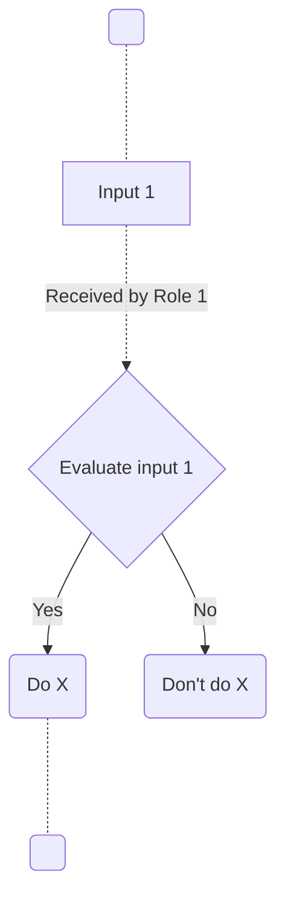

# European GDI - Test SOP for linting

| Metadata          | Value               |
|-------------------|---------------------|
| Template SOP number  | GDI-SOP0002 |
| Template SOP version | ``v1``          |
| Template SOP Type    | European-level SOP |
| GDI Node             |  |
| Instance version     |  |

## Index

1. [Document History](#1-document-history)
2. [Glossary](#2-glossary)
3. [Roles and Responsibilities](#3-roles-and-responsibilities)
4. [Purpose](#4-purpose)
5. [Scope](#5-scope)
6. [Introduction and Background Information - as needed](#6-introduction-and-background-information)
7. [Su07ary or Context Diagram - as needed](#7-su07ary-or-context-diagram)
8. [Procedure](#8-procedure)
9. [References](#9-references)

### 1. Document History

| Template Version | Instance version | Author(s) | Description of changes       | Date       |
|---------|-----------|-----------|------------------------------|------------|
| ``v1`` | ``v2`` | Bruce Wayne | Modified node's instance at ... | ``2024.07.23`` |
| ``v1`` | ``v1`` | Bruce Wayne | SOP Instance of node ..., changed ... | ``2024.07.22`` |
| ``v1`` |  | Bruce Wayne | First version of template... | ``2024.07.21`` |

### 2. Glossary
Find GDI SOPs common Glossary at the [**charter document**](https://github.com/GenomicDataInfrastructure/standard-operating-procedures/blob/main/docs/GDI-SOP_charter.md).

| Abbreviation | Description     |
|---------------|-----------------|
|               |                 |

| Term          | Definition      |
|---------------|-----------------|
|               |                 |

### 3. Roles and Responsibilities
See qualifications and responsibilities of the roles at the [**Organisational Roles and Responsibilities**](https://github.com/GenomicDataInfrastructure/standard-operating-procedures/blob/main/docs/GDI-SOP_organisational-roles-and-responsibilities.md) document.

| Role       | Full name       | GDI/node role   | Organisation |
|------------|-----------------|-----------------|--------------|
| Author     | Bruce Wayne |                 |              |
| Reviewer   | Batman |                 |              |
| Approver   | Alfred |                 |              |
| Authorizer |  |                 |              |

### 4. Purpose
Test scope

### 5. Scope
Test scope 

### 6. Introduction and Background Information
Test introduction

### 7. Summary or Context Diagram


### 8. Procedure
#### 1. < Evaluate input 1 >
| Step identifier            | When             | Who |
|:------------------|:----|:----|
| 1                     | When input 1 is received... | The 1+MG Management Board at ... |

After input 1 is received by ..., it is evaluated following this checklist:
- It is ...
- It contains ...>_
#### 2.1. < Do X >
| Step identifier            | When             | Who |
|:------------------|:----|:----|
| 2.1                     | After positive evaluation at [step 1](#1--evaluate-input-1-)... | The 1+MG Management Board at ... |

If positive evaluation is received, then ... executes the following code:
```bash
echo "Hello world"
```
#### 2.2. < Do X >
| Step identifier            | When             | Who |
|:---------------------------|:-----------------|:----|
| 2.2                  | After negative evaluation at [step 1](#1--evaluate-input-1-)... | The 1+MG Management Board at ... |

If negative evaluation is received, then ... executes the following code:
```bash
echo "Bye world"
```

### 9. References
| Reference | Description                                          |
|-----------|------------------------------------------------------|
| [1](#)    | European GDI - SOP Charter (including Glossary)      |
| [2](#)    | European GDI - Procedures for Information Service Management (ISM) for SOPs |
| [3](#)    | European GDI - Organisational Roles and Responsibilities (ORR) |
| [4](#)    | ... |