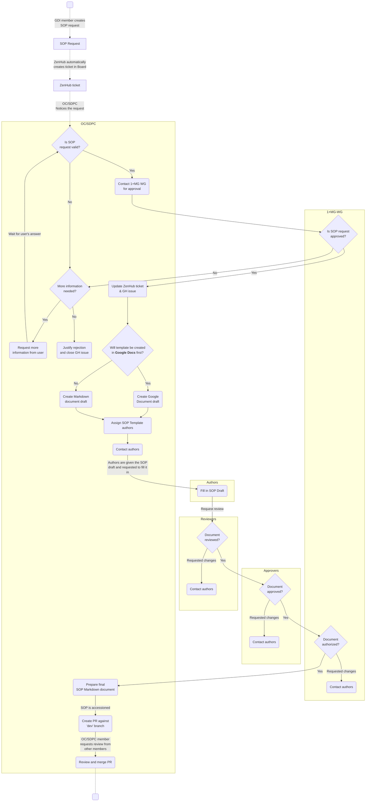

# European GDI - SOP Template creation

| Metadata          | Value         |
|-------------------|---------------------|
| Template SOP number  | ``GDI-SOP0007`` |
| Template SOP version      | ``v1`` |
| Template SOP Type      | European-Level SOP |
| GDI Node   |  |
| Instance Version     |  |

## Index

1. [Document History](#1-document-history)
2. [Glossary](#2-glossary)
3. [Roles and Responsibilities](#3-roles-and-responsibilities)
4. [Purpose](#4-purpose)
5. [Scope](#5-scope)
6. [Introduction and Background Information - as needed](#6-introduction-and-background-information)
7. [Summary or Context Diagram - as needed](#7-summary-or-context-diagram)
8. [Procedure](#8-procedure)
9. [References](#9-references)

### 1. Document History
| Template Version | Instance version | Author(s) | Description of changes       | Date       |
|---------|-----------|-----------|------------------------------|------------|
| ``v1`` | ``-`` | Marcos Casado Barbero | Created first version of the template | ``2024.07.08`` |

### 2. Glossary
Find GDI SOPs common Glossary at the [**charter document**](https://github.com/GenomicDataInfrastructure/standard-operating-procedures/blob/main/docs/GDI-SOP_charter.md).

| Abbreviation | Description     |
|---------------|-----------------|
| GH | GitHub |
| PR | Pull Request |

| Term          | Definition      |
|---------------|-----------------|
|               |                 |

### 3. Roles and Responsibilities
See qualifications and responsibilities of the roles at the [**Organisational Roles and Responsibilities**](https://github.com/GenomicDataInfrastructure/standard-operating-procedures/blob/main/docs/GDI-SOP_organisational-roles-and-responsibilities.md) document.

| Role       | Full name       | GDI/node role   | Organisation |
|------------|-----------------|-----------------|--------------|
| Author     | Marcos Casado Barbero | OC/SDPC | EMBL-EBI |
| Reviewer   | ``-``           | OC/SDPC | GDI |
| Approver   | ``-``           | OC/SDPC | GDI |
| Authorizer | ``-``           | 1+MG WG | GDI |

### 4. Purpose
This SOP will help maintainers of the [``GenomicDataInfrastructure/standard-operating-procedures``](https://github.com/GenomicDataInfrastructure/standard-operating-procedures) repository (i.e., GDI's Operations Committee) **transform SOP Requests into SOP templates**. In doing so, the process will be reproducible and straightforward.

### 5. Scope
This SOP **starts with the need to create a new GDI SOP Template**, triggered by the creation of a new GH issue through the [``New SOP Request``](https://github.com/GenomicDataInfrastructure/standard-operating-procedures/issues/new?assignees=&labels=new-sop-request%2Cenhancement&projects=&template=new_sop_request.yaml&title=%5BSOP+Request%5D+%3CShort+title%3E) issue template.

The SOP encompasses the steps after the need for an SOP has been manifested, until the addition of the markdown SOP within the GitHub repository itself. The **output of this SOP will be the finalized document added to the repository**.

### 6. Introduction and Background Information
Given the size of GDI as a project, in order to minimize the heterogeneity among GDI nodes, this repository contains SOPs, templates and instances, standardizing procedures for GDI members to follow. How these SOPs are created is a process in itself, which task 4.3 of the project aims to define. This document aids the creators of these SOP Templates along that process.

### 7. Summary or Context Diagram


### 8. Procedure
#### 1. Evaluate SOP request
| Step identifier | When| Who |
|:----------------|:----|:----|
| ``1``         | When GH issue (_New SOP Request_) is created | OC/SDPC |

A GH user creates a GH issue like the following, requesting a new SOP:


The first step is for the Operations Committee to **evaluate the new SOP request**, following these criteria:
- **Request**: Is the request correctly made? Is there missing information? Is the given information comprehensive enough?
- **Existing content**: Is the requested SOP not already in the GH repository?
- **Motivation**: Is the creation of the SOP justified and valid? Would GDI benefit from the creation of this SOP? Is the SOP covering a repetitive process of the GDI workflow?

Depending on the answer to all previous questions:
- If the answers are **affirmative**, proceed to [step 2](#2-contact-1mg-working-group).
- If the answers are **negative**, either:
    - Request more information from the user, and repeat the review if necessary.
    - Justify the rejection of the request in the GH issue, and close it.

#### 2. Contact 1+MG Working Group
| Step identifier | When| Who |
|:----------------|:----|:----|
| ``2`` | After new SOP request has been reviewed by the Operations Committee | OC/SDPC |

Once the request has been internally reviewed, it is the turn of the 1+MG WG to review it. In order to do so, the OC/SDPC member shall contact the 1+MG WG, (#! Channel to be decided: email, slack...), with a message like:
````
Subject: [GDI T4.3] New SOP request: < Title of SOP >
````
````
Dear 1+MG Working Group,

We hope this message finds you well.

The Operations Committee (OC) and Security and Data Protection Committee (SDPC) have recently reviewed a new Standard Operating Procedure (SOP) request. After our initial evaluation, we have deemed this request valid.

We kindly ask the 1+MG Working Group to review this request. If your approval is provided, we will proceed with drafting the SOP template. You can find the details of the request in the following GitHub Issue: < GitHub Issue Link >

Thank you for your attention to this matter. We look forward to your prompt review.

Best regards,

< Your Name >
< Your GDI Node >
Operations Committee (OC) / Security and Data Protection Committee (SDPC)
````

Similarly to [step 1](#1-evaluate-sop-request), the course of action will depend on the outcome of the review:
- If the answer from the 1+MG WG is **affirmative**: 
   - Add the tag ``accepted`` to the GitHub issue
   
   - In the ZenHub board, move the ticket (i.e., the request) to the ``Product backlog`` column.
   - Proceed to [**step 3**](#3-draft-sop-document).
- If the answer from the 1+MG WG is **negative**, either:
    - Request more information from the user, and clarify questions from the 1+MG WG, to repeat the review.
    - Justify the rejection of the request in the GH issue, and close it.

#### 3. Draft SOP document
| Step identifier | When| Who |
|:----------------|:----|:----|
| ``3`` | After 1+MG WG has approved SOP request | OC/SDPC |

Once the 1+MG WG has given approval to proceed with the SOP, the OC/SDPC member shall **prepare the SOP draft**. This document will be a modified copy of the [general SOP template](../../docs/GDI-SOP_sop-template.md).

Depending on the product backlog, a request may need to wait until it is picked for drafting. Once this step is started, **add yourself as an assignee** to the ZenHub ticket (i.e., the request) and move it to the ``In Progress`` column.


The **format** of the drafted document can vary, based on the convenience of all the roles intervening in the writing and reviewing processes:
- **Markdown document**. The draft can be started plainly in markdown, by making a copy of the [general SOP template](../../docs/GDI-SOP_sop-template.md) (already in markdown). This format is recommended only if everyone involved in the process is familiar with Git and Markdown's syntax. While less agile than a live collaborative platform, the benefit is that there are no format conversions, and the draft evolves directly into the final SOP document.
- **Google Document**. The template may be transformed from its native markdown to a Google Document, where it will be edited live as a draft, and then reformatted back into a markdown document later on. While reformatting back to Markdown will be needed at [step 6](#6-prepare-final-sop-markdown-document), this is likely the most common path, given its simplicity by making use of Google Drive features. To create the draft, follow these steps:
   - Either (_option 1_) directly copy-paste the markdown from the [general SOP template](../../docs/GDI-SOP_sop-template.md) into a new document at **GDI's [SOP Drafts](https://drive.google.com/drive/u/0/folders/131kJLHDk8L2oGgnRzRBT5AR0Ofpbn2qS) directory**; or (_option 2_) duplicate the existing SOP Template Google Document in the same directory. See video snippet below.
   - Name the new file following the format of ``< YYYYMMDD > - GDI-SOP_draft-< SOP title >`` (e.g., ``20240702 - GDI-SOP_draft-SOP Template creation``).


Regardless of the format, **fill out the draft with as much information** (e.g., background, purpose, summary...) **as possible**, to the best of your knowledge. This content will be finished by the authors later on.

#### 4. Contact Authors
| Step identifier | When| Who |
|:----------------|:----|:----|
| ``4`` | After SOP document has been drafted | OC/SDPC |

Once the SOP document has been drafted, experts are required to fill in the gaps and finalize it. These **authors are to be appointed and contacted by the OC/SDPC**. Who the authors are will depend on the background and requirements of each SOP, and thus it is the responsibility of the OC/SDPC to find the best suited people for the task. The only requirements are for authors to be part of the GDI project and to know about, or be part of, the subject the SOP revolves around.

Depending on the selected authors, communication may vary. For example, if the experts are part of the OC/SDPC themselves, then it may be best to let the group know through GDI's Slack workspace or mailing list. On the other hand, if authors are external to these two committees, the following email template could be used to contact them.

````
Subject: [GDI T4.3] Requesting expert input for drafted SOP
````
````
Dear < Recipient's Name(s) >,

We hope this message finds you well.

The GDI's Operations Committee (OC) and Security and Data Protection Committee (SDPC) have drafted a new Standard Operating Procedure (SOP): "< SOP Title >". We now seek your expertise to fill in the gaps and help us finalize it. Given your background and involvement in the GDI project, we believe you are well-suited as an author of the SOP.

We kindly request you to review the SOP draft and provide the necessary input. Please find the draft SOP document here: < URL of drafted document >

We will aid you during the subsequent rounds of review, approval and authorization of the SOP.

Should you know any other GDI members that could assist as authors as well, please let us know to get in contact with them. 

Thank you for your attention and collaboration. We look forward to your valuable contributions.

Best regards,

< Your Name >
< Your GDI Node >
Operations Committee (OC) / Security and Data Protection Committee (SDPC)
````

Depending on the format of the draft, the above-mentioned ``< URL of drafted document >`` will change:
- **Google Document**. You can simply paste the URL of the Google Document, making sure to add the recipients as editors of that particular document in Google Drive.
- **Markdown document**. The easiest way to share the document would be by creating a drafted PR in GH, from either a personal fork or branch to the ``dev`` branch. Make sure to create it as a _Draft pull request_. If done this way, at [step 7](#7-create-pr-review-and-merge) you will simply have to convert the draft into a _Ready for review_ PR.

Remember to leave a comment in the GitHub issue, briefly mentioning that authors have been contacted. Be mindful of the information you share (e.g., no email addresses), since _anything_ that is typed through ZenHub in the ticket, will be **publicly displayed** in the GitHub issue!

This step of the process ends when enough GDI members accepted authoring the SOP. For this to happen, it may be needed for the OC/SDPC member to engage in conversations to find the best suited authors. These conversations will be useful when reviewers are needed.

#### 5. Monitor SOP development
| Step identifier | When| Who |
|:----------------|:----|:----|
| ``5``                  | After SOP authors have been appointed | OC/SDPC |

It is the duty of the OC/SDPC to monitor the entire SOP development process, ensuring that:
- **Authors** are engaged with the development of the SOP. Checking the content of the SOP or contacting the authors recurrently may be required.
- **Reviewers and approvers are appointed**, diverse across GDI nodes, and engaged in the process. Beyond the role definitions in the [ORR](../../docs/GDI-SOP_organisational-roles-and-responsibilities.md), the rule of thumb is for these roles to span multiple GDI nodes. Reviewers may be selected directly by the OC/SDPC or by the authors themselves. Approvers will be part of the OC/SDPC itself.
- **Communication is efficient** throughout the process. For example, ensuring that 1+MG WG receives the request to authorize the final SOP, or that authors are aware of any requested changes. 
- All **people involved are included in the _Roles and Responsibilities_ section** of the drafted SOP. This includes all authors, reviewers, approvers, authorizers and any other role pertinent to the SOP.
- Every **gate-keeping event** (review, approval, authorization) **is documented** in the GH issue. In other words, when the SOP draft passes through any of these steps, the OC/SDPC should document it in the GH issue. For example: ``SOP draft has been reviewed by reviewers X, X and X...``.

Once the drafted SOP has been filled in by the authors, and has passed the inspection of reviewers and approvers, it will be the duty of the OC/SDPC member to **communicate the formal authorization request to the 1+MG WG**. Make use of the template below to craft the email, ideally replying to the thread that started at [step 2](#2-contact-1mg-working-group).

````
Subject: [GDI T4.3] Requesting SOP Authorization
````
````
Dear 1+MG Working Group,

We hope this message finds you well.

The Operations Committee (OC) and Security and Data Protection Committee (SDPC) are pleased to inform you that a new Standard Operating Procedure (SOP) has been developed and is pending formal authorization. It was drafted by the OC/SDPC, authored, and reviewed by GDI members, and finally approved by the OC/SDPC. We now seek the formal authorization from the 1+MG Working Group to add this SOP to the GDI SOP GitHub repository.

Please provide your formal authorization at your earliest convenience. Find the current SOP document here: < URL of SOP document >. 

More information about the development process can be found within the [Information Service Management](https://github.com/GenomicDataInfrastructure/standard-operating-procedures/blob/main/docs/GDI-SOP_information-service-management.md) at our repository.
Thank you for your attention and cooperation.

Best regards,

< Your Name >
< Your GDI Node >
Operations Committee (OC) / Security and Data Protection Committee (SDPC)
````

Similar to previous steps, this one shall finish once formal approval from the 1+MG WG has been received. It will be the responsibility of the OC/SDPC to keep track of the status of development and to make sure requested changes are addressed (e.g., contacting authors, modifying it themselves...).

#### 6. Prepare final SOP Markdown document
| Step identifier | When| Who |
|:----------------|:----|:----|
| ``6`` | After receiving authorization from 1+MG WG | OC/SDPC |

Now that we have the content reviewed and ready, we need to format it to fit into the GH repository. The difficulty of this step will vary depending on the chosen format for the draft at [step 3](#3-draft-sop-document). In both cases, it is assumed that you are familiar with GH and already have a local copy of the GDI SOP repository (i.e., you have cloned it).

If the **document was drafted using Google Drive**, its format must be modified before adding it to the repository. On the other hand, if the **document was drafted in markdown** format natively, there are no format changes required and thus you can skip the first step of the following:
1. [_Only if the document was drafted using Google Drive_] **Copy the whole Google Document and paste it** into the left box at [**gdoc2md**](https://gdoc2md.com/). There are many tools to format a Google Document into markdown but, in our experience, this one keeps the markdown format the closest to the native template, which is especially relevant regarding tables. Bear in mind that anything copied here would be processed by the tool deployed at someone else's server. If the document contains information that should not be public (yet), consider other choices, like locally installing [gdoc2md](https://github.com/mr0grog/google-docs-to-markdown) or [pandoc](https://pandoc.org/installing.html).


2. **Copy the raw markdown into a new file**. Check the [accessioning guide](../../docs/GDI-SOP_sop-accessioning.md#file-naming-conventions) to know how to name and where to place this new file.

3. Manually **inspect that the markdown file complies with the [Style and Format guide for GDI SOPs](../../docs/GDI-SOP_style-guide.md)** before proceeding to [step 7](#7-create-pr-review-and-merge). Some **format changes** may be due depending on the document, especially if it was drafted originally in Google Drive. These changes should not affect the content that was reviewed and authorized previously, just the format.

#### 7. Create PR, review and merge
| Step identifier | When| Who |
|:----------------|:----|:----|
| ``7`` | After final document was created | OC/SDPC |

Once the markdown file has the required content in the proper format, the OC/SDPC shall add it to the rest of SOPs in the repository. To do so, a **PR against the ``dev`` branch** needs to be created, containing the new SOP. Remember to **comment the GH issue** (i.e., its URL) of the SOP request in this PR, so that it is automatically tracked by GH.

Members of the OC/SDPC are to be listed as **reviewers** in the PR. Given that the content is not supposed to be modified, this review is merely for format changes between the formal authorization and the final document ([step 6](#6-prepare-final-sop-markdown-document)). Furthermore, if there are any GH actions as checks (e.g., an SOP linter), they should be addressed (i.e., assert that they pass) before merging.

Finally, once the PR was reviewed and there are no conflicting checks, it is to be **merged** against the ``dev`` branch. The new content will stay there until it is to be released and merged with ``main``.

In case there are merge conflicts, resolve them either through GH's user interface or command line before merging (see [documentation](https://docs.github.com/en/pull-requests/collaborating-with-pull-requests/addressing-merge-conflicts/resolving-a-merge-conflict-on-github)).

### 9. References
| Reference | Description                                          |
|-----------|------------------------------------------------------|
| [1](https://github.com/GenomicDataInfrastructure/standard-operating-procedures/blob/main/docs/GDI-SOP_charter.md) | European GDI - SOP Charter |
| [2](https://github.com/GenomicDataInfrastructure/standard-operating-procedures/blob/main/docs/GDI-SOP_information-service-management.md) | European GDI - Procedures for Information Service Management (ISM) for SOPs |
| [3](https://github.com/GenomicDataInfrastructure/standard-operating-procedures/blob/main/docs/GDI-SOP_organisational-roles-and-responsibilities.md) | European GDI - Organisational Roles and Responsibilities (ORR) |
| [4](https://drive.google.com/drive/u/0/folders/131kJLHDk8L2oGgnRzRBT5AR0Ofpbn2qS) | European GDI - GDI's SOP Drafts directory |
| [5](https://gdoc2md.com/) | gdoc2md - Document formatter from Google Document to Markdown|
| [6](https://github.com/GenomicDataInfrastructure/standard-operating-procedures) | European GDI - standard-operating-procedures GH repository|
| [7](https://github.com/GenomicDataInfrastructure/standard-operating-procedures/issues/new?assignees=&labels=new-sop-request%2Cenhancement&projects=&template=new_sop_request.yaml&title=%5BSOP+Request%5D+%3CShort+title%3E) | European GDI - New SOP request GH issue template |