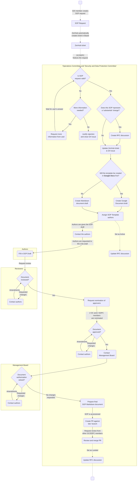
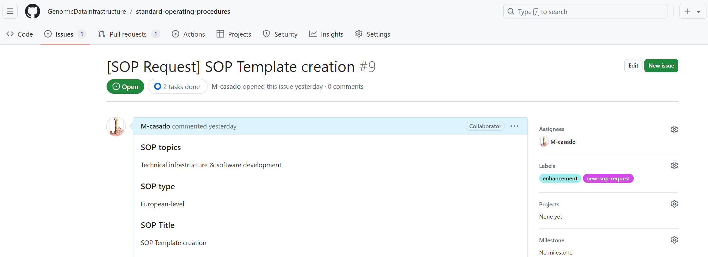
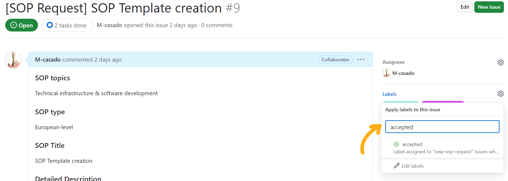
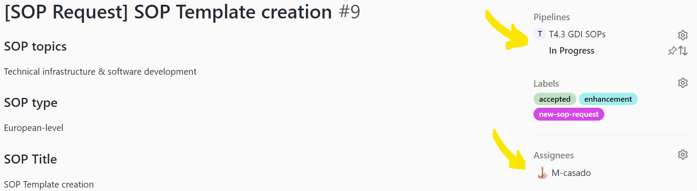
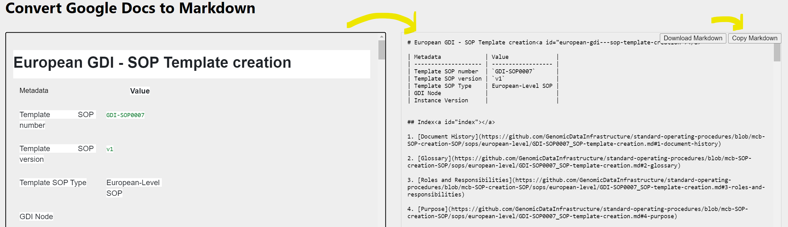
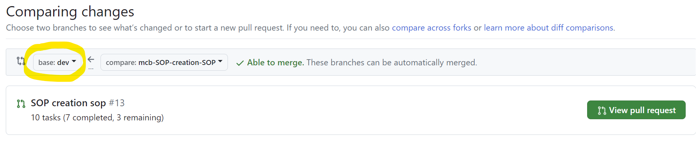
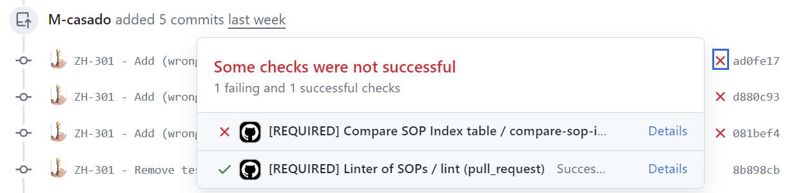

# European GDI - SOP Template creation

| Metadata             | Value              |
|----------------------|--------------------|
| Template SOP number  | ``GDI-SOP0007``    |
| Template SOP version | ``v1``             |
| Topic                | Helpdesk & operations |
| Template SOP Type    | European-Level SOP |
| GDI Node             |                    |
| Instance Version     |                    |

## Index

1. [Document History](#1-document-history)
2. [Glossary](#2-glossary)
3. [Roles and Responsibilities](#3-roles-and-responsibilities)
4. [Purpose](#4-purpose)
5. [Scope](#5-scope)
6. [Introduction and Background Information](#6-introduction-and-background-information)
7. [Summary or Context Diagram](#7-summary-or-context-diagram)
8. [Procedure](#8-procedure)
9. [References](#9-references)

### 1. Document History
| Template Version | Instance version | Author(s) | Description of changes       | Date       |
|---------|-----------|-----------|------------------------------|------------|
| ``v1`` |  | Marcos Casado Barbero | Created first version of the SOP | ``2024.07.08`` |

### 2. Glossary
Find GDI SOPs common Glossary at the [**charter document**](https://github.com/GenomicDataInfrastructure/standard-operating-procedures/blob/main/docs/GDI-SOP_charter.md).

| Abbreviation  | Description                             |
|---------------|-----------------------------------------|
| EBI           | European Bioinformatics Institute       |
| EMBL          | European Molecular Biology Laboratory   |
| GH            | GitHub                                  |
| HRI           | Health Research Infrastructure          |
| IST           | Instituto Superior Técnico              |
| NBIS          | National Bioinformatics Infrastructure Sweden |
| PR            | Pull Request                            |
| RFC           | Request For Comments                    |
| SLA           | Service Level Agreements                |
| UU            | University of Uppsala                   |

| Term          | Definition      |
|---------------|-----------------|
|               |                 |

### 3. Roles and Responsibilities
See the qualifications and responsibilities of the roles at the [**Organisational Roles and Responsibilities**](https://github.com/GenomicDataInfrastructure/standard-operating-procedures/blob/main/docs/GDI-SOP_organisational-roles-and-responsibilities.md) document.

| Role       | Full name       | GDI/node role   | Organisation |
|------------|-----------------|-----------------|--------------|
| Author     | Marcos Casado Barbero | Task 4.3 member | EMBL-EBI |
| Reviewer   | Pedro Ferreira | Task 4.3 member | IST |
| Reviewer   | Bianca Hendriksze | Task 4.3 member | HRI |
| Reviewer   | Elisavet Torstensson | Task 4.3 member | UU / NBIS |
| Reviewer   | Mattias Strömberg | Task 4.3 member | UU / NBIS |
| Approver   | Markus Englund | Task 4.3 member | UU / NBIS |
| Approver   | Dylan Spalding | WP5 Leader | CSC |
| Authorizer | _TBD: to be brought up in a monthly MB meeting, to appoint a MB authorizer_ | Management Board | _TBD_ |

### 4. Purpose
This SOP will help maintainers of the [``GenomicDataInfrastructure/standard-operating-procedures``](https://github.com/GenomicDataInfrastructure/standard-operating-procedures) repository (i.e., GDI's Operations Committee and Security and Data Protection Committee) **transform SOP Requests into SOP templates**. In doing so, the process will be reproducible and straightforward, ensuring consistency and quality in SOP development across the GDI project

### 5. Scope
This SOP **starts with the need to create a new GDI SOP Template**, triggered by the creation of a new GH issue through the [``New SOP Request``](https://github.com/GenomicDataInfrastructure/standard-operating-procedures/issues/new?assignees=&labels=new-sop-request%2Cenhancement&projects=&template=new_sop_request.yaml&title=%5BSOP+Request%5D+%3CShort+title%3E) issue template.

The SOP encompasses the steps after the need for an SOP has been manifested, until the addition of the markdown SOP within the GitHub repository itself. The **output of this SOP will be the finalized document added to the repository**.

### 6. Introduction and Background Information
Given the size of GDI as a project, in order to minimize the heterogeneity among GDI nodes, this repository contains SOPs, templates, and instances, standardizing procedures for GDI members to follow. How these SOPs are created is a process in itself, which task 4.3 of the project aims to define. This document aids the creators and maintainers of these SOP Templates along that process.

### 7. Summary or Context Diagram


### 8. Procedure
#### 1. Evaluate SOP request
| Step identifier | When| Who |
|:----------------|:----|:----|
| ``1``         | When GH issue (_New SOP Request_) is created | OC/SDPC |

A GH user creates a GH issue like the following, requesting a new SOP:



The first step is for the Operations Committee to **evaluate the new SOP request**, following these criteria:
- **Existing content**: Is the requested SOP not already in the GH repository?
- **Request**: Is the request correctly made? Is there missing information? Is the given information comprehensive enough?
- **Motivation**: Is the creation of the SOP justified and valid? Would GDI benefit from the creation of this SOP? Is the SOP covering a repetitive process of the GDI workflow?

🔀 Depending on the answer to all previous questions:
- If the answers are **affirmative**:
    - Add the tag ``accepted`` to the GitHub issue
    
    - In the ZenHub board, move the ticket (i.e., the request) to the ``Product backlog`` column.
    - Proceed to [step 2](#2-create-rfc-discussion).
- If the answers are **negative**, either:
    - Request more information from the user, and repeat the review if necessary.
    - Justify the rejection of the request in the GH issue, and close it.

#### 2. Create RFC discussion
| Step identifier | When| Who |
|:----------------|:----|:----|
| ``2`` | After new SOP request has been deemed valid by the Operations Committee | OC/SDPC |

Once the SOP request was accepted, it is time for the idea to be built from within GDI. **Depending on the relative importance of the SOP**, you may need to bring it forth in the shape of an **RFC**, to host a GDI-led discussion. Follow the checklist below (_#! TODO: this list will be at the [RFC's README](https://github.com/GenomicDataInfrastructure/rfcs?tab=readme-ov-file#when-to-follow-this-process) at some point_) to decide the course of action:

- **Impact on Multiple Nodes or Stakeholders:**
  - Does the SOP affect multiple GDI nodes or have the potential to influence operations across the network?
  - Will the SOP change how multiple stakeholders (e.g., operations, data management, security) interact with or use GDI infrastructure?

- **Introduction of New Features or Processes:**
  - Does the SOP introduce a new feature, process, or operational procedure that was not previously part (or similar) of GDI operations?
  - Is this SOP setting a precedent for future SOPs that would fundamentally alter existing workflows?

- **Modification of Existing GDI Procedures:**
  - Does the SOP significantly change the semantics or behavior of an existing procedure that is widely used or critical to the GDI infrastructure?
  - Does the SOP propose removing or deprecating a feature or procedure that is currently in use by GDI nodes?

- **Impact on GDI Service Levels (SLAs):**
  - Could the SOP influence key Service Level Agreements (SLAs) within GDI, such as system uptime, helpdesk response times, or software update protocols?
  - Does the SOP align with or potentially conflict with existing SLAs, requiring a review to ensure consistency and clarity for users?

- **Cross-Functional Dependencies:**
  - Does the SOP require coordination between different functions or teams within GDI, such as security, operations, and data management?
  - Will the SOP impact how different GDI committees (e.g., OC, SDPC) operate or collaborate?

- **Potential for User Confusion or Misalignment:**
  - Could the SOP lead to confusion among users or stakeholders regarding their roles, responsibilities, or the functionality of GDI services?
  - Is there a risk that the SOP might lead to a misalignment between user expectations and the services provided by GDI?

- **Risk and Compliance Considerations:**
  - Does the SOP introduce new risks or compliance requirements that need to be carefully reviewed and managed?
  - Is there a significant risk that the SOP might not meet the necessary compliance standards without thorough review and consensus?

- **Strategic Importance:**
  - Is the SOP strategically important for the long-term goals or sustainability of the GDI?
  - Does the SOP align with or diverge from the broader strategic vision of GDI, requiring input and consensus from a wider audience?

- **Community Feedback and Consensus Building:**
  - Would the SOP benefit from broader community feedback to ensure it is well-received and effectively implemented?
  - Has there been significant interest or concern from the community that would warrant a more formal review and discussion process?

- **Complexity and Scope of Change:**
  - Is the SOP complex enough that its implementation could have unforeseen consequences or require extensive coordination?
  - Does the SOP cover a wide scope, making it difficult to assess its impact without a more structured and collaborative review process?

🔀 Depending on the answer to previous questions:
- If some answers are **affirmative**:
    - Continue with this step, creating the RFC discussion.
- If all are **negative** or you consider the SOP not to be substantial:
    - Skip the rest of step 2, and jump straight to [step 3](#3-draft-sop-document).

Go to [**GDI's RFC GH repository**](https://github.com/GenomicDataInfrastructure/rfcs?tab=readme-ov-file#what-the-process-is) and familiarize yourself with the process of **RFC creation**. As the first step, **create a [new discussion](https://github.com/GenomicDataInfrastructure/rfcs/discussions/new/choose)** choosing the ``RFC Discussions`` category. The goal of this discussion is for the SOP, as a substantial change to GDI, to be introduced and discussed by the GDI community.

_#! TO-DO: the process of adding an RFC to the repository is still not fully defined, but the idea is for a discussion to be opened in GH, for consensus to be reached and a final markdown RFC document to be merged with the repo._

#### 3. Draft SOP document
| Step identifier | When| Who |
|:----------------|:----|:----|
| ``3`` | After RFC discussion has reached consensus, if an RFC was created | OC/SDPC |

Depending on the course of action of [step 2](#2-create-rfc-discussion), this step may start without the need of an RFC, or when the RFC discussion has reached consensus. Regardless of the origin, the OC/SDPC member shall **prepare the SOP draft**. This document will be a modified copy of the [general SOP template](../../docs/GDI-SOP_sop-template.md).

Depending on the product backlog, a request may need to wait until it is picked for drafting. Once this step is started, **add yourself as an assignee** to the ZenHub ticket (i.e., the request) and move it to the ``In Progress`` column.



The **format** of the drafted document can vary, based on the convenience of all the roles intervening in the writing and reviewing processes:
- **Markdown document**. The draft can be started plainly in markdown, by making a copy of the [general SOP template](../../docs/GDI-SOP_sop-template.md) (already in markdown). This format is recommended only if everyone involved in the process is familiar with Git and Markdown's syntax. While less agile than a live collaborative platform, the benefit is that there are no format conversions, and the draft evolves directly into the final SOP document.
- **Google Document**. The template may be transformed from its native markdown to a Google Document, where it will be edited live as a draft, and then reformatted back into a markdown document later on. While reformatting back to Markdown will be needed at [step 6](#6-prepare-final-sop-markdown-document), this is likely the most common path, given its simplicity by making use of Google Drive features. To create the draft, follow these steps:
   - Either (_option 1_) directly copy-paste the markdown from the [general SOP template](../../docs/GDI-SOP_sop-template.md) into a new document at **GDI's [SOP Drafts](https://drive.google.com/drive/u/0/folders/131kJLHDk8L2oGgnRzRBT5AR0Ofpbn2qS) directory**; or (_option 2_) duplicate the existing SOP Template Google Document in the same directory. See video snippet below.
   - Name the new file following the format of ``< YYYYMMDD > - GDI-SOP_draft-< SOP title >`` (e.g., ``20240702 - GDI-SOP_draft-SOP Template creation``).
   - In Google Documents, tables can have a **header**, but you must specify it as such for each table (or copy-paste the one you configure): right-click on a table, click on ``Table properties``, click on ``Row``, and then tick the box ``Pin header row(s)`` (number of header rows commonly is 1). This little trick will save you a lot of headaches when the time comes to transform the document to markdown.


Regardless of the format, **fill out the draft with as much information** (e.g., background, purpose, summary...) **as possible**, to the best of your knowledge. This content will be finished by the authors later on.

#### 4. Contact Authors
| Step identifier | When| Who |
|:----------------|:----|:----|
| ``4`` | After SOP document has been drafted | OC/SDPC |

Once the SOP document has been drafted, experts are required to fill in the gaps and finalize it. These **authors are to be appointed and contacted by the OC/SDPC**. Who the authors are will depend on the background and requirements of each SOP, and thus it is the responsibility of the OC/SDPC to **find the best-suited people for the task**. The only requirements are for authors to be part of the GDI project and to know about, or be part of, the subject the SOP revolves around. An approach to identify authors is to go through the contributors of the RFC discussion at [step 2](#2-create-rfc-discussion).

The communication may vary depending on the selected authors. For example, if the experts are part of the OC/SDPC themselves, then it may be best to let the group know through GDI's Slack workspace or mailing lists (``gdi-oc [at] elixir-europe.org`` and ``gdi-sdpc [at] elixir-europe.org``). On the other hand, if authors are external to these two committees, the following email template could be used to contact them.

Remember to CC the OC and SDPC mailing lists: ``gdi-oc [at] elixir-europe.org`` and ``gdi-sdpc [at] elixir-europe.org``.
````
Subject: [GDI T4.3] Requesting expert input for drafted SOP
````
````
Dear < Recipient's Name(s) >,

We hope this message finds you well.

The GDI's Operations Committee (OC) and Security and Data Protection Committee (SDPC) have drafted a new Standard Operating Procedure (SOP): "< SOP Title >". We now seek your expertise to fill in the gaps and help us finalize it. Given your background and involvement in the GDI project, we believe you are well-suited as an author of the SOP.

We kindly request you to review the SOP draft and provide the necessary input. Please find the draft SOP document here: < URL of drafted document >

We will aid you during the subsequent rounds of review, approval and authorization of the SOP. You can find more information about GDI SOPs here: https://github.com/GenomicDataInfrastructure/standard-operating-procedures

Should you know any other GDI members who could assist as authors as well, please let us know to get in contact with them. 

Thank you for your attention and collaboration. We look forward to your valuable contributions.

Best regards,

< Your Name >
< Your GDI Node >
Operations Committee (OC) / Security and Data Protection Committee (SDPC)
````

Depending on the format of the draft, the above-mentioned ``< URL of drafted document >`` will change:
- **Google Document**. You can simply paste the URL of the Google Document, making sure to add the recipients as editors of that particular document in Google Drive.
- **Markdown document**. The easiest way to share the document would be by creating a drafted PR in GH, from either a personal fork or branch to the ``dev`` branch. Make sure to create it as a _Draft pull request_. If done this way, at [step 7](#7-create-pr-review-and-merge) you will simply have to convert the draft into a _Ready for review_ PR. Check the [accessioning guide](../../docs/GDI-SOP_sop-accessioning.md#file-naming-conventions) to know how to name and where to place this new file.

Remember to **leave a comment in the GitHub issue**, briefly mentioning that authors have been contacted. Be mindful of the information you share (e.g., no email addresses), since _anything_ that is typed through ZenHub in the ticket, will be **publicly displayed** in the GitHub issue!

This step of the process ends when enough GDI members accepted authoring the SOP. For this to happen, it may be needed for the OC/SDPC member to engage in conversations to find the best-suited authors. These conversations will be useful when reviewers are needed.

#### 5. Monitor SOP development
| Step identifier | When| Who |
|:----------------|:----|:----|
| ``5``                  | After SOP authors have been appointed | OC/SDPC |

It is your duty, as a member of the OC/SDPC, to monitor the entire SOP development process, ensuring that:
- **Authors** are engaged with the development of the SOP. Checking the content of the SOP or contacting the authors recurrently may be required.
- **Reviewers and approvers are appointed**, diverse across GDI nodes, and engaged in the process. Beyond the role definitions in the [ORR](../../docs/GDI-SOP_organisational-roles-and-responsibilities.md), the rule of thumb is for these roles to span multiple GDI Pillars and nodes. Reviewers may be selected directly by the OC/SDPC or by the authors themselves. Approvers will be part of the OC/SDPC itself.
- **Communication is efficient** throughout the process. For example, ensuring that GDI MB receives the request to authorize the final SOP, or that authors are aware of any requested changes. 
- All **people involved are included in the _Roles and Responsibilities_ section** of the drafted SOP. This includes all authors, reviewers, approvers, authorizers and any other role pertinent to the SOP.
- Every **gate-keeping event** (review, approval, authorization) **is documented in the GH issue and RFC discussion**. In other words, when the SOP draft passes through any of these steps, the OC/SDPC should document it in the GH issue and RFC discussion. For example: ``SOP draft has been reviewed by reviewers X, X and X...``.

In each of the subsequent sub-steps, back and forth communication between all actors may be needed to address requests.

##### 5.1 Appoint reviewers

Similar to how authors were nominated and contacted, you shall **appoint reviewers and contact them** requesting their review. Depending on the SOP, who are the reviewers and how to contact them will vary. If by email, you can use the email template below.

Remember to CC the OC and SDPC mailing lists: ``gdi-oc [at] elixir-europe.org`` and ``gdi-sdpc [at] elixir-europe.org``.
````
Subject: [GDI T4.3] Requesting SOP review
````
````
Dear < Recipient's Name(s) >,

We hope this message finds you well.

A new GDI Standard Operating Procedure (SOP) is in development. We now seek your expertise to review the drafted SOP to ensure that its content meets GDI's quality standards. Given your background and involvement in the GDI project, we believe you are well-suited as a reviewer of this SOP, titled "< SOP Title >".

We kindly request you to review the SOP draft and provide your feedback. Please find the draft SOP document here: < URL of drafted document >

You can find more information about GDI SOPs here: https://github.com/GenomicDataInfrastructure/standard-operating-procedures

Should you know any other GDI members who could assist as reviewers as well, please let us know to get in contact with them.

Thank you for your attention and collaboration. We look forward to your valuable contributions.

Best regards,

< Your Name >
< Your GDI Node >
Operations Committee (OC) / Security and Data Protection Committee (SDPC)
````

You shall **follow through the communication between authors and reviewers**, to ensure that once authors have drafted the SOP, reviewers are notified and proceed with their reviews.

##### 5.2 Request OC/SDPC approval
Once the drafted SOP has been filled in by the authors, and has passed the inspection of reviewers, the SOP document shall go through approval of the OC/SDPC. **These committees need to nominate 2 members each** (4 in total), that will be responsible for approval of the SOP.

Use the following template to **send an email to the OC (``gdi-oc [at] elixir-europe.org``) and SDPC (``gdi-sdpc [at] elixir-europe.org``) requesting approval**:
````
Subject: [GDI T4.3] Requesting SOP approval
````
````
Dear OC/SDPC,

I hope this message finds you well.

A new GDI Standard Operating Procedure (SOP) is in development. It was drafted by the OC/SDPC, authored, and reviewed by GDI members, and is pending approval from across the Operations Committee (OC) and Security and Data Protection Committee (SDPC).

Please appoint 2 members of each committee (4 in total) to take the role of approvers of the SOP. These shall provide a formal approval or justified rejection at the earliest convenience. Find the current SOP document here: < URL of SOP document >. 

You can find more details about this SOP development at the following sources: 
- [Charter](https://github.com/GenomicDataInfrastructure/standard-operating-procedures/blob/main/docs/GDI-SOP_charter.md)
- [Information Service Management](https://github.com/GenomicDataInfrastructure/standard-operating-procedures/blob/main/docs/GDI-SOP_information-service-management.md).
- SOP Request: < URL of the GH issue, the SOP request >
- RFC Discussion: < URL of the RFC discussion created for this SOP, if applicable >

Thank you for your attention and collaboration.

Best regards,

< Your Name >
< Your GDI Node >
Operations Committee (OC) / Security and Data Protection Committee (SDPC)
````

**Follow through the approval process**, ensuring that all three GDI Pillars are aware of the new SOP, and have given their formal approval. It may be needed for you to bring it up at committee meetings, or to chase members to approve the SOP.

##### 5.3 Contact Management Board
Once approved by the OC/SDPC, **communicate the formal authorization request to the GDI MB**. Make use of the template below to craft the email sent to ``gdi-mb [at] elixir-europe.org``.

Remember to CC the OC and SDPC mailing lists: ``gdi-oc [at] elixir-europe.org`` and ``gdi-sdpc [at] elixir-europe.org``.
````
Subject: [GDI T4.3] Requesting SOP Authorization
````
````
Dear GDI Management Board,

We hope this message finds you well.

The Operations Committee (OC) and Security and Data Protection Committee (SDPC) are pleased to inform you that a new GDI Standard Operating Procedure (SOP) has been developed. It was drafted by the OC/SDPC, authored, and reviewed by GDI members, and finally approved by the OC/SDPC. We now present this SOP to the Management Board for formal authorization.

As part of the authorization process, if no issues are raised within four weeks of this notice, the OC/SDPC will consider the SOP to be authorized and we will proceed to add it to the GDI SOP GitHub repository.

Please, also let us know if:
- An extension to this 4-week period is required to evaluate whether to veto or not the SOP.
- You are certain the veto of the SOP will not be exercised before these 4 weeks. This will help us resume the process as early as possible.  

Please, find the SOP document here: < URL of SOP document >.

More information about the SOP development process can be found within the [Charter](https://github.com/GenomicDataInfrastructure/standard-operating-procedures/blob/main/docs/GDI-SOP_charter.md) and [Information Service Management](https://github.com/GenomicDataInfrastructure/standard-operating-procedures/blob/main/docs/GDI-SOP_information-service-management.md) at our repository.
Thank you for your attention and collaboration.

Best regards,

< Your Name >
< Your GDI Node >
Operations Committee (OC) / Security and Data Protection Committee (SDPC)
````

This **step shall finish** either:
- When the **period to raise issues (4 full weeks) concluded without any complaints from the MB**. 
- The **MB explicitly authorized the SOP** before the 4-week period finished.

If comments are given from this body, the step shall finish when they are addressed, starting a new period of review altogether. Similar consideration is to be taken if the MB requests a period extension. It will be your responsibility, as a member of the OC/SDPC, to keep track of the status of development and to make sure requested changes are addressed (e.g., contacting authors).

#### 6. Prepare final SOP Markdown document
| Step identifier | When| Who |
|:----------------|:----|:----|
| ``6`` | After receiving authorization from GDI MB | OC/SDPC |

Now that we have the content reviewed and ready, we need to format it to fit into the GH repository. The difficulty of this step will vary depending on the chosen format for the draft at [step 3](#3-draft-sop-document). In both cases, it is assumed that you are familiar with GH and already have a local copy of the GDI SOP repository (i.e., you have cloned it).

If the **document was drafted using Google Drive**, its format must be modified before it is added to the repository. On the other hand, if the **document was drafted in markdown** format natively, there are no format changes required and thus you can skip the first two of the following:
1. [_Only if the document was drafted using Google Drive_] **Copy the whole Google Document and paste it** into the left box at [**gdoc2md**](https://gdoc2md.com/). There are many tools to format a Google Document into markdown but, in our experience, this one keeps the markdown format the closest to the native template, which is especially relevant regarding tables. Bear in mind that anything copied here would be processed by the tool deployed at someone else's server. If the document contains information that should not be public (yet), consider other choices, like locally installing [gdoc2md](https://github.com/mr0grog/google-docs-to-markdown) or [pandoc](https://pandoc.org/installing.html).

2. [_Only if the document was drafted using Google Drive_] **Copy the raw markdown into a new file**. Check the [accessioning guide](../../docs/GDI-SOP_sop-accessioning.md#file-naming-conventions) to know how to name and where to place this new file.



3. Manually **inspect that the markdown file complies with the [Style and Format guide for GDI SOPs](../../docs/GDI-SOP_style-guide.md)** before proceeding to [step 7](#7-create-pr-review-and-merge). Some **format changes** may be due depending on the document, especially if it was drafted originally in Google Drive. These changes should not affect the content that was reviewed and authorized previously, just the format.

At this point, **assign an accession to the new SOP**. This includes modifying both the SOP's filename and metadata table inside it. See the [accessioning guide](../../docs/GDI-SOP_sop-accessioning.md#file-naming-conventions) on how to. This accession should be unique, and thus you shall check what the existing accessions are at the [SOP Index table](../README.md), and other incoming accessions in open PRs (from other SOPs also in development).

Finally, update secondary documentation of the repository:
- **Update the [SOP Index table](../README.md)** with the new SOP. You can either do it manually, or copy the output of the following snippet (assuming you have the required libraries installed):
````
python3.8 scripts/sop_index.py sops/ -v 1
````
- Add **any new changes to the [CHANGELOG.md](../../CHANGELOG.md)** document.

#### 7. Create PR, review and merge
| Step identifier | When| Who |
|:----------------|:----|:----|
| ``7`` | After final document was created | OC/SDPC |

Once the markdown file has the required content in the proper format, it is time to add it to the other SOPs in the repository. To do so,  **create a PR against the ``dev`` branch**, containing the new SOP document.



Remember to **comment on the GH issue** (i.e., its URL) of the SOP request in this PR, so that it is automatically tracked by GH.

Members of the OC/SDPC are to be listed as **reviewers** in the PR. Given that the content is not supposed to be modified, this review is merely for format changes that occurred (or should have occurred) between the formal authorization and the final document ([step 6](#6-prepare-final-sop-markdown-document)). 

Furthermore, any **GH workflows** (e.g., SOP linter) **should be addressed** (i.e., assert that they pass) before merging. See in the image below where to look at:



Finally, **once the PR was reviewed** and there are no conflicting checks, **merge it** against the ``dev`` branch. At this point, **this SOP is finished**. The new content will stay there until it is to be released and merged with ``main``.

In case there are merge conflicts, resolve them either through GH's user interface or command line before merging (see [documentation](https://docs.github.com/en/pull-requests/collaborating-with-pull-requests/addressing-merge-conflicts/resolving-a-merge-conflict-on-github)).

At this point, **resolve any possible loose ends** (e.g., GH issues, RFC discussions, email threads...).

### 9. References
| Reference | Description                                          |
|-----------|------------------------------------------------------|
| [1](https://github.com/GenomicDataInfrastructure/standard-operating-procedures/blob/main/docs/GDI-SOP_charter.md) | European GDI - SOP Charter |
| [2](https://github.com/GenomicDataInfrastructure/standard-operating-procedures/blob/main/docs/GDI-SOP_information-service-management.md) | European GDI - Procedures for Information Service Management (ISM) for SOPs |
| [3](https://github.com/GenomicDataInfrastructure/standard-operating-procedures/blob/main/docs/GDI-SOP_organisational-roles-and-responsibilities.md) | European GDI - Organisational Roles and Responsibilities (ORR) |
| [4](https://drive.google.com/drive/u/0/folders/131kJLHDk8L2oGgnRzRBT5AR0Ofpbn2qS) | European GDI - GDI's SOP Drafts directory |
| [5](https://gdoc2md.com/) | gdoc2md - Document formatter from Google Document to Markdown|
| [6](https://github.com/GenomicDataInfrastructure/standard-operating-procedures) | European GDI - standard-operating-procedures GH repository|
| [7](https://github.com/GenomicDataInfrastructure/standard-operating-procedures/issues/new?assignees=&labels=new-sop-request%2Cenhancement&projects=&template=new_sop_request.yaml&title=%5BSOP+Request%5D+%3CShort+title%3E) | European GDI - New SOP request GH issue template |
| [8](https://github.com/GenomicDataInfrastructure/rfcs?tab=readme-ov-file) | European GDI - Request for comments (RFC) |