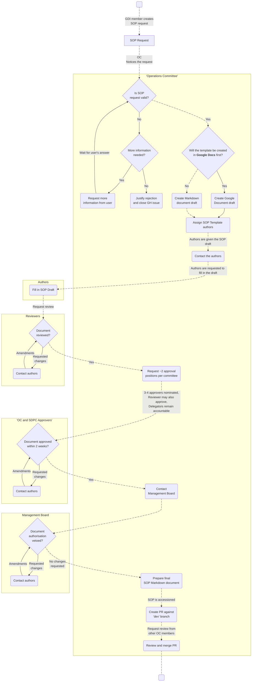
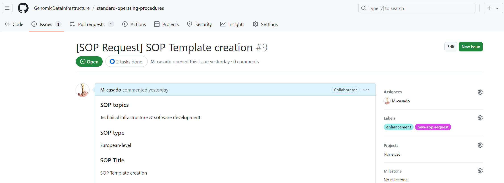
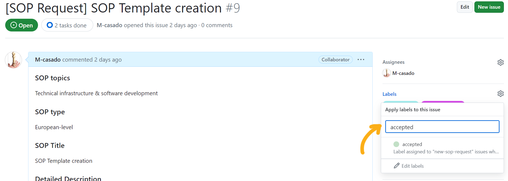
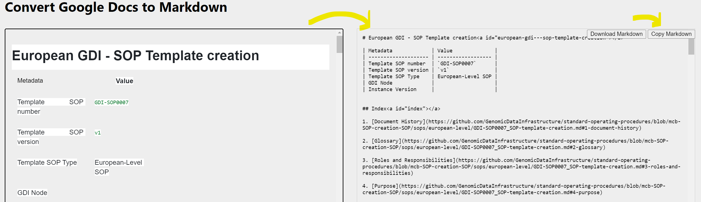
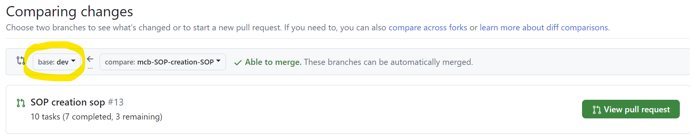
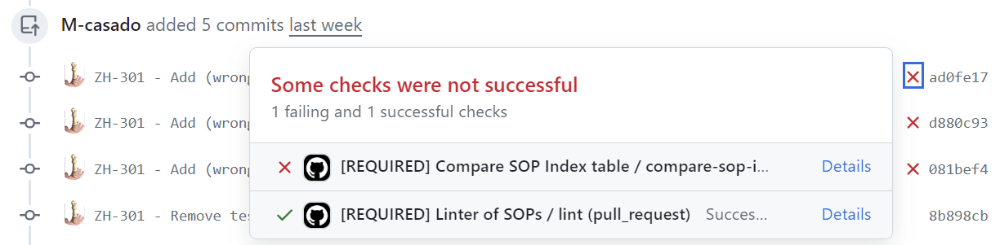

# European GDI - SOP Template creation

| Metadata             | Value              |
|----------------------|--------------------|
| Template SOP number  | ``GDI-SOP0007``    |
| Template SOP version | ``v1``             |
| Topic                | Helpdesk & operations |
| Template SOP Type    | European-Level SOP |
| GDI Node             |                    |
| Instance Version     |                    |

## Index

1. [Document History](#1-document-history)
2. [Glossary](#2-glossary)
3. [Roles and Responsibilities](#3-roles-and-responsibilities)
4. [Purpose](#4-purpose)
5. [Scope](#5-scope)
6. [Introduction and Background Information](#6-introduction-and-background-information)
7. [Summary or Context Diagram](#7-summary-or-context-diagram)
8. [Procedure](#8-procedure)
9. [References](#9-references)

### 1. Document History
| Template Version | Instance version | Author(s) | Description of changes       | Date       |
|---------|-----------|-----------|------------------------------|------------|
| ``v1.0.3`` |  | Marcos Casado Barbero | Annual review: updated OC management and OC/SDPC approval processes, removed request-for-comments (RFC) step, added Notes and delegation-aware Roles and Responsibilities entries - [PR#70](https://github.com/GenomicDataInfrastructure/standard-operating-procedures/pull/70) | ``2026.07.31`` |
| ``v1.0.2`` |  | Marcos Casado Barbero | Annual review - [#67](https://github.com/GenomicDataInfrastructure/standard-operating-procedures/issues/67) | ``2026.01.15`` |
| ``v1.0.1`` |  | Marcos Casado Barbero | Updated to linting rules - [PR46](https://github.com/GenomicDataInfrastructure/standard-operating-procedures/pull/46) | ``2024.10.29`` |
| ``v1`` |  | Marcos Casado Barbero | Created first version of the SOP | ``2024.07.08`` |

### 2. Glossary
Find GDI SOPs common Glossary at the [**charter document**](https://github.com/GenomicDataInfrastructure/standard-operating-procedures/blob/main/docs/GDI-SOP_charter.md).

| Abbreviation  | Description                                                         |
|---------------|---------------------------------------------------------------------|
| CC            | Carbon Copy (used in communications to send a copy to others)       |
| CSC           | Finnish IT centre for science                                       |
| EBI           | European Bioinformatics Institute                                   |
| EMBL          | European Molecular Biology Laboratory                               |
| GH            | GitHub                                                              |
| GDI           | European Genomic Data Infrastructure                                |
| HRI           | Health Research Infrastructure                                      |
| ISM           | Information Service Management                                      |
| IST           | Instituto Superior Técnico                                          |
| IT            | Information Technology                                              |
| MB            | Management Board                                                    |
| NBIS          | National Bioinformatics Infrastructure Sweden                       |
| OC            | Operations Committee                                                |
| ORR           | Organisational Roles and Responsibilities                           |
| PR            | Pull Request                                                        |
| RFC           | Request For Comments                                                |
| SDPC          | Security and Data Protection Committee                              |
| SLA           | Service Level Agreement                                             |
| SOP           | Standard Operating Procedure                                        |
| TBD           | To Be Determined                                                    |
| TB            | Top to Bottom                                                       |
| TODO          | A list of pending tasks                                             |
| URL           | Uniform Resource Locator                                            |
| UU            | University of Uppsala                                               |
| WP            | Work Package                                                        |

| Term          | Definition                                                          |
|---------------|---------------------------------------------------------------------|
| CHANGELOG     | Log or record of all notable changes made to a project              |
| README        | File that provides information about a project or directory         |
| YYYYMMDD      | Date format in year-month-day                                       |

### 3. Roles and Responsibilities
See the qualifications and responsibilities of the roles at the [**Organisational Roles and Responsibilities**](https://github.com/GenomicDataInfrastructure/standard-operating-procedures/blob/main/docs/GDI-SOP_organisational-roles-and-responsibilities.md) document.

| Role       | Full name       | GDI/node role   | Organisation | Notes |
|------------|-----------------|-----------------|--------------|-------|
| Author     | Marcos Casado Barbero | Task 4.3 member | EMBL-EBI |       |
| Reviewer   | Pedro Ferreira | Task 4.3 member | IST |       |
| Reviewer   | Bianca Hendriksze | Task 4.3 member | HRI |       |
| Reviewer   | Elisavet Torstensson | Task 4.3 member | UU / NBIS |       |
| Reviewer   | Mattias Strömberg | Task 4.3 member | UU / NBIS |       |
| Approver   | Óscar Martínez | SDPC member | CRG |       |
| Approver   | Gabriele Rinck |  | EMBL-EBI |       |

### 4. Purpose
This SOP defines the process of creating an SOP, from the [initial SOP request](https://github.com/GenomicDataInfrastructure/standard-operating-procedures/issues?q=is%3Aissue%20state%3Aopen%20label%3Anew-sop-request) to a fully authorised, released SOP. This helps everyone involved in the process, such as the maintainers of the `GenomicDataInfrastructure/standard-operating-procedures` repository, members of GDI's Operations Committee (OC) or those involved in drafting, reviewing, approval and authorisation. In doing so, the process is reproducible and straightforward, ensuring consistency and quality in SOP development across the GDI project.

### 5. Scope
This SOP **starts with the need to create a new GDI SOP Template**, triggered by the creation of a new GH issue through the [``New SOP Request``](https://github.com/GenomicDataInfrastructure/standard-operating-procedures/issues/new?assignees=&labels=new-sop-request%2Cenhancement&projects=&template=new_sop_request.yaml&title=%5BSOP+Request%5D+%3CShort+title%3E) issue template.

The SOP encompasses the steps after the need for an SOP has been identified, until the addition of the markdown SOP within the GitHub repository itself. The **output of this SOP will be the finalised document added to the repository**.

### 6. Introduction and Background Information
Given the size of GDI as a project, in order to minimise the heterogeneity among GDI nodes, this repository contains SOPs, templates, and instances, standardising procedures for GDI members to follow. How these SOPs are created is a process in itself, which task 4.3 of the project aims to define. This document aids the creators and maintainers of these SOP Templates along that process.

### 7. Summary or Context Diagram


### 8. Procedure
#### 8.1. Evaluate SOP request
| Step identifier | When| Who |
|:----------------|:----|:----|
| ``1``         | When GH issue (_New SOP Request_) is created | OC |

The process starts when a GH user creates a GH issue like the following, requesting a new SOP:



As a member of the OC, **evaluate the new SOP request**, following these criteria:
- **Existing content**: Is the requested SOP not already in the GH repository?
- **Request**: Is the request correctly made? Is there missing information? Is the given information comprehensive enough?
- **Motivation**: Is the creation of the SOP justified and valid? Would GDI benefit from the creation of this SOP? Is the SOP covering a repetitive process of the GDI workflow?

If needed, the OC may consult with the SDPC regarding any aspects of the SOP that relate to security or data protection.

🔀 Depending on the answer to all previous questions:
- If the answers are **affirmative**:
    - Add the tag ``accepted`` to the GitHub issue
    
    - Proceed to ⏩[step 2](#82-draft-sop-document).
- If the answers are **negative**, either:
    - Request more information from the user, and repeat the review if necessary.
    - Justify the rejection of the request in the GH issue, and close it. 🔚

#### 8.2. Draft SOP document
| Step identifier | When| Who |
|:----------------|:----|:----|
| ``2`` | After SOP request is accepted | OC |

Following evaluation and acceptance of the SOP request, as a member of the OC, you shall **prepare the SOP draft**. This document will be a modified copy of the [general SOP template](../../docs/GDI-SOP_sop-template.md).

Depending on the product backlog, a request may need to wait until it is picked for drafting.

The **format** of the drafted document can vary, based on the convenience of all the roles intervening in the writing and reviewing processes:
- **Markdown document**. The draft can be started plainly in markdown, by making a copy of the [general SOP template](../../docs/GDI-SOP_sop-template.md) (already in markdown). This format is recommended only if everyone involved in the process is familiar with Git and Markdown's syntax. While less agile than a live collaborative platform, the benefit is that there are no format conversions, and the draft evolves directly into the final SOP document.
- **Google Document**. The template may be transformed from its native markdown to a Google Document, where it will be edited live as a draft, and then reformatted back into a markdown document later on. While reformatting back to Markdown will be needed at [step 5](#85-prepare-final-sop-markdown-document), this is likely the most common path, given its simplicity by making use of Google Drive features. To create the draft, follow these steps:
   - Either (_option 1_) directly copy-paste the markdown from the [general SOP template](../../docs/GDI-SOP_sop-template.md) into a new document at **GDI's [SOP Drafts](https://drive.google.com/drive/u/0/folders/131kJLHDk8L2oGgnRzRBT5AR0Ofpbn2qS) directory**; or (_option 2_) duplicate the existing SOP Template Google Document in the same directory. See video snippet below.
   - Name the new file following the format of ``< YYYYMMDD > - GDI-SOP_draft-< SOP title >`` (e.g., ``20240702 - GDI-SOP_draft-SOP Template creation``).
   - In Google Documents, tables can have a **header**, but you must specify it as such for each table (or copy-paste the one you configure): right-click on a table, click on ``Table properties``, click on ``Row``, and then tick the box ``Pin header row(s)`` (number of header rows commonly is 1). This little trick will save you a lot of headaches when the time comes to transform the document to markdown.


Regardless of the format, **fill out the draft with as much information** (e.g., background, purpose, summary...) **as possible**, to the best of your knowledge. This content will be finished by the authors later on.

Proceed to ⏩[step 3](#83-contact-authors).

#### 8.3. Contact Authors
| Step identifier | When| Who |
|:----------------|:----|:----|
| ``3`` | After SOP document has been drafted | OC |

Once the SOP document has been drafted, experts are required to fill in the gaps and finalise it. These **authors are to be appointed and contacted by you, as part of the OC**. Who the authors are will depend on the background and requirements of each SOP, and thus it is your responsibility as an OC member to **find the best-suited people for the task**. The only requirements are for authors to be part of the GDI project and to know about, or be part of, the subject the SOP revolves around. Alternatively, you may contact the GDI Work Package (WP) leaders to point you in the right direction.

The communication may vary depending on the selected authors. For example, if the experts are part of the OC themselves, then it may be best to let the group know through GDI's Slack workspace or mailing lists (``gdi_operations_committee [at] elixir-europe.org``). On the other hand, if authors are external to the OC, the following email template could be used to contact them.

Remember to CC the OC and SDPC mailing lists: ``gdi_operations_committee [at] elixir-europe.org`` and ``gdi_security_data_protection [at] elixir-europe.org``.
````
Subject: [GDI T4.3] Requesting expert input for drafted SOP
````
````
Dear < Recipient's Name(s) >,

We hope this message finds you well.

The GDI's Operations Committee (OC) has drafted a new Standard Operating Procedure (SOP): "< SOP Title >". We now seek your expertise to fill in the gaps and help us finalise it. Given your background and involvement in the GDI project, we believe you are well-suited as an author of the SOP.

We kindly request you to review the SOP draft and provide the necessary input. Please find the draft SOP document here: < URL of drafted document >

We will aid you during the subsequent rounds of review, approval and authorisation of the SOP. You can find more information about GDI SOPs here: https://github.com/GenomicDataInfrastructure/standard-operating-procedures

Should you know any other GDI members who could assist as authors as well, please let us know to get in contact with them. 

Thank you for your attention and collaboration. We look forward to your valuable contributions.

Best regards,

< Your Name >
< Your GDI Node >
Operations Committee (OC)
````

Depending on the format of the draft, the above-mentioned ``< URL of drafted document >`` will change:
- **Google Document**. You can simply paste the URL of the Google Document, making sure to add the recipients as editors of that particular document in Google Drive.
- **Markdown document**. The easiest way to share the document would be by creating a drafted PR in GH, from either a personal fork or branch to the ``dev`` branch. Make sure to create it as a _Draft pull request_. If done this way, at [step 6](#86-create-pr-review-and-merge) you will simply have to convert the draft into a _Ready for review_ PR. Check the [accessioning guide](../../docs/GDI-SOP_sop-accessioning.md#file-naming-conventions) to know how to name and where to place this new file.

Remember to **leave a comment in the GitHub issue**, briefly mentioning that authors have been contacted. Be mindful of the information you share (e.g., no email addresses), since _anything_ that is in this GitHub repository will be **publicly displayed**!

This step of the process ends when enough GDI members accepted authoring the SOP. For this to happen, it may require you, as an OC member, to engage in conversations to find the best-suited authors. These conversations will also be useful for the selection of reviewers (step 4.1 below).

Proceed to ⏩[step 4](#84-monitor-sop-development).

#### 8.4. Monitor SOP development
| Step identifier | When| Who |
|:----------------|:----|:----|
| ``4``                  | After SOP authors have been appointed | OC |

It is your duty, as a member of the OC, to monitor the entire SOP development process, ensuring that:
- **Authors** are engaged with the development of the SOP. Checking the content of the SOP or contacting the authors recurrently may be required.
- **Reviewers and approvers are appointed**, diverse across GDI nodes, and engaged in the process. Beyond the role definitions in the [ORR](../../docs/GDI-SOP_organisational-roles-and-responsibilities.md), the rule of thumb is for these roles to span multiple GDI Pillars and nodes, as appropriate. Reviewers may be selected directly by the OC or by the authors themselves. The OC and SDPC appoint their respective approval positions.
- **Communication is efficient** throughout the process. For example, ensuring that GDI Management Board (MB) receives the request to authorise the final SOP, or that authors are aware of any requested changes.
- All **people involved are included in the _Roles and Responsibilities_ section** of the drafted SOP. This includes all authors, reviewers, approvers, authorisers, approval delegates and responsible delegators, and any other role pertinent to the SOP.
- Every **gate-keeping event** (review, approval, authorisation) **is documented in the GH issue**. The OC should record reviewer and approver appointments (e.g., ``Reviewed by ...; pending approval by ...``), the committee represented by each approver, any delegation and its responsible delegator, the two-week approval deadlines, and all approval or justified rejection outcomes.

In each of the subsequent sub-steps, back and forth communication between all actors may be needed to address requests.

Proceed to ⏩[step 4.1](#841-appoint-reviewers).

##### 8.4.1 Appoint reviewers
| Step identifier | When| Who |
|:----------------|:----|:----|
| ``4.1``         | After SOP authors have been appointed | OC |

Similar to how authors were nominated and contacted, you shall **appoint reviewers and contact them** requesting their review. Depending on the SOP, who are the reviewers and how to contact them will vary. If by email, you can use the email template below.

Remember to CC the OC mailing list: ``gdi_operations_committee [at] elixir-europe.org`` 
````
Subject: [GDI T4.3] Requesting SOP review
````
````
Dear < Recipient's Name(s) >,

We hope this message finds you well.

A new GDI Standard Operating Procedure (SOP) is in development. We now seek your expertise to review the drafted SOP to ensure that its content meets GDI's quality standards. Given your background and involvement in the GDI project, we believe you are well-suited as a reviewer of this SOP, titled "< SOP Title >".

We kindly request you to review the SOP draft and provide your feedback. Please find the draft SOP document here: < URL of drafted document >

You can find more information about GDI SOPs here: https://github.com/GenomicDataInfrastructure/standard-operating-procedures
There is a review checklist at your disposal that may be of help at: https://github.com/GenomicDataInfrastructure/standard-operating-procedures/blob/main/docs/GDI-SOP_review-checklist.md

Should you know any other GDI members who could assist as reviewers as well, please let us know to get in contact with them.

Thank you for your attention and collaboration. We look forward to your valuable contributions.

Best regards,

< Your Name >
< Your GDI Node >
Operations Committee (OC)
````

You shall **follow through the communication between authors and reviewers**, to ensure that once authors have drafted the SOP, reviewers are notified and proceed with their reviews.

A person who participated in the SOP review may **also** be appointed as an approver of the same SOP.

Once the reviews are finished (i.e., feedback has been addressed), proceed to ⏩[step 4.2](#842-request-ocsdpc-approval).

##### 8.4.2 Request OC/SDPC approval
| Step identifier | When| Who |
|:----------------|:----|:----|
| ``4.2``         | After reviewers have completed SOP review | OC and SDPC |

Once the drafted SOP has been filled in by the authors and has passed the inspection of reviewers, it shall go through approval by the OC and SDPC. The following rules apply:

- **Each committee appoints two approval positions** for the SOP. Commonly, this results in **four** distinct approvers.
- A person who is a **member of both committees** may be appointed by both and approve on behalf of both. In this case, one additional approver must be appointed by each committee, resulting in **three distinct approvers**.
- A **reviewer** may also be appointed as an approver of the same SOP.
- Each committee may use a **rota to share approval appointments evenly** among its members.
- An appointed OC or SDPC member may **delegate the approval task** to another GDI member, including someone who is not a committee member. The delegation fulfils the delegator's committee approval position, but the **delegating member retains responsibility** and accountability for that approval. Both the delegate and responsible delegator must be documented in the GH issue and the Roles and Responsibilities section of the SOP.

If an approver delegates to someone else, both _Approver_ and _Delegate_ need to be properly added to the SOP's Roles and Responsibilities table. This includes recording the delegation in both roles' _Notes_ cells. For example, `Delegated approval to X` (at Approver's) and `Approval delegated by Y` (at Delegate's).

> [!IMPORTANT]
> Each approver must provide a formal approval or justified rejection **within two weeks of being appointed**.

Use the following template to **send an email to the OC (``gdi_operations_committee [at] elixir-europe.org``) and SDPC (``gdi_security_data_protection [at] elixir-europe.org``) requesting approval**:
````
Subject: [GDI T4.3] Requesting SOP approval
````
````
Dear OC/SDPC,

I hope this message finds you well.

A new GDI Standard Operating Procedure (SOP) is in development. It was drafted by the OC, authored, and reviewed by GDI members, and is pending approval from across the Operations Committee (OC) and Security and Data Protection Committee (SDPC).

Please appoint two approval positions from each committee for this SOP. This will normally result in four distinct approvers. A member of both committees may be appointed on behalf of both, provided that one additional approver is appointed by each committee, resulting in three distinct approvers. A previous reviewer of this SOP may also serve the role of an approver.

An appointed committee member may delegate the approval task to another GDI member, including a non-committee member, but the delegating member retains responsibility and accountability for the approval. 

Please document the appointment of approvers or their delegates and responsible delegators in the SOP Request GH issue. 

Each committee may use an optional rota to distribute approval appointments.

Each approver shall provide a formal approval or justified rejection **within two weeks** of their appointment. Find the current SOP document here: < URL of SOP document >.

You can find more details about this SOP development at the following sources:
- [Charter](https://github.com/GenomicDataInfrastructure/standard-operating-procedures/blob/main/docs/GDI-SOP_charter.md)
- [Information Service Management](https://github.com/GenomicDataInfrastructure/standard-operating-procedures/blob/main/docs/GDI-SOP_information-service-management.md).
- SOP Request: < URL of the GH issue, the SOP request >

Thank you for your attention and collaboration.

Best regards,

< Your Name >
< Your GDI Node >
Operations Committee (OC) / Security and Data Protection Committee (SDPC)
````

**Follow through the approval process**, ensuring that both committees complete their required approvals within two weeks and that all three GDI Pillars are aware of the new SOP. It may be necessary to raise the SOP at committee meetings or remind appointed approvers of the deadline. Record each appointment, delegation, responsible delegator, deadline, approval or justified rejection in the GH issue and/or Pull Request.

Once the SOP has been approved, proceed to ⏩[step 4.3](#843-contact-management-board).

##### 8.4.3 Contact Management Board
| Step identifier | When| Who |
|:----------------|:----|:----|
| ``4.3``         | After OC/SDPC approval has been obtained | OC |

Once approved by the OC and SDPC, **communicate the formal authorisation request to the GDI MB**. Make use of the template below to craft the email and send it to ``gdi-mb [at] elixir-europe.org``.

Remember to CC the OC and SDPC mailing lists: ``gdi_operations_committee [at] elixir-europe.org`` and ``gdi_security_data_protection [at] elixir-europe.org``.
````
Subject: [GDI T4.3] Requesting SOP authorisation
````
````
Dear GDI Management Board,

We hope this message finds you well.

The Operations Committee (OC) and Security and Data Protection Committee (SDPC) are pleased to inform you that a new GDI Standard Operating Procedure (SOP) has been developed. It was drafted by the OC, authored, and reviewed by GDI members, and finally approved by the OC and SDPC. We now present this SOP to the Management Board for formal authorisation.

As part of the authorisation process, if no issues are raised within **four weeks** of this notice, the OC will consider the SOP to be authorised and we will proceed to add it to the GDI SOP GitHub repository.

Please, also let us know if:
- An extension to this 4-week period is required to evaluate whether to veto or not the SOP release.
- You are certain the veto of the SOP will not be exercised before these 4 weeks. This will help us resume the process as early as possible.  

Please, find the SOP document here: < URL of SOP document >.

More information about the SOP development process can be found within the [Charter](https://github.com/GenomicDataInfrastructure/standard-operating-procedures/blob/main/docs/GDI-SOP_charter.md) and [Information Service Management](https://github.com/GenomicDataInfrastructure/standard-operating-procedures/blob/main/docs/GDI-SOP_information-service-management.md) at our repository.
Thank you for your attention and collaboration.

Best regards,

< Your Name >
< Your GDI Node >
Operations Committee (OC)
````

This **step shall finish** either:
- When the **period to raise issues (4 full weeks) has concluded without any objections from the MB**.
- The **MB explicitly authorised the SOP** before the 4-week period finished.

If comments are received from this body, the step shall finish when they are addressed, starting a new period of review altogether. Similar consideration is to be taken if the MB requests a period extension. It will be your responsibility, as an OC member, to keep track of the status of development and to make sure requested changes are addressed (e.g., contacting authors).

Proceed to ⏩[step 5](#85-prepare-final-sop-markdown-document).

#### 8.5. Prepare final SOP Markdown document
| Step identifier | When| Who |
|:----------------|:----|:----|
| ``5`` | After authorisation is confirmed (explicitly or by the end of the veto period) | OC |

Now that we have the content reviewed and ready, we need to **format it to fit into the GH repository**. The difficulty of this step will vary depending on the chosen format for the draft at [step 2](#82-draft-sop-document). In both cases, it is assumed that you are familiar with GH and already have a local copy of the GDI SOP repository (i.e., you have cloned it). If you are not familiar with GitHub, refer to the documentation (and its recorded sessions) available at [Introduction to GitHub for GDI SOP Maintainers](../../docs/GDI-SOP_github-introduction-for-maintainers.md) and [SOP GitHub Management](../../docs/GDI-SOP_github-management.md).

If the **document was drafted using Google Drive**, its format must be modified before it is added to the repository. On the other hand, if the **document was drafted in markdown** format natively, there are no format changes required and thus you can skip the first two of the following:
1. [_Only if the document was drafted using Google Drive_] **Copy the whole Google Document and paste it** into the left box at [**gdoc2md**](https://gdoc2md.com/). There are many tools to format a Google Document into markdown but, in our experience, this one keeps the markdown format the closest to the native template, which is especially relevant regarding tables. Bear in mind that anything copied here would be processed by the tool deployed at someone else's server. If the document contains information that should not be public (yet), consider other choices, like locally installing [gdoc2md](https://github.com/mr0grog/google-docs-to-markdown) or [pandoc](https://pandoc.org/installing.html).

2. [_Only if the document was drafted using Google Drive_] **Copy the raw markdown into a new file**. Check the [accessioning guide](../../docs/GDI-SOP_sop-accessioning.md#file-naming-conventions) to know how to name and where to place this new file.



3. Manually **inspect that the markdown file complies with the [Style and Format guide for GDI SOPs](../../docs/GDI-SOP_style-guide.md)**. Some **format changes** may be necessary depending on the document, especially if it was drafted originally in Google Drive. These changes should not affect the content that was reviewed and authorised previously, just the format.

At this point, **assign an accession to the new SOP**. This includes modifying both the SOP's filename and metadata table inside it. See the [accessioning guide](../../docs/GDI-SOP_sop-accessioning.md#file-naming-conventions) on how to. This accession should be unique, and thus you shall check what the existing accessions are at the [SOP Index table](../README.md), and other incoming accessions in open PRs (from other SOPs also in development).

Finally, update secondary documentation of the repository:
- **Update the [SOP Index table](../README.md)** with the new SOP. You can either do it manually, or copy the output of the following snippet (assuming you have the required libraries installed):
````
python3 scripts/sop_index.py sops/ -v 1
````
- Add **any new changes to the [CHANGELOG.md](../../CHANGELOG.md)** document.

Proceed to ⏩[step 6](#86-create-pr-review-and-merge).

#### 8.6. Create PR, review and merge
| Step identifier | When| Who |
|:----------------|:----|:----|
| ``6`` | After final document was created | OC |

Once the markdown file has the required content in the proper format, it is time to add it to the other SOPs in the repository. To do so, **create a PR against the ``dev`` branch**, containing the new SOP document.



Remember to **reference (i.e., comment) the GH issue** (i.e., its URL) of the SOP request in this PR, so that it is automatically tracked by GH.

Members of the OC are to be listed as **reviewers** in the PR. Given that the content is not supposed to be modified, this review is merely for format changes that occurred (or should have occurred) between the formal authorisation and the final document ([step 5](#85-prepare-final-sop-markdown-document)). This assumes that review, approval and authorisation were already given before adding reviewers. Otherwise, you can use the PR review process to request feedback at these steps.

Furthermore, any **GH workflows** (e.g., SOP linter) **should be addressed** (i.e., assert that they pass) before merging. See in the [GH Introduction for Maintainers](../../docs/GDI-SOP_github-introduction-for-maintainers.md#workflows-and-linting) and the image below where to look at:



Finally, **once the PR has been reviewed** and all required checks pass, **merge it** against the ``dev`` branch. At this point, **this SOP development is finished**. The new content will stay there until it is to be released and merged with ``main``.

In case there are merge conflicts, resolve them either through GH's user interface or command line before merging (see [documentation](https://docs.github.com/en/pull-requests/collaborating-with-pull-requests/addressing-merge-conflicts/resolving-a-merge-conflict-on-github)).

At this point, **resolve any possible loose ends** (e.g., GH issues, email threads...).

Congratulations! 🔚

### 9. References
| Reference | Description                                          |
|-----------|------------------------------------------------------|
| [1](https://github.com/GenomicDataInfrastructure/standard-operating-procedures/blob/main/docs/GDI-SOP_charter.md) | European GDI - SOP Charter |
| [2](https://github.com/GenomicDataInfrastructure/standard-operating-procedures/blob/main/docs/GDI-SOP_information-service-management.md) | European GDI - Procedures for Information Service Management (ISM) for SOPs |
| [3](https://github.com/GenomicDataInfrastructure/standard-operating-procedures/blob/main/docs/GDI-SOP_organisational-roles-and-responsibilities.md) | European GDI - Organisational Roles and Responsibilities (ORR) |
| [4](https://drive.google.com/drive/u/0/folders/131kJLHDk8L2oGgnRzRBT5AR0Ofpbn2qS) | European GDI - GDI's SOP Drafts directory |
| [5](https://gdoc2md.com/) | gdoc2md - Document formatter from Google Document to Markdown|
| [6](https://github.com/GenomicDataInfrastructure/standard-operating-procedures) | European GDI - standard-operating-procedures GH repository|
| [7](https://github.com/GenomicDataInfrastructure/standard-operating-procedures/issues/new?assignees=&labels=new-sop-request%2Cenhancement&projects=&template=new_sop_request.yaml&title=%5BSOP+Request%5D+%3CShort+title%3E) | European GDI - New SOP request GH issue template |
