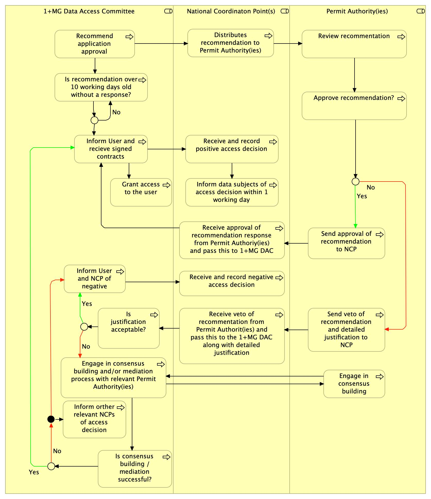

# European GDI - NCPs veto EDIC decision

| Metadata | Value |
| -- | -- |
| Template SOP number       | ``GDI-SOP0002``           |
| Template SOP version      | ``v1``                    |
| Topic                     | Helpdesk & operations |
| Template SOP Type         | Node-specific SOP     |
| GDI Node                  |                       |
| Instance version          |                       |

## Index

1. [Document History](#1-document-history)
2. [Glossary](#2-glossary)
3. [Roles and Responsibilities](#3-roles-and-responsibilities)
4. [Purpose](#4-purpose)
5. [Scope](#5-scope)
6. [Introduction and Background Information](#6-introduction-and-background-information)
7. [Summary or Context Diagram](#7-summary-or-context-diagram)
8. [Procedure](#8-procedure)
9. [References](#9-references)

### 1. Document History

| Template Version | Instance version | Author(s)         | Description of changes               | Date       |
|------------------|------------------|-------------------|--------------------------------------|------------|
| ``v1``               |                  | Marcos Casado Barbero    | Transform document to markdown     | ``2024.09.27`` |
| ``v0.1``             |                  | Dylan Spalding    | Comments addressed and first draft of SOP | ``2024.08.14`` |

### 2. Glossary
Find GDI SOPs common Glossary at the [**charter document**](https://github.com/GenomicDataInfrastructure/standard-operating-procedures/blob/main/docs/GDI-SOP_charter.md).

| Abbreviation | Description                                        |
|--------------|----------------------------------------------------|
| 1+MG         | 1+ Million Genomes                                 |
| DAC          | Data Access Committee                              |
| EDIC         | European Digital Infrastructure Consortium         |
| NCP          | Node Contact Point                                 |
| SOP          | Standard Operating Procedure                       |

| Term          | Definition                                         |
|---------------|----------------------------------------------------|
| Permit Authority | National body responsible for data access decisions |

### 3. Roles and Responsibilities
See the qualifications and responsibilities of the roles at the [**Organisational Roles and Responsibilities**](https://github.com/GenomicDataInfrastructure/standard-operating-procedures/blob/main/docs/GDI-SOP_organisational-roles-and-responsibilities.md) document.

| Role       | Full name             | GDI/node role           | Organisation |
|------------|-----------------------|-------------------------|--------------|
| Author     | Dylan Spalding        | Finland / Pillar II co-lead | CSC          |
| Author     | Marcos Casado Barbero | Task 4.3 Lead | EMBL-EBI          |
| Reviewer   | Regina Becker | LU / Pillar I co-lead | LNDS |
| **Approver**   | Gabriele Rinck | Task 4.3 member | EMBL-EBI |
| **Approver**   | Markus Englund | Task 4.3 member | UU / NBIS |

### 4. Purpose
The purpose of this SOP is to delineate a standardised process for NCPs to review and potentially veto decisions made by the 1+MG EDIC regarding data access requests. This will ensure that data access is consistent with national regulations and ethical standards.

### 5. Scope
This SOP applies to all NCPs and Permit Authorities involved in the GDI project across participating countries, and relates to the 1+MG Data Governance (See [1+MG Data Governance for Research](https://docs.google.com/document/d/1P_nzGxMXG4CWzqkVbceY2fA3MQ7PEAwW)). It covers the procedures for reviewing and vetoing data access decisions made by the 1+MG DAC.

### 6. Introduction and Background Information
The GDI project aims to facilitate the integration and accessibility of genomic data across Europe, underpinned by the 1+MG initiative. The 1+MG EDIC is a central legal entity established through a Commission Implementing Decision. It orchestrates the infrastructure implementation of the multi-country project based on the 1+MG Declaration, central to overseeing data access requests. Given the strategic importance and sensitivity of genomic data, the role of NCPs and Permit Authorities are critical in ensuring that access decisions by the 1+MG DAC adhere to both national and European standards.

### 7. Summary or Context Diagram

**Figure 1**: 1+MG DAC, NCP, and Permit Authority processes for approval or veto of a 1+MG recommendation 

### 8. Procedure
#### 1. NCP Distribute the application recommendation
| Step identifier | When                           | Who       |
|:----------------|:-------------------------------|:----------|
| 1               | Receipt of 1+MG DAC decision   | NCP       |

Once the 1+MG DAC issues a decision, as the NCP, you should **distribute the application recommendation** to the appropriate 1+MG Data Holders and Permit Authority(ies), who will approve or deny the recommendation. Remind them to respond within 10 working days.

Depending on the response that you receive from these authorities and data holders:
- If a decision is **not** communicated within 10 working days, move to step **step 4**.
- If a decision is communicated within 10 working days:
   - If veto is not exercised in the response you receive, let the 1+MG DAC know and move to **step 4**
   - If **veto is exercised** in the response you receive, move to **step 2**.

#### 2. Communicate justification of veto
| Step identifier | When                           | Who       |
|:----------------|:-------------------------------|:----------|
| 2               | After step 1 and within 1 working day  | NCP       |

If the veto of the 1+MG DAC's recommendation is exercised, as the NCP you shall **communicate a detailed justification to the 1+MG DAC within one day**. In this communication, you shall cite discrepancies between the ethical assessment of the 1+MG DAC and the national decision maker(s).

Move to **step 3**.

#### 3. Review of veto by 1+MG DAC
| Step identifier | When                           | Who       |
|:----------------|:-------------------------------|:----------|
| 3               | After step 2                   | 1+MG DAC  |

If veto is exercised on some or all of the relevant data, as the 1+MG DAC, **review the justification provided** by the NCP.

Depending on the outcome of this evaluation:
- If **veto is accepted**, move to **step 7**. 
- If the **justification is not accepted** in full, move to **step 6**. 
- If **no veto was exercised**, or the **time lapse** from step 1 is greater than **10 working days**, move to **step 4**.

#### 4. Inform NCP and User about the decision
| Step identifier | When                           | Who       |
|:----------------|:-------------------------------|:----------|
| 4               | After step 3 or 6              | 1+MG DAC  |

As the 1+MG DAC, **inform the NCP and User** (whose request was initially recommended) of the decision: approved access request.

Move to **step 5**.

#### 5. Inform data subjects
| Step identifier | When                           | Who       |
|:----------------|:-------------------------------|:----------|
| 5               | After step 4                   | NCP       |

As the NCP, **inform the relevant data subjects** of the proposed research **within 1 working day**.

This concludes the process resulting in final approval of the data access request.

#### 6. Consensus building process
| Step identifier | When                           | Who       |
|:----------------|:-------------------------------|:----------|
| 6               | After step 3                   | 1+MG DAC  |

If the justification is not accepted in full, as the 1+MG DAC, **initiate the consensus-building process** between the 1+MG DAC and the national data holders and/or permit authorities. 

Depending on the outcome of the process:
- If **consensus is reached**, move to **step 4**. 
- If consensus is **not** reached, move to **step 7**.

#### 7. Inform User and other NCPs of the final decision
| Step identifier | When                           | Who       |
|:----------------|:-------------------------------|:----------|
| 7               | After step 3 or 6              | 1+MG DAC  |

As the 1+MG DAC, **inform** the User and the User’s institution of the **final decision**, as well as other NCPs for whom the decision to veto may be relevant.

This concludes the process resulting in the rejection of the data access request.

### 9. References
| Reference | Description |
| -- | -- |
| [1](https://docs.google.com/document/d/1b887HMySeKnJt1pN1pZspGRbEnrJ6Sfk-aAwiskYJK0/edit) | European GDI - SOP Charter (including Glossary)                  |
| [2](https://docs.google.com/document/d/1P_nzGxMXG4CWzqkVbceY2fA3MQ7PEAwW/edit)            | 1+MG Data Governance for Research                                |
