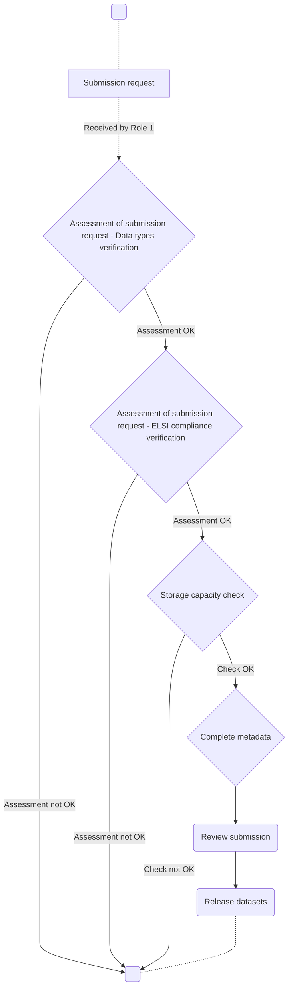

# European GDI - Data Reception Procedure

| Metadata | Value |
|----------|-------|
| Template SOP number | GDI-SOP0010 |
| Template SOP version | v1 |
| Topic | Data & Metadata Management |
| Template SOP Type | Node-specific SOP |
| GDI Node | - |
| Instance version | - |

## Index

1. [Document History](#1-document-history)
2. [Glossary](#2-glossary)
3. [Roles and Responsibilities](#3-roles-and-responsibilities)
4. [Purpose](#4-purpose)
5. [Scope](#5-scope)
6. [Introduction and Background Information](#6-introduction-and-background-information)
7. [Summary or Context Diagram](#7-summary-or-context-diagram)
8. [Procedure](#8-procedure)
9. [References](#9-references)

### 1. Document History

| Template Version | Instance version | Author(s) | Description of changes       | Date       |
|---------|-----------|-----------|------------------------------|------------|
| `v1` | `v1.0.2` | Jorge Oliveira, Aleksandar Kmetov, Jacek Lebioda | Converting to SOP template and futher refinement | 2026.08.31 |
| `v1` | `v1.0.1` | Jorge Oliveira, Miguel Cisneiros | Further development of the first version of the SOP | 2025.08.22 |
| `v1` | `v1.0.0` | Jorge Oliveira, Pedro Ferreira | Created first version of the SOP | 2024.09.10 |

### 2. Glossary
Find GDI SOPs common Glossary at the [**charter document**](https://github.com/GenomicDataInfrastructure/standard-operating-procedures/blob/main/docs/GDI-SOP_charter.md).

| Abbreviation | Description     |
|---------------|-----------------|
| ELSI          | Ethical, Legal, and Social Issues |

| Term          | Definition      |
|---------------|-----------------|
| Node Helpdesk | The support team is responsible for handling tickets related to data management issues associated with the node in the GDI Project. |
| Ticket | Incoming issues from the GDI Virtual Helpdesk, are to be processed within the Node Helpdesk and, after that, returned to the Virtual Helpdesk |
| Data Reception   | The process where GDI node securely acquires, ingests, and validates data supplied by a data provider | 
| Data Submission  | The process of registering, publishing, and making data assets discoverable and accessible |
| Data Preparation | The process of structuring, annotating, and formatting data so that systems and users can discover, access and reuse it | 
| Data Inclusion   | Systematic integration of data into structured and machine-readable datasets |

### 3. Roles and Responsibilities
See qualifications and responsabilities of the roles at the [**Organisational Roles and Responsibilities**](https://github.com/GenomicDataInfrastructure/standard-operating-procedures/blob/main/docs/GDI-SOP_organisational-roles-and-responsibilities.md) document.

| Role       | Full name       | GDI/node role   | Organisation |
|------------|-----------------|-----------------|--------------|
| Author     | Jorge Oliveira | Node technical coordinator   |  BioData.pt   |
| Reviewer   |                 |                 |              |
| Approver   |                 |                 |              |
| Authorizer |                 |                 |              |

### 4. Purpose
This SOP is an overarching procedure on how the data submissions made by the data suppliers will be handled. The purpose is to provide a clear, step-by-step guide for handling data submissions to the European Genomic Data Infrastructure, ensuring that helpdesk members can efficiently and accurately receive and process the submitted data and store it properly. Following, this SOP will streamline data management, maintain consistency, and ensure compliance with relevant protocols.

### 5. Scope
This SOP covers the process from receiving a data submission to the proper storage and acknowledgment of the submission. It defines how helpdesk members handle incoming submissions, ensuring they are stored accurately and appropriately for further use. 

### 6. Introduction and Background Information
This is a node-specific SOP template: each node can use this template as a basis and adapt it to their specific needs and procedures in their instances.

Data Reception in GDI covers two steps of the Data Journey: Data Preparation and Data Inclusion.

### 7. Summary or Context Diagram

### 8. Procedure

#### 1.1 Assessment of submission request - data types evaluation

| Step identifier   | When  | Who |
|:------------------|:------|:----|
| 1.1 | When data is submitted  | Helpdesk member assigned to the ticket (responsible for handling the submission request) |

Check if the submitted data types are in a standardized format - SAM, BAM, CRAM, VCF, FASTA, FASTQ:
 * Yes, continue the process
 * No, contact the submitter and request appropriate changes.

#### 1.2 Assessment of submission request - ELSI compliance verification

| Step identifier            | When             | Who |
|:------------------|:----|:----|
| 1.2 | After data types verification | The Helpdesk member assigned to the ticket (responsible for handling the submission request) |

Make compliance checks, i.e. make sure you have necessary ELSI documents (e.g. informed consent, ethical permits) and ELSI metadata (e.g. data controller).
  * Yes, continue the process
  * No, there is missing/incomplete/incorrect ELSI documentation or metadata: contact the submitter and request appropriate changes.

#### 2. Storage capacity check
| Step identifier            | When             | Who |
|:---------------------------|:-----------------|:----|
| 2.1 | After ticket assessment successful completion. | The Helpdesk member assigned to the ticket (responsible for handling the submission request) |

After evaluating the submission, determine the data size and verify if sufficient storage is available to accommodate it.
  * If yes, continue the process
  * If not, (TBD)

#### 3. Storage capacity check
| Step identifier            | When             | Who |
|:---------------------------|:-----------------|:----|
| 3 | After completing the request evaluation and all related considerations. | The Helpdesk member assigned to the ticket (responsible for handling the submission request) |

TBD

#### 4. Review submission
| Step identifier            | When             | Who |
|:---------------------------|:-----------------|:----|
| 4 | After metadata completion. | The Helpdesk member assigned to the ticket (responsible for handling the submission request) |

After all, review the full submission:
  * Data integrity check
     - Validate checksums.
     - For BAM/CRAM: samtools quickcheck and header validation.
     - For VCF: bcftools view -h and vcftools/bcftools consistency checks.
     - For FASTQ: basic read counts, header sanity checks.
   * Metadata check

#### 5. Release datasets
| Step identifier            | When             | Who |
|:---------------------------|:-----------------|:----|
| 5 | After submission review | The Helpdesk member assigned to the ticket (responsible for handling the submission request) |

TBD

### 9. References

| Reference | Description                                          |
|-----------|------------------------------------------------------|
| [1](#)    | European GDI - SOP Charter (including Glossary)      |
| [2](#)    | European GDI - Procedures for Information Service Management (ISM) for SOPs |
| [3](#)    | European GDI - Organisational Roles and Responsibilities (ORR) |
| [4](#)    | ... |
