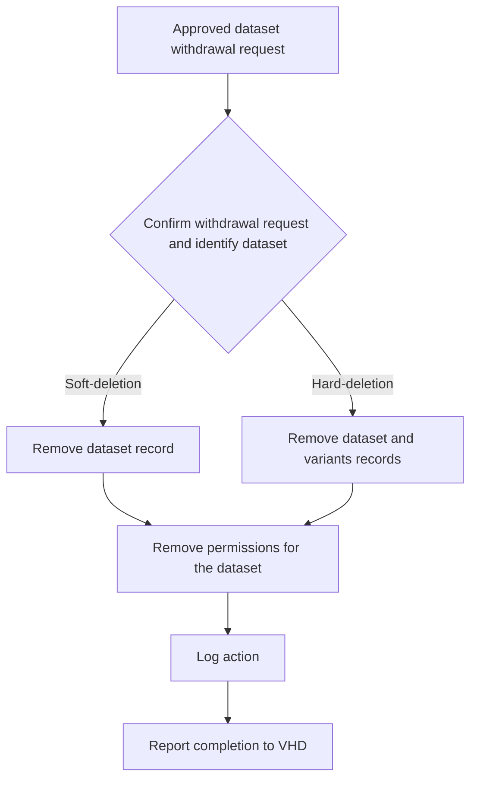

# European GDI - Withdraw_dataset_from_node_allele_frequency_beacon

| Metadata             | Value                                                                 |
| -------------------- | --------------------------------------------------------------------- |
| Template SOP number  | `GDI-SOP0012`                                                         |
| Template SOP version | `v1`                                                                  |
| Topic                | Technical infrastructure & software development                       |
| Template SOP Type    | Node-specific SOP                                                      |
| GDI Node             |                                                                       |
| Instance version     |                                                                       |

## Index

1. [Document History](#1-document-history)
2. [Glossary](#2-glossary)
3. [Roles and Responsibilities](#3-roles-and-responsibilities)
4. [Purpose](#4-purpose)
5. [Scope](#5-scope)
6. [Introduction and Background Information](#6-introduction-and-background-information)
7. [Summary or Context Diagram](#7-summary-or-context-diagram)
8. [Procedure](#8-procedure)
9. [References](#9-references)

### 1. Document History

| Template Version | Instance version | Author(s)                   | Description of changes                                                                                                                                               | Date         |
| ---------------- | ---------------- | --------------------------- | -------------------------------------------------------------------------------------------------------------------------------------------------------------------- | ------------ |
| `v1`             |                  | Liina Nagirnaja, Oriol López-Doriga Sagalés | First version of the SOP for GitHub issue [#65](https://github.com/GenomicDataInfrastructure/standard-operating-procedures/issues/65), based on the approved draft and reviewed copy. | `2026.04.10` |
| `v0`             |                  | Marcos Casado Barbero       | Created template for draft SOP                                                                 | `2026.03.05` |

### 2. Glossary

Find GDI SOPs common Glossary at the [**charter document**](../../docs/GDI-SOP_charter.md).

| Abbreviation  | Description                                       |
| ------------- | ------------------------------------------------- |
| CRG           | Centre for Genomic Regulation                     |
| GDI           | European Genomic Data Infrastructure              |
| GDPR          | General Data Protection Regulation.               |
| EBI           | European Bioinformatics Institute                 |
| EMBL          | European Molecular Biology Laboratory             |
| FAIR          | Findability, Accessibility, Interoperability and Reusability             |
| HTTP          | Hypertext Transfer Protocol                       |
| ID            | Identifier                                        |
| SOP           | Standard Operating Procedure                      |
| VHD           | Virtual Helpdesk                                  |

| Term          | Definition                                                                                                |
| ------------- | ----------------------------------------------------------------------------------------------------------|
| Hard-deletion | Complete data removal from primary systems, plus documented handling of backups according to retention policy, with escalation if the request requires something stricter.                                     |
| Permissions   | All the information related to the dataset grants and its security level configuration.                   |
| Query         | HTTP request to an endpoint of the node’s Allele Frequency beacon.                                        |
| Soft-deletion | Data is marked as withdrawn and made inaccessible to users but retained internally for audit or limited-term retention.|
| Withdrawal    | A performance action to remove the dataset from beacon responses.                                         |

### 3. Roles and Responsibilities

See qualifications and responsibilities of the roles at the [**Organisational Roles and Responsibilities**](../../docs/GDI-SOP_organisational-roles-and-responsibilities.md) document.

| Role       | Full name                   | GDI/node role                                    | Organisation                          |
| ---------- | --------------------------- | ------------------------------------------------ | ------------------------------------- |
| Author     | Liina Nagirnaja             | Beacon Manager                                   | CRG                                   |
| Author     | Jordi Rambla                | Beacon Product Owner                             | CRG                                   |
| Author     | Oriol López-Doriga Sagalés  | Beacon Developer                                 | CRG                                   |
| Reviewer   | Marcos Casado Barbero       | Task 4.3 member                                  | EMBL-EBI                              |
| Approver   | Gabriele Rinck              | Task 4.3 member                                  | EMBL-EBI                              |
| Authorizer | Management Board            | Authorizer according to GDI SOP governance       | GDI                                   |

### 4. Purpose

AF Beacons expose population-level allele counts. A node-level SOP to withdraw data from Allele Frequency Beacons guarantees consistent, auditable removal of frequency contributions in line with GDPR and the GDI overarching withdrawal workflow.

### 5. Scope

This SOP covers the steps required to withdraw a dataset from a Node's Allele Frequency Beacon. Included steps are the identification of dataset records to withdraw, assessing the withdrawal scope, executing the removal of data, validating frequency integrity, auditing and logging the withdrawal, and reporting completion.
It is part of the higher level Dataset Withdrawal SOP (SOP0009).

### 6. Introduction and Background Information

An aggregated data beacon hosts information for variants and minimal metadata for datasets that these variants belong to. These two types of different information are often stored separately in a database but linked through some reference property that contains the dataset id for the records. This dataset id is the pivotal piece of information, under which the records are displayed in a client response and that allows to integrate the response with other services in GDI.
When attempting a withdrawal of the beacon records related to a dataset, it will be necessary to determine which is the exact id of the dataset, as case sensitivity and other character inferences may result in an unsuccessful withdrawal attempt. The withdrawal procedure of a soft-deletion is slightly different from a hard-deletion, where the amount of records to be deleted is significantly higher. Withdrawal by hard-deletion includes variants and dataset records type, whereas soft-deletion includes only the latter. 
It is important that the withdrawal procedure is preceded by a double-check of the dataset requested for withdrawal in coordination with the Fair Data Point service.
For a broader context of GDI SOPs, please refer to the [Charter](../../docs/GDI-SOP_charter.md#4-introduction).

### 7. Summary or Context Diagram



### 8. Procedure

#### 8.1. Confirm withdrawal request and identify dataset

| Step identifier | When | Who |
| :-------------- | :------------------------------------------------------------------ | :-------------------------------------- |
| `1`             | When a dataset withdrawal request has been approved under the overarching withdrawal process described in [GDI-SOP0009 dataset withdrawal](../european-level/GDI-SOP0009_dataset-withdrawal.md#87-per-system-dataset-withdrawal). | Node aggregated beacon maintainer |

As the node aggregated beacon maintainer, confirm that the incoming request package is complete before performing any deletion in beacon. Double check first:
- The original approved withdrawal request or ticket reference
- The requested scope of the withdrawal (soft or hard-deletion)
- The relevant dataset identifier matching the node FAIR Data Point’s dataset to be withdrawn
Send an HTTP GET request to your beacon’s datasets endpoint and locate the record corresponding to the ID of the dataset to be deleted,
```bash
curl 'https://<yourBeaconDomain>/datasets'
```
or perform the id query directly,
```bash
curl 'https://<yourBeaconDomain>/datasets/<id>'
```
Record the dataset identifier and the deletion type (soft or hard). Record the dataset title only as an additional verification check.
- If the request package is complete and the dataset is found, proceed to ⏩[Step 2](#82-remove-the-dataset-from-the-beacon-database).
- If the request package is incomplete or the dataset is not found, request clarification from the GDI Virtual Helpdesk and pause the workflow until the missing information is provided.

#### 8.2. Remove the dataset from the beacon database

| Step identifier | When | Who |
| :-------------- | :------------------------------------------------------------------ | :-------------------------------------- |
| `2`             | After successful completion of [Step 1](#81-confirm-withdrawal-request-and-identify-dataset). | Node aggregated beacon maintainer |

After deletion type of the dataset withdrawal is confirmed:
- If the deletion type is a soft-deletion, proceed to ⏩[Step 2.1](#821-soft-deletion).
- If the deletion type is a hard-deletion, proceed to ⏩[Step 2.2](#822-hard-deletion-option-a).

##### 8.2.1. Soft-deletion

| Step identifier | When | Who |
| :-------------- | :--------------------------------------- | :-------------------------------------- |
| `2.1`             | The deletion type was identified as soft. | Node aggregated beacon maintainer |

Locate yourself in the server where your beacon is running and execute the following command line script to remove the dataset record approved for  withdrawal.
```bash
docker exec mongoprod /bin/bash -c 'mongosh beacon -u <user> -p <password> --authenticationDatabase admin --eval "db.datasets.deleteMany({\"id\": \"<id>\"})"'
```

- If the removal is successful, proceed to ⏩[Step 3](#83-remove-dataset-permissions).
- If the removal is not successful, record the response obtained from the used commands, adding all the information about the actions performed and the intended goal of performing them and report to the GDI Virtual Helpdesk so that requester communication continues through the VHD workflow and proceed to ⏩[Step 3](#83-remove-dataset-permissions).

##### 8.2.2. Hard-deletion (option A)

| Step identifier | When | Who |
| :-------------- | :--------------------------------------- | :-------------------------------------- |
| `2.2`             | The deletion type was identified as hard. | Node aggregated beacon maintainer |

Located at the server where your beacon is running, execute the following command line script on the terminal adding the id for the dataset to be removed with the -d flag.
```bash
docker exec ri-tools python remove_dataset.py -d <id>
```
Next, execute the following command line script on the terminal to remove index references for that dataset.
```bash
docker exec beaconprod python -m beacon.connections.mongo.reindex
```
- If the removal is successful, proceed to ⏩[Step 3](#83-remove-dataset-permissions).
- If the removal is not successful, proceed to ⏩[Step 2.2.1](#8221-hard-deletion-option-b).

###### 8.2.2.1. Hard-deletion (option B)

| Step identifier | When | Who |
| :-------------- | :--------------------------------------- | :-------------------------------------- |
| `2.2.1`             | ⏩[Step 2.2](#822-hard-deletion-option-a) was unsuccessful | Node aggregated beacon maintainer |

Located at the server where your beacon is running, execute the following command line scripts to remove the dataset record and variants records related to the dataset to withdraw.
```bash
docker exec mongoprod /bin/bash -c 'mongosh beacon -u <user> -p <password> --authenticationDatabase admin --eval "db.datasets.deleteMany({\"id\": \"<id>\"})"'
docker exec mongoprod /bin/bash -c 'mongosh beacon -u <user> -p <password> --authenticationDatabase admin --eval "db.genomicVariations.deleteMany({\"datasetId\": \"<id>\"})"'
```
Next, execute the following command line script on the terminal to remove index references for that dataset.
```bash
docker exec beaconprod python -m beacon.connections.mongo.reindex
```
- If the removal is successful, proceed to ⏩[Step 3](#83-remove-dataset-permissions).
- If the removal is not successful, record the response obtained from the used commands, adding all the information about the actions performed and the intended goal of performing them and report to the GDI Virtual Helpdesk so that requester communication continues through the VHD workflow and proceed to ⏩[Step 3](#83-remove-dataset-permissions).

#### 8.3. Remove dataset permissions

| Step identifier | When | Who |
| :-------------- | :--------------------------------------- | :-------------------------------------- |
| `3`             | After ⏩[Step 2](#82-remove-the-dataset-from-the-beacon-database). | Node aggregated beacon maintainer |

Located at the server where your beacon is running, proceed to edit the file at the path `/beacon/permissions/datasets/datasets_permissions.yml` and remove the dataset entry.
Save the file.
- Continue to ⏩[Step 4](#84-verify-log-and-report-completion).

#### 8.4. Verify, log, and report completion

| Step identifier | When | Who |
| :-------------- | :--------------------------------------- | :-------------------------------------- |
| `4`             | After successful completion of Step 3 | Node aggregated beacon maintainer |

Verify in the beacon that the withdrawn records in the dataset are not appearing in a query of datasets and a query of variants.
Add the dataset id to the file in path `/beacon/conf/datasets/datasets/datasets_conf.yml` and add a new item under it called isDeprecated setting it as True:
```yaml
<dataset id>:
  isDeprecated: True
```
Record the action in the local audit or change log, including who performed the change, when it was performed, what was changed, the approved scope, and the reason when that information is available in the request package.
Report completion back to the GDI Virtual Helpdesk so that requester communication continues through the VHD workflow.

### 9. References

| Reference | Description |
| --------- | ----------- |
| [1](../../docs/GDI-SOP_charter.md) | European GDI - SOP Charter (including Glossary) |
| [2](../../docs/GDI-SOP_information-service-management.md) | European GDI - Procedures for Information Service Management for SOPs |
| [3](../../docs/GDI-SOP_organisational-roles-and-responsibilities.md) | European GDI - Organisational Roles and Responsibilities |
