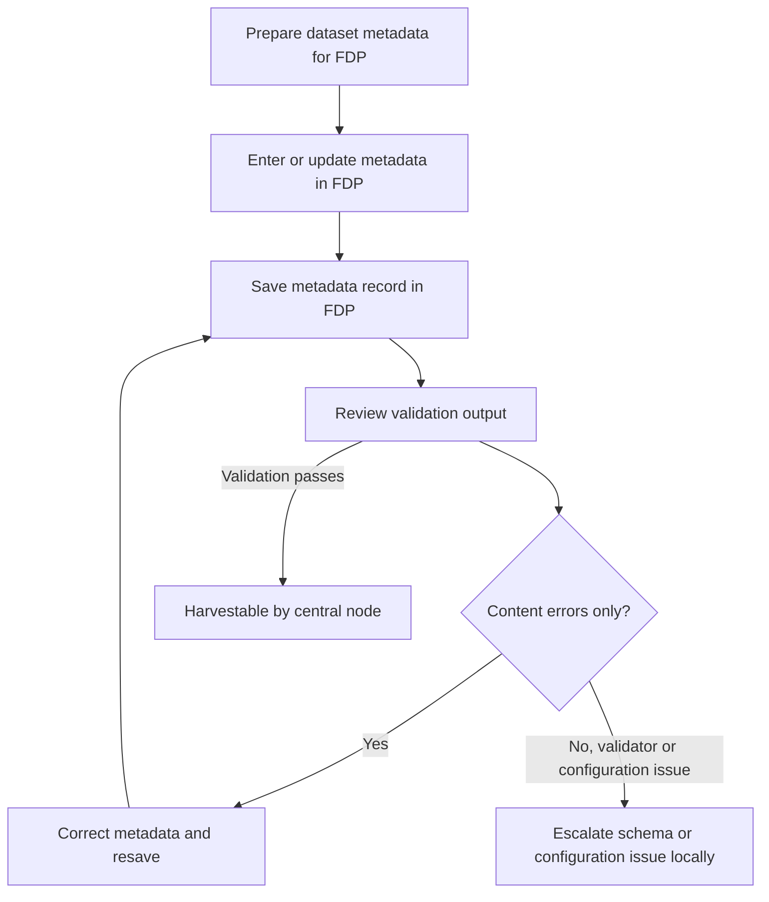

# European GDI - FDP Submission Metadata Validation

| Metadata             | Value                      |
| -------------------- | -------------------------- |
| Template SOP number  | `GDI-SOP0013`              |
| Template SOP version | `v1`                       |
| Topic                | Data & metadata management |
| Template SOP Type    | Node-specific SOP          |
| GDI Node             |                            |
| Instance version     |                            |

## Index

1. [Document History](#1-document-history)
2. [Glossary](#2-glossary)
3. [Roles and Responsibilities](#3-roles-and-responsibilities)
4. [Purpose](#4-purpose)
5. [Scope](#5-scope)
6. [Introduction and Background Information](#6-introduction-and-background-information)
7. [Summary or Context Diagram](#7-summary-or-context-diagram)
8. [Procedure](#8-procedure)
9. [References](#9-references)

### 1. Document History

| Template Version | Instance version | Author(s)                   | Description of changes                                                                                                                                               | Date         |
| ---------------- | ---------------- | --------------------------- | -------------------------------------------------------------------------------------------------------------------------------------------------------------------- | ------------ |
| `v1.0.1`         |                  | Hans-Christian van der Werf | Updated scope, roles, references, and procedure steps after pull request review.                                                                                     | `2026.04.07` |
| `v1`             |                  | Hans-Christian van der Werf | First markdown template version of the SOP for FAIR Data Point submission metadata validation, based on the reviewed draft and aligned with the repository template. | `2026.03.26` |
| `v0`             |                  | Marcos Casado Barbero       | Created the initial SOP request and draft content for submission metadata validation.                                                                                | `2026.03.05` |

### 2. Glossary

Find GDI SOPs common Glossary at the [**charter document**](../../docs/GDI-SOP_charter.md).

| Abbreviation  | Description                                       |
| ------------- | ------------------------------------------------- |
| AP            | Application Profile                               |
| DCAT          | Data Catalog Vocabulary                           |
| FAIR          | Findable, Accessible, Interoperable, and Reusable |
| FDP           | FAIR Data Point                                   |
| GDI           | European Genomic Data Infrastructure              |
| HDM           | Harmonised Data Model                             |
| HealthDCAT-AP | Health Data Catalogue Application Profile         |
| SHACL         | Shapes Constraint Language                        |
| SOP           | Standard Operating Procedure                      |
| TB            | Top to Bottom                                     |

### 3. Roles and Responsibilities

See qualifications and responsibilities of the roles at the [**Organisational Roles and Responsibilities**](../../docs/GDI-SOP_organisational-roles-and-responsibilities.md) document.

| Role       | Full name                   | GDI/node role                                    | Organisation                          |
| ---------- | --------------------------- | ------------------------------------------------ | ------------------------------------- |
| Author     | Hans-Christian van der Werf | SOP author and FDP metadata contributor          | Health Research Infrastructure        |
| Reviewer   | Marcos Casado Barbero       | Task 4.3 member                                  | European Molecular Biology Laboratory |
| Approver   | Gabi Rinck                  | Approver according to current GDI SOP governance | To be confirmed                       |
| Authorizer | GDI Management Board        | SOP authorizer according to GDI governance       | European GDI                          |

### 4. Purpose

This SOP defines the node-level FDP workflow for preparing, entering or updating, validating, correcting, and locally escalating dataset metadata in the FDP. It ensures that metadata saved in the FDP is checked against the node's applied GDI SHACL rules before the record becomes harvestable by the central node.

### 5. Scope

This SOP covers dataset-level metadata entry and update in the FDP, save-time SHACL validation in the FDP, review of the validation output returned when a record is saved, iterative correction of metadata content errors, and local escalation of validator, schema, or configuration issues.

It does not cover full GDI HDM compliance, broader metadata quality assessment beyond SHACL conformance, Beacon validation, or downstream catalogue validation outside the FDP workflow. It also does not define standalone offline validation against arbitrary SHACL validators, the central harvesting validation logic itself, or any scientific or technical processing of the underlying dataset.

### 6. Introduction and Background Information

Dataset descriptions are entered and maintained in the node's FDP instance, for example at `<Node FDP address>`, following the node's operational FDP documentation such as `<Node FDP operational documentation>`.

The operational source of truth for required metadata is the deployed GDI SHACL shape set used by the node. These shapes implement the node's current DCAT and HealthDCAT-AP constraints in the FDP and supersede any simplified prose summary in this SOP. The recommended GDI SHACL release to reference is [4], and nodes should document which shape release is deployed locally.

Nodes may deploy local SHACL shape sets that differ in implementation detail, provided they conform to the central GDI SHACL constraints required for interoperable harvesting. Central interoperability does not require every node to use byte-identical SHACL files.

In this SOP, required metadata means the metadata constraints enforced by the node's deployed SHACL shapes in the FDP. Passing FDP SHACL validation does not by itself imply full GDI HDM compliance, Beacon compliance, or compliance with future central catalogue validation rules.

In current FAIRDataPoint implementations, metadata create and edit actions return validation feedback as part of the save workflow [7], [8], [9]. If the FDP resource definitions, shape targets, or metadata model configuration are incorrect, apparent success may not represent a trustworthy validation outcome. Treat such cases as local FDP configuration issues and escalate them according to step 8.5.

### 7. Summary or Context Diagram

### 8. Procedure

#### 8.1. Prepare metadata for FDP entry

| Step identifier | When                                                                | Who                                     |
| :-------------- | :------------------------------------------------------------------ | :-------------------------------------- |
| `1`             | When dataset metadata is ready to be entered or updated in the FDP. | Node metadata curator or FDP maintainer |

As the node metadata curator or FDP maintainer, collect the dataset description, related distribution metadata, and contact information needed for the FDP record. Use the deployed GDI SHACL shapes and referenced standards as the source of truth while preparing the record instead of maintaining a separate local checklist.

If the node keeps a local submission or curation log, record which FDP instance, local documentation, and SHACL release apply to the record before proceeding.

#### 8.2. Enter or update metadata in the FDP

| Step identifier | When                                                                                 | Who                                     |
| :-------------- | :----------------------------------------------------------------------------------- | :-------------------------------------- |
| `2`             | After step 1, when the metadata record is ready to be entered or updated in the FDP. | Node metadata curator or FDP maintainer |

Enter or update the metadata directly in the node's FDP. Follow the node's FDP operating instructions, for example `<Node FDP operational documentation>`, and ensure the record is created under the intended FDP resource type and deployed shape set.

If the node uses helper tooling around the FDP, such as a local upload or onboarding workflow, that tooling must still result in a save operation against the FDP record that is reviewed according to this SOP.

#### 8.3. Save the record and review validation output

| Step identifier | When                                                                    | Who                                     |
| :-------------- | :---------------------------------------------------------------------- | :-------------------------------------- |
| `3`             | After step 2, when the metadata record is ready to be saved in the FDP. | Node metadata curator or FDP maintainer |

Save the metadata record in the FDP and review the validation feedback returned by the FDP. Treat the deployed SHACL constraints as the authoritative pass or fail criteria for this SOP.

If the validation passes, proceed to ⏩[step 8.6](#86-confirm-harvestable-state-and-record-the-outcome). If the validation fails, determine whether the outcome reflects metadata content errors or a likely validator, schema, or configuration issue before proceeding.

#### 8.4. Correct metadata content errors and resave

| Step identifier | When                                                                                                        | Who                                     |
| :-------------- | :---------------------------------------------------------------------------------------------------------- | :-------------------------------------- |
| `4`             | After step 3, when the validation output shows metadata content errors that can be corrected in the record. | Node metadata curator or FDP maintainer |

Correct the metadata content in the FDP record and save it again. Repeat this correction loop until the validation passes or until the output indicates a local FDP validator, shape, or configuration issue that cannot be resolved immediately.

If the issue is corrected, return to ⏩[step 8.3](#83-save-the-record-and-review-validation-output). If the problem is not a record-content issue, continue to ⏩[step 8.5](#85-escalate-validator-schema-or-configuration-issues-locally).

#### 8.5. Escalate validator, schema, or configuration issues locally

| Step identifier | When                                                                                                                                                        | Who                                       |
| :-------------- | :---------------------------------------------------------------------------------------------------------------------------------------------------------- | :---------------------------------------- |
| `5`             | After step 3 or step 4, when the validation output suggests a schema, configuration, or validator problem, or when repeated saves do not resolve the issue. | FDP maintainer or local FDP service owner |

Treat persistent failures, unexpected validation gaps, wrong resource targeting, or shape deployment problems as local FDP operational issues. Escalate them through the node's local FDP support path, for example `<Node FDP support contact or ticket workflow>`, and stop the record from being treated as harvestable until the issue is resolved.

If the problem is resolved, return to ⏩[step 8.3](#83-save-the-record-and-review-validation-output). If the node keeps a ticket, log, or audit trail, record the issue type, the FDP component affected, and the resolution outcome.

#### 8.6. Confirm harvestable state and record the outcome

| Step identifier | When                                                                                                                     | Who                                     |
| :-------------- | :----------------------------------------------------------------------------------------------------------------------- | :-------------------------------------- |
| `6`             | After step 3, when the FDP validation output passes without unresolved local validator, schema, or configuration issues. | FDP maintainer or node metadata curator |

When validation succeeds, the record can be treated as harvestable by the central node. This SOP ends at that point; the downstream central harvesting workflow remains outside its scope and should be defined in a future GDI harvesting specification or SOP.

If the node keeps a local operational log, ticket, or audit trail, record that the metadata passed FDP validation, which SHACL release was applied, and whether any local escalation was needed before the record became harvestable.

### 9. References

| Reference                                                                                                    | Description                                                                             |
| ------------------------------------------------------------------------------------------------------------ | --------------------------------------------------------------------------------------- |
| [1](../../docs/GDI-SOP_charter.md)                                                                           | European GDI - SOP Charter (including Glossary)                                         |
| [2](../../docs/GDI-SOP_information-service-management.md)                                                    | European GDI - Procedures for Information Service Management for SOPs                   |
| [3](../../docs/GDI-SOP_organisational-roles-and-responsibilities.md)                                         | European GDI - Organisational Roles and Responsibilities                                |
| [4](https://github.com/GenomicDataInfrastructure/gdi-metadata/releases/tag/1.2.0)                            | GDI metadata SHACL release 1.2.0 used as the example release reference for FDP shapes   |
| [5](https://healthdataeu.pages.code.europa.eu/healthdcat-ap/releases/release-6/)                             | HealthDCAT-AP release 6                                                                 |
| [6](https://www.w3.org/TR/vocab-dcat-3/)                                                                     | DCAT 3 recommendation                                                                   |
| [7](https://genomicdatainfrastructure.github.io/gdi-userportal-docs/developer-guide/fdp/)                    | GDI user portal FDP documentation with node-oriented FDP and SHACL operational guidance |
| [8](https://github.com/FAIRDataTeam/FAIRDataPoint-client/blob/v1.18.1/src/components/EntityCreate/index.vue) | FAIRDataPoint client create workflow showing validation feedback returned during save   |
| [9](https://github.com/FAIRDataTeam/FAIRDataPoint-client/blob/v1.18.1/src/components/EntityEdit/index.vue)   | FAIRDataPoint client edit workflow showing validation feedback returned during save     |
| [10](https://www.itb.ec.europa.eu/shacl/dcat-ap/upload)                                                      | European SHACL validator, optional supporting reference                                 |
| 11                                                                                                           | Future European GDI central harvesting SOP or specification, not yet available          |
| 12                                                                                                           | Future European GDI HDM validation SOP or specification, not yet available              |
| 13                                                                                                           | Future European GDI Beacon validation SOP or specification, not yet available           |
