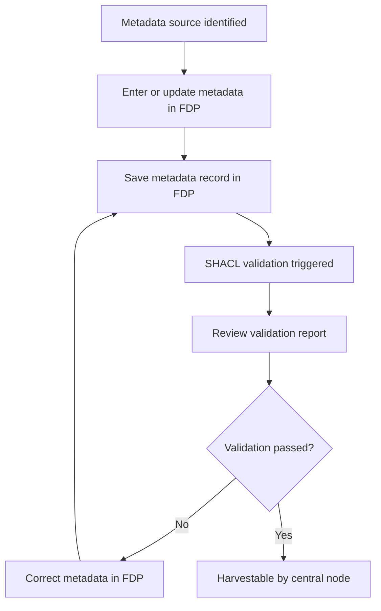

# European GDI - Submission Metadata Validation

| Metadata | Value |
| -- | -- |
| Template SOP number | `GDI-SOP0013` |
| Template SOP version | `v1` |
| Topic | Data & metadata management |
| Template SOP Type | Node-specific SOP |
| GDI Node |  |
| Instance version |  |

## Index

1. [Document History](#1-document-history)
2. [Glossary](#2-glossary)
3. [Roles and Responsibilities](#3-roles-and-responsibilities)
4. [Purpose](#4-purpose)
5. [Scope](#5-scope)
6. [Introduction and Background Information](#6-introduction-and-background-information)
7. [Summary or Context Diagram](#7-summary-or-context-diagram)
8. [Procedure](#8-procedure)
9. [References](#9-references)

### 1. Document History

| Template Version | Instance version | Author(s) | Description of changes | Date |
| -- | -- | -- | -- | -- |
| `v1` |  | Hans-Christian van der Werf | First markdown template version of the SOP for FAIR Data Point submission metadata validation, based on the reviewed draft and aligned with the repository template. | `2026.03.26` |
| `v0` |  | Marcos Casado Barbero | Created the initial SOP request and draft content for submission metadata validation. | `2026.03.05` |

### 2. Glossary

Find GDI SOPs common Glossary at the [**charter document**](../../docs/GDI-SOP_charter.md).

| Abbreviation | Description |
| -- | -- |
| DCAT | Data Catalog Vocabulary |
| FAIR | Findable, Accessible, Interoperable, and Reusable |
| FDP | FAIR Data Point |
| GDI | European Genomic Data Infrastructure |
| SHACL | Shapes Constraint Language |
| SOP | Standard Operating Procedure |
| TB | Top to Bottom |

### 3. Roles and Responsibilities

See qualifications and responsibilities of the roles at the [**Organisational Roles and Responsibilities**](../../docs/GDI-SOP_organisational-roles-and-responsibilities.md) document.

| Role | Full name | GDI/node role | Organisation |
| -- | -- | -- | -- |
| Author | Hans-Christian van der Werf | SOP author and FDP metadata contributor | Health Research Infrastructure |
| Reviewer | Marcos Casado Barbero | Task 4.3 lead | European Molecular Biology Laboratory |
| Approver | To be assigned | Approver according to GDI SOP governance | To be assigned |
| Authorizer | To be assigned | Authorizer according to GDI SOP governance | To be assigned |

### 4. Purpose

This SOP defines how a GDI node prepares, enters, validates, corrects, and approves dataset metadata in its FDP. It ensures that metadata saved in the FDP is reviewed against the node's applied GDI SHACL rules before the record is accepted for publication or retention.

### 5. Scope

This SOP covers dataset-level metadata entry in the FDP, automatic SHACL validation triggered when the record is saved, review of the validation output, and iterative correction until the metadata record passes validation.

It does not cover validation workflows outside the FDP, including future validation in other catalogues or services, nor scientific or technical processing of the underlying dataset.

### 6. Introduction and Background Information

Dataset descriptions are entered and maintained in the FDP. When a metadata record is saved in the FDP, SHACL validation is triggered automatically by the system.

The operational source of truth for required metadata is the deployed GDI SHACL shape set used by the node. These shapes implement the node's current DCAT and health data catalogue metadata constraints and supersede any simplified prose summary in this SOP.

In this SOP, required metadata means the metadata constraints enforced by the node's deployed SHACL shapes in the FDP. External validator tools may be used as supporting references for analysis, but the operational validation step described here is the FDP save-triggered SHACL validation.

### 7. Summary or Context Diagram

### 8. Procedure

#### 8.1. Prepare and enter dataset metadata in FDP

| Step identifier | When | Who |
|:--|:--|:--|
| 1 | When dataset metadata is ready to be entered or updated in the FDP. | Metadata submitter or designated metadata curator |

As the metadata submitter or designated metadata curator, collect the dataset description, related distribution metadata, and contact information needed for the FDP record. Enter or update the metadata directly in the FDP according to the deployed shapes and referenced specifications.

Use the governing GDI SHACL shapes and referenced standards as the source of truth while preparing the record instead of maintaining a separate local checklist.

#### 8.2. Save the record and review SHACL validation results

| Step identifier | When | Who |
|:--|:--|:--|
| 2 | After step 1, when the metadata record is ready to be saved in the FDP. | Metadata submitter or FDP maintainer |

Save the metadata record in the FDP. The save action triggers SHACL validation in the FDP.

Review the validation result shown by the FDP and treat the applied SHACL constraints as the authoritative pass or fail criteria. Mandatory metadata fields are those marked as required by the applicable SHACL shapes enforced by the FAIR Data Point at save time.

#### 8.3. Correct failures and finalize the valid record

| Step identifier | When | Who |
|:--|:--|:--|
| 3 | After the FDP has returned SHACL validation feedback following save. | Metadata submitter, FDP maintainer, and designated approver as applicable |

If validation fails, update the metadata in the FAIR Data Point and save again. Repeat the correction cycle until the SHACL validation passes.

When validation succeeds, the data can be harvested. Record the outcome in the local log or audit trail if applicable.

### 9. References

| Reference | Description |
| -- | -- |
| [1](../../docs/GDI-SOP_charter.md) | European GDI - SOP Charter (including Glossary) |
| [2](../../docs/GDI-SOP_information-service-management.md) | European GDI - Procedures for Information Service Management for SOPs |
| [3](../../docs/GDI-SOP_organisational-roles-and-responsibilities.md) | European GDI - Organisational Roles and Responsibilities |
| [4](https://github.com/GenomicDataInfrastructure/gdi-metadata) | GDI metadata SHACL repository used to manage FDP shapes |
| [5](https://healthdataeu.pages.code.europa.eu/healthdcat-ap/releases/release-6/) | Health data catalogue application profile release 6 |
| [6](https://www.w3.org/TR/vocab-dcat-3/) | DCAT 3 recommendation |
| [7](https://www.itb.ec.europa.eu/shacl/dcat-ap/upload) | European SHACL validator, optional supporting reference |
